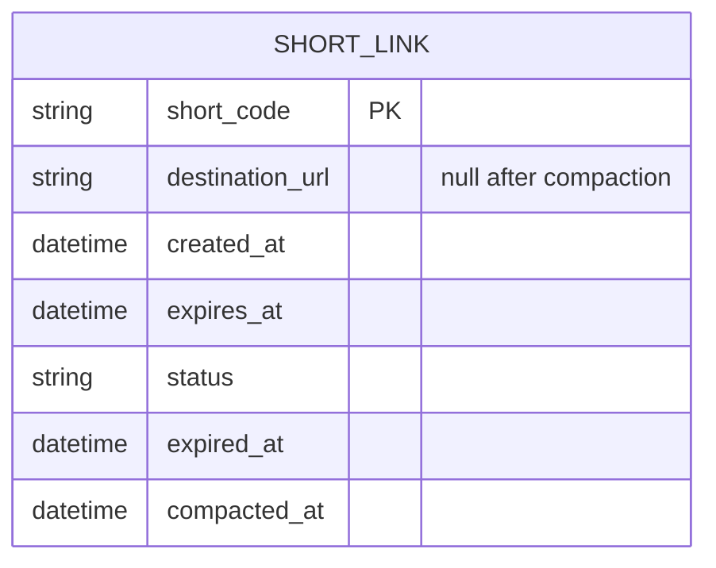
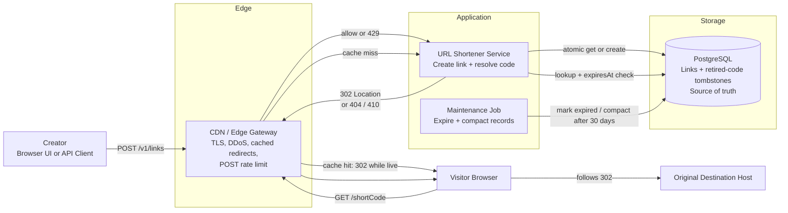
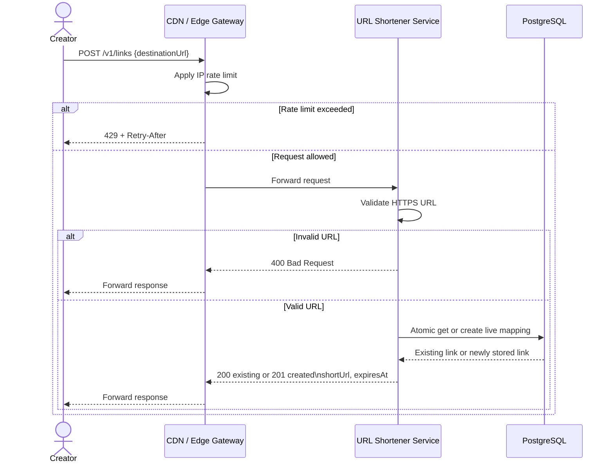
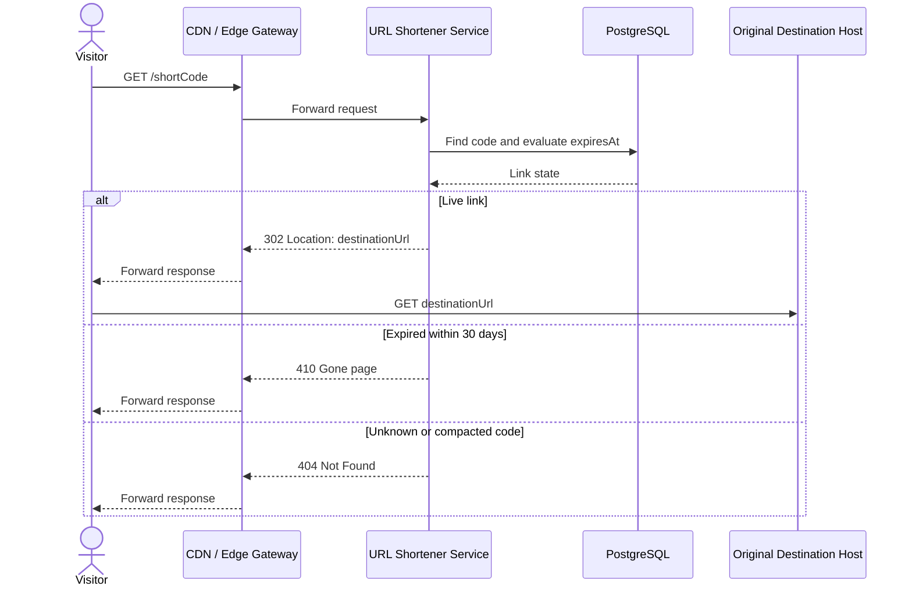

# URL Shortener Exercise

## Goal

Design a service that gives a long URL a short alias and redirects requests for
that alias to the original URL.

This began from a first mental model and was refined in short iterations.

## Current MVP at a Glance

The smallest useful summary of the current design is:

- anyone can submit one well-formed HTTPS destination without an account
- `POST /v1/links` returns an existing live link for the same exact destination
  or creates a new opaque, random 10-character Base62 code
- `GET /{shortCode}` returns `302` while live, `410` for 30 days after expiry,
  and `404` after that retention window
- every link lives for 24 hours; expired codes never reactivate or gain a new
  meaning
- PostgreSQL is the source of truth for creation, expiry, and uniqueness
- an edge/CDN cache is the first read-scale optimization; it may never serve a
  redirect beyond `expiresAt`

The rest records the decisions, tradeoffs, and failure cases behind that MVP.

## Starting Mental Model

Describe, in your own words:

- what a URL shortener is
- who uses it and what they are trying to achieve
- the smallest version you would build
- what you think happens when a user creates and opens a short link
- assumptions or uncertainties you already see

Write freely. A rough model is useful evidence for the next step; it is not a
test and does not need to be correct yet.

## Iteration Log

### Version 0 — Initial Model

A URL shortener turns a long URL into a shorter link, for example
`short.example/xyz`. Its core mapping is:

- when a user submits original URL `A`, the service gives them short code `B`
- when someone opens `B`, the service resolves it back to `A` and redirects
  their browser to the original destination

The system retains the `B -> A` mapping. Storage, caching, abuse protection,
authentication, analytics, and scale are refined later.

#### Basic Flow

1. User A submits original URL `A` to the service.
2. The service chooses a short code `B`, stores the `B -> A` mapping, and
   returns the short URL containing `B`.
3. User A shares the short URL.
4. User B opens it in a browser.
5. The service looks up `B`. If the mapping exists, it responds with an HTTP
   redirect to `A`; the browser then requests `A` from its original host.
6. If the mapping does not exist, the service returns an error. If it has
   expired, the service returns a descriptive expiry page with `410 Gone`.

#### Product Boundary

The smallest product has two externally visible operations:

- create a short link from a destination URL and retain the mapping
- resolve a short link and redirect the browser to its destination

Sharing happens in the browser, app, or operating system; it is not a
shortener operation.

#### First Data Model Idea

Keep the submitted destination as one value. Splitting protocol, host, path,
query, and fragment is unnecessary for a redirect and risks changing it.
The minimal mapping has:

- `shortCode`: the part after the shortener's host, such as `xyz`
- `destinationUrl`: the complete submitted destination, such as
  `https://youtube.com/watch?v=...`
- `expiresAt`: the moment after which the link must not redirect

The shortener host, such as `https://ly.do`, is service configuration, not
per-link data. The code identifies rather than encodes the destination.

### Version 1 — Requirements and First Design

#### Access Decision

Anyone can create a link without an account: paste, receive, share.
Authentication can arrive with link management, analytics, paid features, or
per-user limits. Anonymous creation increases abuse risk, so the MVP needs
edge controls rather than mandatory accounts.

#### Link Lifetime Decision

Links expire 24 hours after creation; that is service configuration, not an
anonymous-user choice. They then stop redirecting and return `410 Gone`, unlike
a never-known code, which returns `404 Not Found`. Expiry is a request-time
rule, not merely cleanup.

#### Destination Validation Decision

Accept only well-formed `https` URLs; reject `http`, `javascript`, `file`, and
other schemes with `400 Bad Request`. Parse and check scheme and host, but do
not fetch the destination. HTTPS protects transport, not reputation, so
phishing controls are later work. The tradeoff is that legacy HTTP URLs cannot
be shortened.

#### Duplicate Destination Decision

Submitting the same exact live destination returns its existing link. “Same”
means exact validated URL: normalising trailing slashes or tracking parameters
can change meaning and is deferred.

The durable store atomically enforces one live mapping per destination; a cache
cannot, because concurrent requests can both miss it. This is `get or create`,
not “check, then write.” After expiry, the same destination receives a new
code; the old code is never reactivated.

#### HTTP Contract

Creation is an API resource; resolution is the public short-link route itself.

| Operation | Request | Success | Expected failures |
| --- | --- | --- | --- |
| Create link | `POST https://api.ly.do/v1/links` | `201 Created` for a new mapping; `200 OK` for an existing live mapping | `400` invalid destination, `429` rate limited, `503` PostgreSQL unavailable |
| Resolve link | `GET https://ly.do/{shortCode}` | `302 Found` with `Location` | `404` unknown or compacted code, `410` expired code within retention, `503` source of truth unavailable and no valid cached response |

Create request body:

```json
{ "destinationUrl": "https://example.com/a-long-path" }
```

Successful create response:

```json
{
  "shortUrl": "https://ly.do/aB3xQ",
  "expiresAt": "2026-09-18T12:00:00Z"
}
```

| Response | Required headers | Body |
| --- | --- | --- |
| `201` / `200` create | `Content-Type: application/json` | The JSON response above. |
| `302` resolve | `Location: {destinationUrl}`; shared-cache TTL no later than `expiresAt` | Empty. |
| `429` | `Retry-After` | Small error response. |
| `400`, `404`, `410`, `503` | `Content-Type` appropriate to API or browser route | Small descriptive error response. |

`302` keeps the browser redirect temporary; the browser then requests the
destination directly.

### Version 2 — Failure, Scale, and Tradeoffs

#### Source of Truth Decision

PostgreSQL is the durable source of truth: it supports code and destination
lookups, uniqueness rules, and atomic creation without an extra component.
The code is indexed for redirects and the destination for duplicate detection.
Redis may later cache reads, but cannot decide uniqueness, expiry, or
concurrent creation correctness.

#### Initial Link Record

`shortCode` is the primary key: it is the immutable public identity used by
the redirect route. A separate internal ID adds no MVP rule.

The single logical table is `short_links`:

| Column | Example type | Meaning and rule |
| --- | --- | --- |
| `short_code` | `varchar(10)` | Primary key; exactly 10 Base62 characters; never reused. |
| `destination_url` | `text` | Complete validated HTTPS destination; `NULL` only after compaction. |
| `created_at` | `timestamptz` | Creation time. |
| `expires_at` | `timestamptz` | Hard deadline for redirects; later than `created_at`. |
| `status` | enum | `ACTIVE`, `EXPIRED`, or `TOMBSTONE`. |
| `expired_at` | `timestamptz` | When lifecycle maintenance recorded expiry. |
| `compacted_at` | `timestamptz` | When the destination was removed and the row became a tombstone. |

`destination_url` is indexed but not globally unique. The rule is one
**active** row per exact destination; once it expires, a new code may be
created for that same URL.

#### Entity Relationship Model

There is intentionally only one entity in the MVP. No account, ownership,
analytics, or custom-domain feature exists yet, so inventing related tables
would add structure without serving a current rule.



`SHORT_LINK` begins as an active mapping. It becomes expired when its deadline
passes and finally becomes a tombstone: a reduced row that retains only the
code and lifecycle information needed to prevent code reuse.

#### PostgreSQL Schema and Indexes

The following is a deliberately small PostgreSQL schema. It makes the code the
primary key and allows one active row per exact destination while preserving
expired rows and code tombstones.

```sql
CREATE TYPE link_status AS ENUM ('ACTIVE', 'EXPIRED', 'TOMBSTONE');

CREATE TABLE short_links (
    short_code      varchar(10) PRIMARY KEY,
    destination_url text,
    created_at      timestamptz NOT NULL DEFAULT CURRENT_TIMESTAMP,
    expires_at      timestamptz NOT NULL,
    status          link_status NOT NULL DEFAULT 'ACTIVE',
    expired_at      timestamptz,
    compacted_at    timestamptz,

    CHECK (short_code ~ '^[0-9A-Za-z]{10}$'),
    CHECK (expires_at > created_at),
    CHECK (
        (status IN ('ACTIVE', 'EXPIRED') AND destination_url IS NOT NULL)
        OR (status = 'TOMBSTONE' AND destination_url IS NULL)
    )
);

-- The redirect lookup is covered by the primary key.
-- This rule prevents two live codes for the same exact destination.
CREATE UNIQUE INDEX one_active_link_per_destination
    ON short_links (destination_url)
    WHERE status = 'ACTIVE';

-- Lets the maintenance job find expired full records to compact.
CREATE INDEX expired_link_cleanup
    ON short_links (expires_at)
    WHERE status = 'EXPIRED';
```

The partial unique index uses stored `status = 'ACTIVE'`, not a predicate such
as `expires_at > CURRENT_TIMESTAMP`. An index cannot make uniqueness depend on
the changing clock, so a transaction moves an overdue active row to `EXPIRED`
before a replacement can be created. The resolver still compares `expires_at`
with current server time on every request, so a delayed maintenance job never
extends a link's life.

#### Transactional Create Flow

The essential rule is not "read, then write". It is one database transaction
that expires an old active mapping if needed, then either creates a new mapping
or returns the one another request already created.

```text
createLink(destinationUrl):
  validate destinationUrl is well-formed HTTPS

  begin transaction
    now = database current time

    mark as EXPIRED any ACTIVE row for destinationUrl where expiresAt <= now

    candidateCode = secureRandomBase62(length = 10)

    try INSERT short_links(
        short_code, destination_url, created_at, expires_at, status
      ) VALUES (
        candidateCode, destinationUrl, now, now + 24 hours, ACTIVE
      )
      ON CONFLICT (destination_url) WHERE status = ACTIVE DO NOTHING
      RETURNING short_code, expires_at

      if an inserted row was returned:
        commit
        return 201 Created with that row

      existing = SELECT short_code, expires_at
                 FROM short_links
                 WHERE destination_url = destinationUrl
                   AND status = ACTIVE

      if existing exists:
        commit
        return 200 OK with existing

      if the INSERT failed only because candidateCode already exists:
        rollback this transaction
        retry createLink with another candidateCode

      otherwise:
        rollback and return 503 or retry a transient database error
```

`ON CONFLICT` turns simultaneous insertion of the same destination into a safe
read of the winner. A short-code collision is separate: roll back, generate a
new code, and retry. A savepoint is possible but unnecessary for this rare case.

#### Resolution and Maintenance Pseudocode

```text
resolve(shortCode):
  row = SELECT destination_url, expires_at, status
        FROM short_links
        WHERE short_code = shortCode

  if row does not exist or row.status is TOMBSTONE:
    return 404 Not Found

  now = trusted server time

  if row.status is ACTIVE and row.expires_at > now:
    return 302 Location: row.destination_url

  if row.expires_at + 30 days > now:
    return 410 Gone

  return 404 Not Found

maintenanceJob():
  mark ACTIVE rows with expires_at <= current time as EXPIRED
  for EXPIRED rows older than 30 days:
    set destination_url = null,
        status = TOMBSTONE,
        compacted_at = current time
```

The maintenance job reduces retained destination data; it is not relied on to
stop redirects. That safety check lives in `resolve`.

For PostgreSQL syntax and behavior, see the official documentation on
[`INSERT ... ON CONFLICT`](https://www.postgresql.org/docs/current/sql-insert.html)
and [partial indexes](https://www.postgresql.org/docs/current/indexes-partial.html).

#### Expired Link Retention

Keep the full expired record for 30 days and return `410 Gone` in that window.
Afterward return `404 Not Found`, remove the destination data, and retain a
small code-only tombstone. Codes are never reused, so an old public code never
gets a new meaning. A new link for the same destination uses a new code.

#### Expiry Enforcement

Every resolver checks `expires_at` against trusted server time before returning
`302`. An overdue link returns `410` during retention and `404` afterward even
if maintenance has not run. The background job updates storage state; it does
not enforce redirect correctness. Future cached entries must expire no later
than `expires_at`.

#### Initial Abuse Protection

The product may have a browser UI, an API, or both. The initial protection must
therefore work for API clients and cannot rely on CAPTCHA, which is only a
possible later supplement for a browser UI.

An edge gateway, reverse proxy, or CDN-capable entry point applies a per-IP
token-bucket limit before `POST /v1/links` reaches the application or
PostgreSQL. The initial policy is 10 creation requests per minute with a burst
capacity of 20. In a token bucket, the allowance refills at the stated rate
while allowing a short burst up to its capacity. Requests above the limit
receive `429 Too Many Requests` and `Retry-After`.

This is a cheap brake on simple automated abuse, not a complete botnet defense.
The public `GET /{shortCode}` path receives CDN or edge DDoS protection, but
does not use the same tight per-IP creation limit: viral links and shared
networks can create legitimate high redirect traffic.

API keys are deferred. They would enable identity and differentiated quotas,
but add key issuance, rotation, and validation without solving anonymous abuse
by themselves. Destination reputation or block lists are also later work for
phishing and misuse. The service should monitor rate-limit rejections so the
initial threshold can be tuned from observed traffic.

#### PostgreSQL Outage Behavior

Without PostgreSQL, both operations return `503 Service Unavailable`, never
`404`: the service cannot determine the link state. Creation is not queued or
accepted without the source of truth. A future cache may serve only a known
live mapping with `expires_at`; its miss or expired entry still returns `503`.

#### Concurrent Creation

Two requests may collide on the same destination or the same generated code.
Database uniqueness lets only one win: the destination loser returns that
winner's mapping; the code loser generates a new code and retries. This needs
no global application lock, and a cache does not decide either rule.

#### Retry Safety

Creating the same live destination is idempotent: a retry after a timed-out
response returns `200` if the first request committed, otherwise it creates
the mapping and returns `201`. No separate idempotency table is needed while
one destination has one meaningful live outcome. A future `Idempotency-Key`
would fit richer create options.

#### Public Code Decision

Codes are opaque, cryptographically random, 10-character Base62 values. They
do not hash or encode the destination, making enumeration harder. The space is
about `8.4 × 10^17`; collisions still retry through the primary-key rule.
This is public temporary sharing, not authorization for private documents.

#### Initial Traffic Assumption and Analytics Boundary

Assume 10 redirects per creation, then validate it using aggregate `302` counts
divided by creations. At one million creations/day, that is roughly 12 creates
and 116 redirects per second on average; at a 10x peak, 120 and 1,160. This
makes the system read-heavy and justifies an edge cache before Redis. Per-link
analytics are out of scope; if added, their writes must not delay redirects.

#### Initial Observability Baseline

Track availability, latency, and unexpected outcome changes, separated by
endpoint and result:

- request rate and result counts: `201` created, `200` reused, `302`
  redirected, `400` invalid, `404` unknown, `410` expired, `429` limited, and
  `503` unavailable
- latency, including `p95` and `p99`: the time under which 95 or 99 of every
  100 requests finish. These reveal slow users hidden by the average.
- PostgreSQL query latency, query failures, connection-pool saturation, and
  storage capacity
- edge rate-limit rejections, which show whether the threshold needs tuning or
  abuse has changed
- maintenance-job last successful run, failures, and records expired or
  compacted, so cleanup does not silently stop

Log request ID, route, result class, latency, and safe context. Never log full
destination URLs or use them as metric labels: they may contain tokens and
would create unbounded metric cardinality.

Alert on sustained `503` or server errors, latency regression, PostgreSQL
health failure, and missed maintenance. Investigate changes in `404`, `410`,
and `429` first: they can be normal expiry, stale links, scanning, or abuse.
Restore resolution before creation in an incident, because it breaks existing
shared links.

#### Cache Candidates

An edge/CDN caches public redirects near visitors and also enforces routing,
DDoS protection, and the creation rate limit. An edge cache hit bypasses the
service and PostgreSQL; this is the first read-scale optimization. Redis is a
later cache if measured edge hit rate or origin load needs it.

Only the resolution lookup is worth caching here:
`short_code -> destination_url, expires_at`. A creation cache can improve
duplicate lookup latency but never decides the atomic `get or create` rule.

The shared cache may store a `302` only until `expires_at` (for example, with
`s-maxage` equal to remaining lifetime). It must never redirect later. Normal
expiry therefore needs no purge; early revocation would require a state update
and explicit CDN purge, and remains out of scope.

## MVP Architecture

One business service owns the product rules. The edge is only the traffic and
protection boundary. PostgreSQL is the source of truth; the maintenance job
updates stored lifecycle state but never decides whether a redirect is valid.



The tombstone is a reduced PostgreSQL row, not another database. Redis is not
part of this MVP; it is only a possible later read cache.

### Creation Flow



### Resolution Flow



## MVP Complete

This design is complete at the minimum defensible level. It can create and resolve temporary public links correctly, including expiry, retries, concurrent creation, basic abuse protection, operational failures, and the metrics needed to run it.

### Explicitly out of scope

- User accounts, link ownership, API keys, and paid plans.
- Custom aliases, custom domains, and user-configured expiry.
- Per-link analytics or reporting dashboards.
- Private-document sharing, signed links, or other capability-security features.
- Early revocation and takedowns; the cache design notes what would change when this becomes a requirement.
- Redis, read replicas, sharding, multi-region deployment, and vendor-specific infrastructure choices.

These are not omissions. They are intentional deferrals: the current product does not require them, and adding them now would make the exercise less useful as an MVP design.

### Continue only when there is a reason

Revisit this design only when a new product requirement or an observed metric demands it. For example: cache misses could justify Redis, abusive creation could justify API keys, and a revocation requirement could justify cache purges and extra lifecycle states.

## Reflection

At the end, capture:

- what changed in your original model
- which requirement caused the biggest design change
- one reusable design lesson
