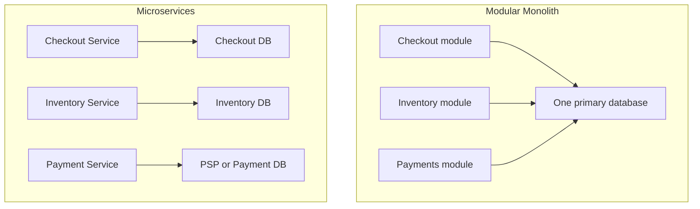

# Monolith vs Microservices

> Primary fit: `Shared core`

Use this topic when the real question is not "Do you know the
word microservices?" but:

- when would you keep a modular monolith
- when do service boundaries become worth it
- what extra backend work appears after the split

This follows the same reusable study shape used elsewhere in the repo:

- definition
- minimal example
- real implementation
- practical summary

---

## 1. Definition

### Monolith

A monolith is one application deployed as one unit.

A good monolith can still be modular internally, for example with `checkout`,
`inventory`, and `payments` modules inside one deployable app, often with one
primary relational database.

Important practical point:

> A monolith does not have to be a mess. A modular monolith is often the best
> starting point.

Why it matters:

- simpler deployment, debugging, and transaction handling
- but shared deployment and shared scaling can become painful once domains or teams diverge

Best fit when:

- the domain is still changing fast
- the team is still small or tightly coupled
- one transaction boundary still helps more than service separation

### Microservices

Microservices split the system into independently deployable services organized
around business capabilities.

The important part is not "many services."
The important part is clear boundaries: each service can be deployed and owned
independently, and each service owns its own data instead of sharing the same
tables behind the scenes.

Important practical point:

> Microservices are mainly a boundary and operating-model decision, not a magic
> performance upgrade.

Why it matters:

- better fit when different domains need different release cadence, ownership, or scaling
- but cross-service workflows, consistency, and operations get harder very quickly

Best fit when:

- shared deployment is already creating real team friction
- some domains need clearly different scaling or operational expectations
- business boundaries are stable enough that each service can truly own its data

### Clarifications that help in practice

#### Do you always need a gateway?

No.

A monolith can expose HTTP directly and work perfectly well.
Gateways become more useful when you need:

- one public entry point for several backends
- edge auth, rate limiting, or routing
- response composition through a `BFF` (`Backend For Frontend`)

`BFF` means **Backend For Frontend**.
It is a backend layer built for one client experience, such as `web` or `mobile`.
Its job is to hide the need to call several internal services and return data already shaped for that screen or app flow.

Small concrete example:

- mobile app needs order summary + loyalty points + delivery ETA in one response
- instead of making the app call three services directly, a BFF calls them internally and returns one frontend-shaped payload

A `gateway` and a `BFF` are not the same thing.
A gateway mainly gives you one entry point plus shared edge concerns such as routing, auth, and rate limiting.
A BFF mainly gives you client-specific composition and adaptation for one frontend.
In some systems the same edge component does both jobs, but the concepts are still different.

#### Is a monolith with Postgres and Redis already a distributed system?

Not in the same sense as a microservices architecture, but it **does** have distributed-system characteristics.

In strict architecture language, many people would still call it a monolith.
In failure-mode language, you should already reason about it as a system with distributed boundaries.

Why:

- your app process can fail
- Postgres can fail independently
- Redis can fail independently
- network calls between them can time out or partition

What makes a system "distributed" in practice is not only microservices.
It is that useful work depends on **separate processes or nodes communicating over a network**, with independent failure and timing.

That can include:

- one app talking to Postgres and Redis
- one service talking to a payment provider
- several microservices talking to each other
- background workers consuming from a queue

So microservices are one common form of distributed system, but not the only one.

Good practical nuance:

> A monolith with external databases or caches is not "purely local." It already
> has network failure and partial-failure concerns, even if deployment and ownership
> are still centralized.

#### Why do you lose one ACID transaction after the split?

In the monolith case, several writes may sit inside one database transaction because they use the same local database.

After the split:

- `Order Service` owns its own database
- `Inventory Service` owns its own database
- `Payment Service` may call an external PSP or own another database

Now one local Postgres transaction cannot atomically cover all three boundaries.

That is why microservices push you toward:

- sagas or compensating actions
- outbox patterns
- idempotency
- explicit state transitions

What replaces the old "one big ACID transaction" is usually:

- **local ACID inside each service boundary**
- **reliable event publication** with outbox
- **idempotent consumers and APIs** so retries are safe
- **sagas or compensating actions** when one business flow spans several services

So the goal changes:

- monolith -> one transaction keeps everything consistent immediately
- microservices -> each service stays locally correct, and the wider workflow reaches a correct final state through messages, retries, and compensation

Short version:

> You do not lose ACID because microservices are "worse." You lose it because the
> work is no longer one local database transaction.

#### How do microservices communicate?

The common answers are:

- synchronous `HTTP/REST`
- synchronous `gRPC`
- asynchronous events or commands through a broker such as Kafka, RabbitMQ, or SQS

Smallest mental model:

- use synchronous calls when the caller needs an answer now
- use asynchronous messaging when the work can continue later or several consumers care about the same event

Typical examples:

- `Checkout Service` calls `Pricing Service` synchronously because it needs the price now
- `Order Service` publishes `OrderCreated` asynchronously because inventory, email, fraud, and analytics may all react separately

Good practical nuance:

> Most real systems use both. Synchronous calls are common for immediate request-response needs, while events are common for propagation, decoupling, and follow-up work.

---

## 2. Minimal Example

### Modular monolith version

Imagine an ecommerce backend with:

- `Checkout`
- `Inventory`
- `Payments`
- `Orders`

All four live inside one Spring Boot app with one Postgres database.

When a user places an order:

1. validate cart
2. reserve inventory
3. authorize payment
4. create order
5. commit one database transaction

Why this is attractive:

- simple local development because one app and one database are easy to run on a laptop
- easy debugging because you can step through the whole request path in one process
- cheap internal calls because module-to-module communication stays in-process
- strong ACID transaction across the write path because related writes commit or roll back together

Pros:

- fast team velocity while the domain is still evolving because boundaries can change inside one codebase
- easier to change boundaries later because you have not yet paid the cost of remote calls, duplicated data, and service ownership

Tradeoffs / Cons:

- one deployable unit can become a release bottleneck when unrelated changes must ship together
- hotspots may force you to scale more than one domain at once, even if only one path is actually busy

### Microservices version

Now split it into:

- `Checkout Service`
- `Inventory Service`
- `Payment Service`
- `Order Service`

Each service owns its own database.

The same order flow now becomes:

1. `Checkout Service` receives request
2. asks `Inventory Service` for reservation
3. asks `Payment Service` for authorization
4. tells `Order Service` to create order
5. publishes events for downstream work in other systems

What changed:

- you gained independent scaling and deployment, so hot paths can move without redeploying everything
- you lost the single ACID transaction, so cross-service correctness now depends on coordination patterns
- network calls, retries, tracing, and eventual consistency became real work, not background details

Pros:

- domain teams can move more independently because they no longer share one release train for every change
- hot domains can scale and release on their own terms without dragging quieter domains with them

Tradeoffs / Cons:

- correctness now depends more on idempotency, outbox, saga, and observability because no single database transaction protects the whole workflow
- local reasoning becomes harder because the full success or failure path is spread across service boundaries and time

Visual anchor for the example:

Core rule:

> If two services still need the same database tables to do their jobs, the
> boundary is probably wrong.

---

## 3. Quick Justification Check

Use this as a quick check, not as a second full explanation.

- shared deployment is actively blocking teams
- one domain needs clearly different scaling, latency, availability, or release rules
- boundaries are stable enough that each service can own its data cleanly
- the organization can already support tracing, CI/CD, rollback, and on-call ownership
- the extracted capability is mature enough to stand alone instead of being a moving target

Good senior line:

> I would not move to microservices because the system is "big." I would move
> when the domain boundaries are clear and the organization is paying a real
> cost for shared deployment and shared ownership.

---

## 4. Quick No-Split Check

Use this as a quick check, not as a second full explanation.

- the team is still small enough that service overhead would cost more than it saves
- the domain is still moving fast, so the real boundaries are not stable yet
- the real pain is code quality inside one codebase, not deployment coupling between domains
- one transaction boundary still matters more than independent service releases
- the organization is not ready for tracing, rollback, and runtime ownership across several services

Good senior line:

> If the domain is still moving fast, I usually prefer a modular monolith so we
> can learn the real boundaries before paying the full distributed-systems cost.

---

## 5. The Big Traps

Yes: this section means the most common ways to get microservices wrong.

### 1. Shared database

This is the classic distributed monolith trap.

If multiple services read and write the same tables:

- coupling stays high because schema changes still force coordination
- releases are not truly independent because both services depend on the same tables and migration timing
- failures become harder to isolate because data bugs leak across the supposed boundary

Concrete example:

- `Order Service` and `Inventory Service` are separate deployables, but both update the same `orders` and `inventory` tables in one shared schema

### 2. Chatty synchronous call chains

If one user request becomes:

`gateway -> service A -> service B -> service C -> service D`

you create:

- higher latency because each hop adds network and processing time
- more timeout risk because the user request now waits on the slowest chain
- harder debugging because the visible failure may be several hops away from the real cause
- cascading failure paths because one slow service can back up the whole request path

Concrete example:

- checkout request calls pricing, then inventory, then promotions, then fraud, then notifications synchronously before returning to the user

### 3. No plan for distributed writes

Once services own separate data, dual writes become dangerous.

You need patterns such as:

- transactional outbox so state change and event publication stay coordinated
- saga or compensating actions when one step succeeds and a later step fails
- idempotent consumers so retries do not duplicate business effects

Concrete example:

- the order row is committed, but the payment event publish fails, so downstream systems (the later dependent systems) never learn that the order moved forward

### 4. Splitting by technical layers instead of business capability

Bad boundaries:

- `controller service`
- `repository service`
- `email utility service`

Better boundaries:

- `inventory`
- `checkout`
- `payments`
- `orders`

Concrete example:

- creating a standalone "email service" just because sending email is a technical function, even though it has no real business ownership or stable domain boundary

### 5. Weak observability

Without:

- correlation IDs to tie one request or order flow across services
- tracing to see which hop was slow or failed
- service-level metrics to detect which component is unhealthy
- clear ownership so someone can actually respond

microservices become an expensive guessing exercise.

Concrete example:

- an order fails somewhere after the gateway, but no correlation ID ties together the traces, so three teams spend hours guessing which hop actually broke

---

## 6. Real Implementation Shape

The practical path is usually:

1. start with a modular monolith
2. keep domain boundaries explicit inside the codebase
3. measure where scaling or team coupling is actually hurting
4. extract one business-critical boundary at a time
5. add observability and retry/idempotency discipline before celebrating the split

For commerce or payments, a common first extraction might be:

- `checkout` stays central while it still coordinates most of the revenue-critical request path
- `payments` is isolated because it has external-provider dependencies
- `inventory` may separate later when contention, reservations, and omnichannel flows justify it

For retail backends, strong sentence:

> The skill is not choosing microservices in theory. The skill is deciding which
> boundary is worth extracting first without increasing migration risk on
> revenue-critical flows.

---

## 7. Real Case: Shopify Chose A Modular Monolith First

Why this matters:

- this is a strong architecture example because Shopify was already large, but still did not treat microservices as the automatic next step
- by `September 16, 2020`, Shopify described the core monolith as over `2.8 million` lines of Ruby code, so this is not small-startup advice
- it gives you a concrete way to explain that architecture decisions should follow the real bottleneck, not fashion
- it also helps you separate three decisions that are often blurred together: code organization, deployment boundaries, and data-consistency boundaries

Smallest mental model:

- Shopify's core pain was not simply "the system is big"
- the pain was that one large core codebase had become harder to understand, change, debug, and own safely
- instead of splitting everything into networked services immediately, they first reorganized the core into clearer business-domain components inside one deployable system

What they did in practice:

- moved away from Rails organization by technical layers and toward business domains such as orders, inventory, billing, and tax
- introduced components inside the Rails monolith, often using Rails packaging mechanisms such as Rails Engines, so one domain could be worked on with less accidental coupling to the rest of the app
- used `Packwerk`, a static dependency-checking tool, to flag cross-component references that violated the intended boundaries before they spread further
- worked on clear public entrypoints between components, meaning other teams should call explicit interfaces instead of reaching into another component's internals
- made component ownership explicit per team so responsibility stayed clear even in one shared codebase
- kept one deployable unit for much of the core while they learned which boundaries were truly stable enough to deserve extraction
- kept the operational simplicity of one main deployable system while improving internal modularity and team ownership

Why that was reasonable:

- a full service split would have added remote-call latency, harder debugging across process boundaries, and more operational work
- it would also have turned many cross-domain changes into multi-service coordination work
- cross-service data consistency would have become harder because one local transaction no longer protects the full workflow
- their immediate problem was developer productivity and boundary clarity inside the core system
- a modular monolith solved the first problem without paying the full distributed-systems cost too early

Practical takeaway:

- the first architectural question was not "how do we get more services?"
- it was "how do we make the existing core easier to understand, change, and own safely?"
- that is a stronger system-design mindset because it starts from the real engineering pain instead of from an architecture trend

What this case does **not** mean:

- it does not mean microservices are bad
- it does not mean a monolith scales forever without discipline
- it means modularity and service extraction are separate decisions, and sometimes you need the first one before the second

Practical summary:

> Shopify is a useful example because they were already operating at large scale,
> but still chose to fix boundaries inside the core first. The lesson is not
> "never use microservices." The lesson is "do not distribute a boundary before
> you understand and enforce it."

Useful nuance for follow-up questions:

> I would use the Shopify case to argue for modularity first, not to argue that
> every system should stay monolithic forever. If one domain later needs its own
> scaling, release cadence, or operational isolation, that can still justify a
> service boundary.

Official source trail:

- [Deconstructing the Monolith - Shopify Engineering](https://shopify.engineering/blogs/engineering/deconstructing-monolith-designing-software-maximizes-developer-productivity)
- [Under Deconstruction - Shopify Engineering](https://shopify.engineering/blogs/engineering/shopify-monolith)
- [A Packwerk Retrospective - Shopify Engineering](https://shopify.engineering/a-packwerk-retrospective)

## 8. Practical Summary

Good short answer:

> I do not default to microservices. I usually start with a modular monolith,
> keep business boundaries explicit, and only split services when team autonomy,
> scaling needs, or operational requirements justify it. Once I split, each
> service owns its data, and I accept the extra cost: network failures, retries,
> tracing, and eventual consistency. That means outbox, idempotency, and
> observability stop being optional.

Good follow-up answer:

> Microservices help when the organization needs independent ownership and
> deployment, but they are a bad trade if the team is small or the domain is not
> stable yet. Otherwise you just trade one simple problem for many operational
> problems.

---

## 9. What Matters Most

- you do not treat microservices as the default answer
- you understand database-per-service as a real boundary, not just separate repos
- you understand why transactions get harder after the split and what replaces them
- you can name operational costs, not only diagram boxes
- you connect service boundaries to domain boundaries and team ownership

If you say only "microservices scale better," the answer is weak.

If you say "I prefer a modular monolith first, then extract where team or
throughput boundaries justify it," the answer is usually much stronger.

---

## 10. Related Reading

- [03-distributed-transactions-and-events.md](./03-distributed-transactions-and-events.md)
- [02-resiliency-patterns.md](./02-resiliency-patterns.md)
- [04-networking-fundamentals.md](./04-networking-fundamentals.md)
- [05-distributed-tracing.md](./05-distributed-tracing.md)
- [06-reactive-and-event-driven-basics.md](./06-reactive-and-event-driven-basics.md)
- [15-retail-inventory-and-fulfillment-systems.md](./15-retail-inventory-and-fulfillment-systems.md)
