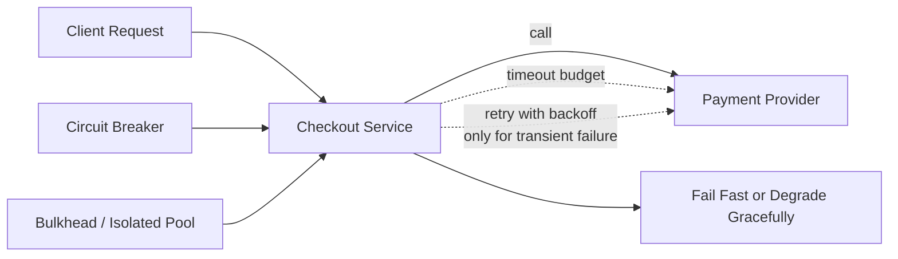

# Resiliency Patterns in Distributed Systems

> Primary fit: `Shared core / Payments / Fintech`

You do not need to be an SRE, but in backend work you do need to explain
how a service behaves when calls to other services or providers are slow,
unreliable, or fully down.

This topic matters because many backend design follow-ups are really resiliency
questions in disguise:

- what happens if the payment provider times out?
- what happens if one dependency is slow and everything piles up?
- what should fail fast and what can degrade safely?

This note keeps the shape practical:

1. what the pattern solves
2. the smallest useful example
3. where it fits in real systems
4. how to explain it calmly

### What You Actually Need To Know As A Backend Engineer

You usually do **not** implement these patterns from scratch.

What you do need to know is:

- what failure the pattern is protecting against
- where it usually lives: application code, HTTP client, worker pool, queue, gateway, or service mesh
- what the dangerous misuse looks like
- what business paths should fail fast, retry, or degrade

Why some sections have code and others only implementation shapes:

- timeout and retry often appear directly in application code because the service chooses them per outbound call
- circuit breaker is often provided by a resiliency library, gateway, or service mesh rather than handwritten business logic
- bulkhead is usually a resource-isolation decision, such as separate thread pools, worker groups, queues, or concurrency limits, so there is no single universal code snippet

Practical rule:

> I do not need to build a circuit breaker from scratch. I do need to know when to use one, where to place it, and what bad behaviour it prevents.

---

## 1. The Core Failure Model

The problem is not only "a request fails".
The bigger problem is that one slow or unhealthy dependency can consume threads,
connections, retries, and queue capacity until healthy parts of the system also degrade.

Small concrete example:

- checkout service calls payment provider
- payment provider is slow
- requests keep waiting
- threads pile up
- connection pool fills
- retries make the traffic spike worse
- now checkout looks "down" even though your code was fine

Short rule:

> resiliency is about stopping one bad area from taking the whole system down

Visual anchor:



---

## 2. Timeout

### What it is

A timeout is the maximum time you allow a network call to wait before failing.

### What problem it solves

Without a timeout, a slow dependency can hold your thread or connection for far too long.
That turns one slow hop into a system-wide resource problem.

### Smallest example

- payment call starts
- provider does not respond
- after 2 seconds, fail the call instead of waiting indefinitely

### Real implementation

```kotlin
val client = RestClient.builder()
    .requestFactory(
        HttpComponentsClientHttpRequestFactory().apply {
            setConnectTimeout(Duration.ofSeconds(2))
            setReadTimeout(Duration.ofSeconds(5))
        }
    )
    .build()
```

Use different budgets for different paths:

- low latency user request -> tighter timeout
- slow batch import -> larger timeout

### Where it fits

- payment-provider calls in checkout
- partner APIs that often time out or fail
- HTTP calls from one internal service to another

Pros:

- bounds waiting time
- protects threads and connections from hanging too long

Tradeoffs / Cons:

- too aggressive a timeout creates false failures
- timeout budgets need to match the operation, not one global guess

### Practical summary

> Every network call needs a timeout. Otherwise one slow dependency can consume
> threads and connections until the caller degrades too.

---

## 3. Retry with Exponential Backoff

### What it is

Retry means trying again after a transient failure.
Exponential backoff means waiting longer between attempts.

`Transient failure` means a failure that is likely to disappear if you wait a little and try again.
The operation itself is still valid; the problem is temporary infrastructure or dependency instability.

Good examples:

- one timeout
- one brief `503 Service Unavailable`
- one short network interruption
- one temporary connection reset

Not good retry examples:

- validation error like `400 Bad Request`
- authentication or authorization failure like `401` or `403`
- business rejection such as "card declined" or "out of stock"
- a non-idempotent write where retrying could create a duplicate side effect

### What problem it solves

Some failures are temporary:

- one timeout
- one brief 503
- one network hiccup

Retry can recover those cases without user-visible failure.

### The trap

Retrying immediately can create a retry storm.
If 500 callers all retry at once, they can finish off a dependency that was already struggling.

`Jitter` means adding a small random delay so all callers do not retry again at exactly the same moment.
There is no single magic jitter value.
The goal is to spread retries out enough that callers stop moving in lockstep.

Practical rule:

- a common choice is randomizing each wait by about `25%` to `50%` of the base backoff
- smaller jitter may not spread retries enough
- much larger jitter can make retries feel unnecessarily slow

### Smallest example

- attempt 1 fails
- wait `200ms` base, but with `25%` jitter the real wait becomes about `150-250ms`
- attempt 2 fails
- wait `400ms` base, but with `25%` jitter the real wait becomes about `300-500ms`
- attempt 3 fails
- stop and surface the error

### Real implementation

```kotlin
val config = RetryConfig.custom<PaymentResult>()
    .maxAttempts(3)
    .waitDuration(Duration.ofMillis(200))
    .retryOnException { ex ->
        ex is SocketTimeoutException || ex is ConnectException
    }
    .build()

val retry = Retry.of("paymentProvider", config)
val chargeWithRetry = Retry.decorateSupplier(retry) {
    paymentClient.charge(request)
}

val result = chargeWithRetry.get()
```

The important part is not the library name.
It is the rule:

- bounded attempts
- backoff
- retry only transient failures
- combine with idempotency for money-sensitive writes

### Where it fits

Good fit:

- public internet calls
- external APIs that fail intermittently
- short transient failures

Bad fit:

- non-idempotent writes without protection
- validation errors
- calls to a dependency that is already overloaded, where more retries would only make things worse

Pros:

- recovers many transient failures cheaply
- improves resilience without changing the user contract

Tradeoffs / Cons:

- can amplify load if used carelessly
- unsafe for non-idempotent writes without protection

### Practical summary

> I retry only transient failures, with exponential backoff and jitter. I do not
> retry blindly on every error, and I combine retries with idempotency for
> money-sensitive writes.

---

## 4. Circuit Breaker

### What it is

A circuit breaker stops sending traffic to a dependency that is failing too often.

### What problem it solves

If a dependency is clearly unhealthy, more attempts just waste threads and time.
The caller should fail fast until the dependency has a chance to recover.

### Smallest example

- payment service sees 60% failures to provider X over a short window
- circuit opens
- new calls fail fast immediately
- after a cooldown, a few test calls are allowed
- if they succeed, the circuit closes again

### Common implementation shapes

You usually do not handwrite the state machine in normal product code.
More often you configure a library or policy that already knows the `CLOSED`, `OPEN`,
and `HALF_OPEN` states.

- `CLOSED` = traffic flows normally
- `OPEN` = fail fast, no real call
- `HALF_OPEN` = allow a small probe sample

Typical tools:

- Resilience4j
- service mesh policies

### Where it fits

- legacy dependency that fails often or responds slowly
- unstable third-party provider
- any dependency whose timeout path is expensive

Pros:

- fails fast when a dependency is clearly unhealthy
- protects the caller from wasting more capacity on doomed calls

Tradeoffs / Cons:

- bad thresholds can trip too early or too late
- adds more tuning and monitoring work

### Practical summary

> A circuit breaker is useful when retries stop making sense. Once failure rate is
> clearly high, I would fail fast and protect the caller instead of letting every
> request wait for another timeout.

---

## 5. Bulkhead

### What it is

A bulkhead isolates resources so one degraded path does not consume everything.

Think of it as resource isolation: one noisy area should not eat the threads,
workers, DB connections, or queue capacity needed by a more critical area.

### What problem it solves

If search, reporting, and checkout all share the same thread pool or worker capacity,
one slow path can starve the rest.

### Smallest example

- search traffic becomes slow
- search uses its own limited pool
- search starts failing
- checkout pool stays healthy

### Common implementation shapes

Bulkhead is not one specific class or algorithm.
It depends on which resource you are trying to isolate.

- separate thread pools
- separate worker groups
- separate queues
- per-route or per-dependency concurrency limits
- separate deployments for critical versus non-critical workloads

In plain English, this often means:

- checkout does not share the same worker pool as reporting
- recommendation calls cannot consume all outbound HTTP capacity
- one noisy queue cannot block every worker needed by another flow

### Where it fits

- checkout vs reporting
- online API vs batch processing
- recommendation side-calls vs core transaction flow

Pros:

- limits how far the damage spreads
- protects critical capacity from non-critical degradation

Tradeoffs / Cons:

- more resource planning
- under-sizing isolated pools can create self-inflicted bottlenecks

### Practical summary

> Bulkheads are about isolating resources. I do not want a slow non-critical path,
> like reporting or recommendations, to consume the capacity needed by checkout.

---

## 6. Fallback and Graceful Degradation

### What it is

Fallback means returning a degraded but still useful result when a dependency is down.

### What problem it solves

Not every failure should blank the whole page or fail the whole request.
Some features are optional and can degrade safely.

### Smallest example

- recommendation service is down
- product page still loads
- recommendations section returns empty

### Safe fallback levels

1. cached value
2. empty/default value
3. partial response
4. queue non-critical follow-up work

### Where it fits

Good fit:

- recommendations
- analytics side effects
- low-risk read models

Bad fit:

- payment capture
- inventory deduction
- anything where silent degradation creates incorrect state

Pros:

- preserves user experience for optional features
- reduces the chance that one non-critical failure blanks the whole flow

Tradeoffs / Cons:

- can hide real issues if overused
- dangerous if applied to correctness-critical operations

### Practical summary

> I use fallbacks for non-critical dependencies, but not for money or inventory
> correctness. A degraded recommendation is acceptable. A silently degraded payment is not.

---

## 7. Rate Limiting and Rejecting Excess Traffic

### What it is

Rate limiting restricts how much traffic one caller can send.
`Load shedding` means rejecting extra traffic on purpose so the system can keep
serving the traffic it still has capacity for.

### What problem it solves

Without limits, one tenant, script, or spike can consume most of the shared capacity.

### Smallest example

- one client sends 500 requests per second
- API allows only 50 per second for that key
- extra requests get `429 Too Many Requests`

### Common patterns

- token bucket = allows controlled burst, then steady refill
- fixed or sliding window = easier per-user/per-minute limits

### Where it fits

- login
- search
- webhook intake
- public APIs

Pros:

- protects shared capacity
- limits noisy neighbours and runaway clients

Tradeoffs / Cons:

- too strict a limit hurts legitimate traffic
- the key choice (`IP`, user, tenant, API key) changes behaviour a lot

### Practical summary

> Rate limiting protects shared capacity. It is not only a security control; it is
> also a reliability control because it prevents one caller from overwhelming the system.

---

## 8. How The Patterns Work Together

The usual healthy combination is:

- timeout -> stop one slow dependency from holding resources forever
- retry with backoff -> recover short temporary failures
- circuit breaker -> stop sending every call into a dependency that is clearly unhealthy
- bulkhead -> keep critical resources separate from noisy or non-critical work
- fallback -> degrade only the parts that are optional
- rate limiting -> stop one caller or spike from consuming too much shared capacity

Good mental flow:

1. put a time limit on the call so one slow dependency cannot block everything
2. retry only when the failure looks temporary and retrying is actually safe
3. if the dependency is clearly unhealthy, stop sending every request into the same failure
4. keep critical resources separate so non-critical work cannot starve checkout or payment
5. only degrade features that are optional; never fake success for money or stock correctness

---

## 9. Pattern Choice By Use Case

### Payment flow with an external provider

- timeout: yes
- retry: maybe, only if the provider operation is idempotent or protected by a key
- circuit breaker: yes
- fallback: no fake success path
  Why: if the payment dependency is sick, you want to fail clearly and protect correctness, not pretend the charge worked.

### Product page with optional enrichments

- timeout: yes
- retry: maybe for read calls
- fallback: yes for recommendations or low-risk catalog enrichment
- bulkhead: yes between checkout and non-critical read paths
  Why: some parts of the page can degrade, but checkout and core purchase flows must keep their own capacity.

### Batch integration with core systems

- timeout: yes
- retry: yes, bounded
- circuit breaker: useful
- queue buffering: useful, meaning extra work can wait in a queue instead of being forced immediately
- fallback: usually not a user-facing concept here
  Why: batch jobs can wait, retry, and resume later; the goal is controlled processing, not instant user-facing response.

---

## 10. The Big Traps

1. **Retrying non-idempotent writes blindly**
   Example: retrying `POST /payments` without an idempotency key.

2. **No timeouts**
   Example: threads hang on a provider call until the pool is exhausted.

3. **Fallback on correctness-critical operations**
   Example: pretending payment succeeded because the provider response was slow.

4. **No resource isolation**
   Example: reporting traffic consumes the same capacity as checkout.

5. **Thinking one pattern solves everything**
   Example: adding retries without timeouts or circuit breakers.

---

## 11. Practical Answer Shape

Good short answer:

> I think about resiliency in layers. First I bound waiting time with timeouts,
> then I retry only transient failures with backoff and jitter, use circuit
> breakers to fail fast when a dependency is unhealthy, isolate critical
> capacity with bulkheads, and only use fallbacks where degraded behaviour is actually safe.
