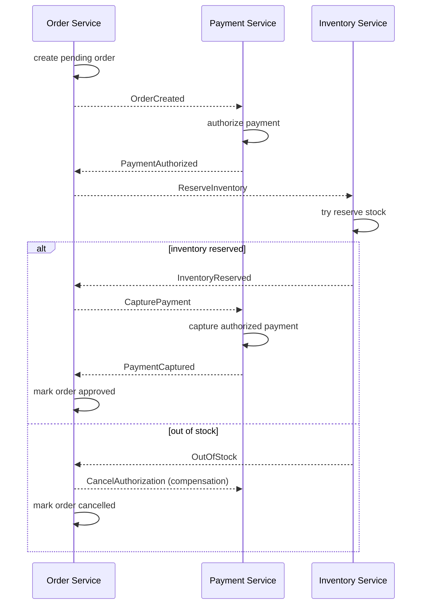
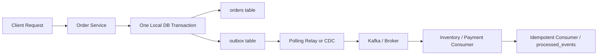

# Distributed Transactions & Event-Driven Architecture

> Primary fit: `Shared core / Payments / Fintech`

You do not need to memorize every pattern name here, but you do need a clear mental model
for one recurring backend question: "what happens when one business
operation spans multiple services and something fails in the middle?"

In a monolith, you use `@Transactional` to ensure a write to the `Users` table and the `Orders` table either both succeed or both fail.

In a microservices world, the `Users` table and `Orders` table belong to different databases owned by different services. You cannot use one simple local database transaction across them. This is one of the hardest recurring backend problems once data and ownership are split across services.

Plain-English version:

- one step may already have committed in Service A
- another step may fail in Service B
- now the system is in a half-finished business state
- the real job is making that state safe and recoverable

Quick terms used here:

- `eventual consistency` = different parts of the system may agree a little later instead of all at once
- `compensation` = a new business action that semantically undoes an earlier step
- `choreography` = services react to each other's events without one central coordinator
- `orchestration` = one central workflow component tells the other services what step to run next
- `projection` = a read-optimized view built from source data or events

---

## 0. Quick Pattern Choice

Use this mental model:

- **Saga:** one business workflow spans several services and you need explicit forward steps plus compensation
- **Outbox Pattern:** one service must both save state and publish an event reliably
- **CQRS:** writes and reads behave very differently, so one model no longer serves both well
- **Event Sourcing:** the event history itself is part of the product, audit, or compliance value

If these names feel abstract, the practical translation is:

- saga = workflow recovery problem
- outbox = dual-write safety problem
- CQRS = write model and read model have diverged
- event sourcing = history itself matters, not only latest state

These patterns are related, but they solve different problems.

Why this section matters:

- the correct pattern buys clarity for one kind of problem
- the cost is almost always more moving parts and more care in how you run the system

---

## 1. The Saga Pattern

A Saga is a sequence of local transactions.
Each service commits its own step locally, then the workflow moves on to the next step.

If a local transaction fails (e.g., Out of Stock), the saga executes a series of **Compensating Transactions** that undo the changes made by the preceding local transactions.

`Compensating transaction` sounds abstract, but it usually means a concrete business undo action:

- cancel an authorization
- release a reservation
- issue a refund
- mark an order as cancelled

Important clarification:

- this is **not** a database rollback across all services
- each service has already committed its own local transaction
- a compensating transaction is a **new business action** that semantically undoes the earlier step

Example:

- in many card flows, `Payment Service` authorizes first and captures later
- if `Inventory Service` fails before capture, the saga compensates by cancelling the payment authorization
- if money was already captured when a later step fails, the saga cannot roll back the original payment transaction in a DB sense
- instead, it performs a new action such as `RefundPayment`

Important payment nuance:

- `authorize` usually comes before `capture`
- `authorize` reserves or approves the funds
- `capture` finalizes the charge
- if the failure happens before capture, compensation is often cancelling the authorization
- if the failure happens after capture, compensation is usually `RefundPayment`

Practical explanation:

> We cannot keep one ACID transaction across several services without hurting availability badly, so the safer model is local transactions plus compensation and eventual consistency.

`ACID` here means the usual local database guarantees around atomicity,
consistency, isolation, and durability.
The important limit is that those guarantees stop at the local database boundary.

Visual anchor:



### A. Saga Choreography (Decentralized)
There is no central coordinator. Each service listens for events from other services and reacts.
1.  **Order Service** creates a *Pending* Order and publishes `OrderCreatedEvent`.
2.  **Payment Service** listens to `OrderCreatedEvent`, authorizes the card, and publishes `PaymentAuthorizedEvent`.
3.  **Inventory Service** listens to `PaymentAuthorizedEvent`, reserves stock, and publishes `InventoryReservedEvent`.
4.  **Payment Service** listens to `InventoryReservedEvent`, captures the authorized payment, and publishes `PaymentCapturedEvent`.
5.  **Order Service** listens to `PaymentCapturedEvent` and marks the Order as *Approved*.

*   *If Payment Authorization Fails:* Payment Service publishes `PaymentAuthorizationFailedEvent`. Order Service listens, and marks Order as *Cancelled*.
*   *If Inventory Fails Before Capture:* Inventory Service publishes `OutOfStockEvent`. Payment Service or Order Service triggers `CancelAuthorization`, and the Order becomes *Cancelled*.
*   *Pros:* Simple for 2 or 3 services. No single point of failure.
*   *Cons:* The workflow can become hard to follow because the state machine is spread across several services.
*   *Use it when:* The workflow is still small, the event chain is easy to explain, and a central coordinator would add more machinery than value.
*   *Avoid it when:* The flow is long or nobody can easily answer "what step is this order in right now?"
### B. Saga Orchestration (Centralized)
A central coordinator (the Orchestrator) tells the participating services what local transactions to execute.
1.  **Order Service** creates a *Pending* Order and creates an `OrderSagaCoordinator`.
2.  The **Coordinator** sends an `AuthorizePayment` command to the Payment Service.
3.  Payment Service replies with `PaymentAuthorized`.
4.  The **Coordinator** then sends a `ReserveInventory` command to the Inventory Service.
5.  If Inventory Service replies with `InventoryReserved`, the **Coordinator** sends `CapturePayment` to the Payment Service and then marks the Order as *Approved*.
6.  If Inventory Service replies with `InventoryExhausted_Failure`, the **Coordinator** executes the *Compensating Transaction*: it sends `CancelAuthorization` to the Payment Service and marks the Order as *Cancelled*.
7.  If some later step fails after capture already happened, compensation becomes `RefundPayment` instead of `CancelAuthorization`.

*   *Pros:* Best for complex workflows (4+ steps). Centralized logic is easy to test and monitor. No cyclic dependencies.
*   *Cons:* Requires building or adopting explicit workflow infrastructure such as Temporal, AWS Step Functions, or Camunda.
*   *Use it when:* The workflow is long-lived, business-critical, and needs one place to reason about the whole state machine.
*   *Avoid it when:* The flow is simple enough that a central orchestrator would mostly add extra machinery.
### Example domains

**Commerce example:**

- checkout creates a pending order
- payment authorization succeeds
- inventory reservation fails for one SKU
- the workflow compensates by cancelling the payment authorization or refunding, then marks the order cancelled

**Payments example:**

- payment request is accepted and a local payment intent is created
- fraud or balance validation later fails in another step
- the workflow compensates by marking the payment as failed or reversing the prior money action, instead of pretending one global rollback exists

---

## 2. CQRS (Command Query Responsibility Segregation)

In traditional CRUD systems, you use the same database model to write data (Commands) and read data (Queries).

**The Problem:** In complex domains, the way you write data (e.g., validating complex business rules before inserting an Order) is very different from how you query it (e.g., generating a massive join-heavy dashboard for the sales team). The database gets locked by heavy read queries, starving the write queries.

`Command path` means the side that validates and commits business changes.
`Query path` means the side optimized for reading, searching, or reporting.

**The Solution (CQRS):**
Separate the read and write models completely, often into different databases.

1.  **Command Path:** Processes complex business logic and writes to a relational database (e.g., Postgres). Optimized for ACID guarantees.
2.  **Synchronization:** When data is written to the Postgres DB, an event is fired (e.g., via Debezium CDC or an Outbox pattern) to Kafka.
3.  **Query Path:** A separate service consumes the Kafka event and builds a highly denormalized, read-optimized view of the data in a different database (e.g., Elasticsearch for search, or MongoDB for fast document retrieval). The UI queries *this* database.

`CDC` means `Change Data Capture`: copying committed database changes into another
system so downstream consumers can react without the write path making a fragile
direct call to every dependency.

*   *Trade-off:* High architectural complexity and introduces eventual consistency. That means the read side may be a little behind the write side for a short time.
*   *Pros:* The write side and the read side can each be optimized for their real job. Heavy reads stop competing directly with critical writes.
*   *Cons:* More infrastructure, more synchronization logic, and the read side may be a little behind the write side.
*   *Use it when:* The write model and read model are genuinely different, especially when heavy reads would otherwise compete with critical writes.
*   *Avoid it when:* One normal relational model still serves both reads and writes without pain.
### Example domains

**Commerce example:**

- command side writes orders and stock movements into Postgres
- query side builds denormalized read models for product pages, order history, or dashboards
- this keeps heavy read traffic away from the critical write flow

**Payments example:**

- command side handles payment requests and strict state transitions
- query side builds merchant dashboards, customer history views, or reconciliation read models
- that lets the payment write flow stay strict while the reporting side stays fast

---

## 3. Event Sourcing

Instead of storing the *current state* of an entity, you store a sequence of *state-changing events*.

*   **Traditional DB:** `AccountBalance = $100` (You don't know how it got there unless you have complex audit logs).
*   **Event Sourced DB:**
    1.  `AccountOpenedEvent($0)`
    2.  `DepositedEvent($200)`
    3.  `WithdrawnEvent($100)`
    *(The current balance is calculated by replaying the events.)*

`Replay` here means reading the historical events again in order to rebuild the
current state or a derived view.

*   *Pros:* 100% reliable audit log (Financial systems love this). "Time travel" debugging—you can recreate the state of the system at any given second in the past.
*   *Cons:* Extremely steep learning curve. Querying is hard (you usually combine Event Sourcing with CQRS to build read projections).
*   *Use it when:* A full event history is itself part of the product or compliance value.
*   *Avoid it when:* You mainly need current state and ordinary audit logging is enough.
### Example domains

**Commerce example:**

- less common for ordinary catalogue or checkout flows
- could still make sense for domains where a full history of stock movements or allocation decisions is itself valuable

**Payments example:**

- much easier to justify in money-sensitive domains
- a payment or ledger domain may value the exact event history for audit, reconciliation, and investigation, not only the latest state

---

## 4. The Outbox Pattern (Solving the Dual-Write Problem)

This is one of the most common reliability patterns in event-driven systems because it
solves a very common failure mode cleanly.

**The Problem (Dual-Write):**

In a Saga, each step must do two things atomically: write to its own database AND publish
an event to Kafka. The naive implementation does both:

```kotlin
// BROKEN — these two operations are NOT atomic
orderRepository.save(order)             // 1. Write to Postgres
kafkaTemplate.send("orders", event)     // 2. Publish to Kafka — may fail or disconnect
```

By **naive implementation**, we mean the straightforward code most people write first:

- do the database write
- then call Kafka, RabbitMQ, SNS, or another broker
- assume both steps either succeed together or fail together

They do not. They are two separate systems with two separate failure modes.

If step 1 succeeds and step 2 fails (network blip, Kafka down, app crash), the order is
saved but the event is never published. The Saga stalls permanently. The inventory is never
reserved. The payment is never captured. **The order is a ghost.**

**The Solution (Outbox Pattern):**

Insert the event into an `outbox` table in the **same local database transaction** as the
business write. A separate relay process reads the outbox and publishes to Kafka.

`Relay` here means the small background component that turns an unpublished
outbox row into a broker event later.

Visual anchor:



```
Step 1 — One DB transaction (atomic):
    BEGIN;
      INSERT INTO orders (...)       -- business write
      INSERT INTO outbox (event_type, payload, published=false)  -- event staging
    COMMIT;

Step 2 — Relay process (separate):
    SELECT * FROM outbox WHERE published = false;
    kafkaTemplate.send(...);
    UPDATE outbox SET published = true WHERE id = ...;
```

Smallest implementation:

1. In the service transaction, save the business row and an outbox row together.
2. A relay process reads unpublished outbox rows.
3. The relay publishes the event to the broker.
4. The relay marks the row as published, or records `published_at`.
5. Consumers stay idempotent because relay retries can produce duplicates.

Minimal schema:

```sql
CREATE TABLE outbox (
    id UUID PRIMARY KEY,
    aggregate_type TEXT NOT NULL,
    aggregate_id TEXT NOT NULL,
    event_type TEXT NOT NULL,
    payload JSONB NOT NULL,
    created_at TIMESTAMP NOT NULL DEFAULT NOW(),
    published_at TIMESTAMP NULL
);
```

Minimal service code:

```kotlin
@Transactional
fun placeOrder(cmd: PlaceOrderCommand) {
    val order = orderRepository.save(Order.pending(cmd))

    val event = OutboxEvent(
        id = UUID.randomUUID(),
        aggregateType = "order",
        aggregateId = order.id.toString(),
        eventType = "OrderCreated",
        payload = objectMapper.writeValueAsString(
            mapOf("orderId" to order.id, "userId" to cmd.userId)
        )
    )

    outboxRepository.save(event)
}
```

Smallest relay:

```kotlin
fun publishPendingOutboxRows() {
    val batch = outboxRepository.findTop100ByPublishedAtIsNullOrderByCreatedAtAsc()

    batch.forEach { row ->
        kafkaTemplate.send("orders", row.payload)
        outboxRepository.markPublished(row.id)
    }
}
```

**Why it works:**
- If the app crashes after COMMIT, the outbox row is there — the relay will publish it on
  restart. At-least-once delivery guaranteed.
- If the relay fails after publishing but before marking `published = true`, it will
  re-publish on next run. The consumer must be idempotent (deduplicate by event ID).

*   *Use it when:* One service must persist state and emit an event reliably without a
single cross-system transaction.
*   *Avoid it when:* The service does not publish integration events at all, or a direct
local transaction inside one database is enough.
**Pros:**

- turns a fragile dual write into one local durable transaction
- easy to explain and defend in code and design reviews
- makes event loss much less likely than direct publish-after-save

**Tradeoffs / Cons:**

- adds outbox storage and relay logic
- at-least-once delivery means consumers still need deduplication
- you need monitoring here because stuck outbox rows become real incidents

### Example domains

**Commerce example:**

- order service commits the order locally
- the same transaction writes an outbox row like `OrderConfirmed`
- later consumers such as inventory, warehouse, or analytics react later without making checkout wait on synchronous enterprise calls

**Payments example:**

- payment service commits the payment intent or authorization result locally
- the same transaction writes an outbox row like `PaymentAuthorized`
- ledger, notification, or risk consumers process it later without trusting a fragile direct DB-plus-broker dual write

**CDC as an alternative relay:**
- **CDC (Change Data Capture):** a way to observe committed database changes and turn them into events afterward
- **Debezium:** a popular CDC tool that reads the Postgres write-ahead log (`WAL`) and emits those changes to Kafka

Instead of writing your own polling relay, you can let Debezium stream committed outbox
rows from Postgres to Kafka automatically. No polling loop needed. This is what the
inventory architecture patterns shown in the system-design materials in this repo.

Practical rule:

- start with a polling outbox relay when you want the simplest thing to reason about
- move to CDC + Debezium when you already run Kafka seriously and want lower-latency,
  infrastructure-managed event publication from the database log

Practical framing:

> The Outbox Pattern converts a distributed transaction (DB + broker) into a local
> transaction plus at-least-once delivery. It trades exactly-once publishing for
> reliability, then pushes deduplication to consumers where it is cheaper and easier
> to enforce.

If you are still learning this pattern, a safe honest answer is:

> I have not operated this pattern deeply at large scale yet, but the model I trust is:
> keep the business write local and durable, stage the event in the same transaction, publish
> asynchronously, and make consumers idempotent because duplicates are cheaper than silent
> event loss.

---

## 5. Consumer Idempotency (Deduplication)

The other half of the Outbox Pattern. Since the relay guarantees at-least-once delivery,
consumers will occasionally receive the same event twice (relay restart, Kafka consumer
rebalance, network retry).

**Solution: processed-events table**

```sql
CREATE TABLE processed_events (
    event_id    UUID PRIMARY KEY,
    processed_at TIMESTAMP DEFAULT NOW()
);
```

```kotlin
@Transactional
fun handleOrderCreated(event: OrderCreatedEvent) {
    if (processedEventRepository.existsById(event.id)) {
        log.info("[InventoryConsumer] Duplicate event {}, skipping", event.id)
        return   // idempotent: already processed
    }
    inventoryService.softReserve(event.orderId, event.items)
    processedEventRepository.save(ProcessedEvent(event.id))
}
```

The insert into `processed_events` and the business operation happen in the same
transaction — if either fails, both roll back. The event will be re-delivered and
re-processed correctly.

*   *Use it when:* The system or broker sending you the event delivers at-least-once and duplicate events are possible.
*   *Avoid it when:* You are still assuming the broker will deliver exactly once at the
business-effect level and therefore skipping deduplication entirely.
### Example domains

**Commerce example:**

- inventory consumer receives `OrderCreated` twice after a relay retry
- deduplication prevents reserving the same stock twice

**Payments example:**

- ledger or notification consumer receives `PaymentAuthorized` twice
- deduplication prevents duplicate ledger entries or duplicate customer notifications

---

## 6. Practical Summary By Domain

If you only want the shortest practical summary, use this:

### Commerce / Ecommerce

- **Saga** makes sense for checkout-style workflows that span order, inventory, and payment, especially when one step can fail after another already committed.
- **Outbox Pattern** is a strong default when order or inventory writes must reliably trigger warehouse, analytics, notification, or downstream retail systems.
- **Consumer Idempotency** matters because inventory, reservation, and order events can be retried, and duplicate handling errors create visible customer problems.
- **CQRS** becomes credible when read traffic and read shapes diverge sharply from the write flow, such as catalogue views, dashboards, search, or order-history read models.
- **Event Sourcing** is usually not the default answer; it only becomes worth it when a full history of stock or allocation decisions is itself valuable.

### Payments / Fintech

- **Saga** is strong for payment flows that cross payment intent, authorization, risk, ledger, notification, or reconciliation steps, where one global rollback does not exist.
- **Outbox Pattern** is one of the safest high-signal answers because payment and ledger state changes often need reliable async publication to other critical consumers.
- **Consumer Idempotency** is essential because duplicate money-side effects are much more dangerous than duplicate low-risk side effects.
- **CQRS** is useful for merchant dashboards, reporting, customer history views, and reconciliation read models, where strict write logic and read-heavy views have different needs.
- **Event Sourcing** is much more defensible here than in ordinary ecommerce, especially for ledger-like or audit-heavy domains where the event history itself has compliance or investigation value.

### Smallest Reusable Summary

For commerce flows, a strong default is usually `Saga + Outbox + Idempotency`, with
`CQRS` only when read traffic or read shape clearly diverges from writes.

For payment flows, the same default still works, but `CQRS` becomes easier to justify
for reporting and `Event Sourcing` becomes more credible for ledger-like domains where
audit history is part of the product value.
