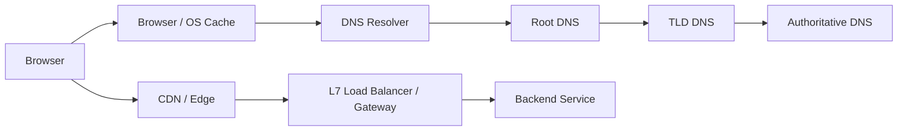

# Networking Fundamentals for Backend Engineers

> Primary fit: `Shared core`

You do not need to be a network engineer, but understanding how traffic moves from a user's browser to your server is critical in backend and system-design work. Here is a high-level refresher of the concepts you probably have not revisited in a while.

---

## 0. The Network Layer Model (TCP/IP)

Networks are organized in layers, each with a specific job. Each layer hands off to the
one below it. You don't need to memorize all 7 OSI layers — know the 4-layer TCP/IP model,
because "Layer 4" and "Layer 7" are constantly referenced in load balancing, firewalls,
and API design.

```
┌─────────────────────────────────────────────────────────────────┐
│  Layer 4 — Application   │ HTTP, HTTPS, WebSocket, gRPC, DNS    │
│  (what your app speaks)  │                                      │
├─────────────────────────────────────────────────────────────────┤
│  Layer 3 — Transport     │ TCP, UDP                             │
│  (how data flows)        │ Adds ports, reliability, ordering    │
├─────────────────────────────────────────────────────────────────┤
│  Layer 2 — Internet      │ IP (IPv4, IPv6)                      │
│  (where to send it)      │ Adds source & destination IP address │
├─────────────────────────────────────────────────────────────────┤
│  Layer 1 — Network       │ Ethernet, Wi-Fi, fiber optic cable   │
│  (how bits move)         │ Adds MAC address, physical signal    │
└─────────────────────────────────────────────────────────────────┘
```

**Why this matters in practice:**
- "Layer 4 Load Balancer" = looks at IP + port only (TCP/UDP level). Fast, no content
  inspection. Good when every backend instance can handle the same traffic, for example
  spreading generic HTTPS traffic across identical app servers.
- "Layer 7 Load Balancer" = reads the HTTP headers and URL path (Application level).
  Slower but smart — can route `/api/orders` to one cluster and `/api/users` to another.
  Good when different routes need different backends, policies, or auth behavior.
- A firewall rule "block port 5432" = blocking at Layer 3/4 (IP + TCP port for Postgres).

**TCP/IP in one sentence:** Your HTTP request is wrapped in TCP (adds reliability), which
is wrapped in IP (adds addressing), which is wrapped in Ethernet (adds physical delivery).
Each layer unwraps one envelope on the receiving end.

---

## 1. The Journey of a Request: DNS & IP

When a user types `https://www.google.com` into their browser, the computer doesn't know where that is. It only understands IP addresses (like `142.250.190.46`).

**DNS (Domain Name System):** The phonebook of the internet.
1.  **Browser Cache:** The browser checks if it already knows the IP.
2.  **OS Cache:** The Operating System checks its local cache.
3.  **Resolver:** The OS asks a configured DNS Resolver (often your ISP, public DNS like `8.8.8.8`, or an organization-managed DNS resolver).
4.  **DNS Hierarchy:** If the resolver does not already know the answer, it queries the DNS hierarchy step by step:
    * Root servers: They do **not** know the final IP for `www.google.com`, and they do **not** serve the `.com` zone themselves. They know which name servers are responsible for the `.com` top-level domain, so they return a **referral**: "Ask the `.com` TLD servers next."
    * `.com` TLD servers: They do **not** normally know the final IP for `www.google.com` either. Their job is to know which authoritative name servers are responsible for domains under `.com`, so they return another **referral**: "For `google.com`, ask these authoritative name servers."
    * Authoritative name servers for `google.com`: These are the servers that hold the actual DNS records for that domain, such as `A`, `AAAA`, or `CNAME` records. This is the level that can finally answer: "The record for `www.google.com` is this."
5.  **Response:** The resolver returns the IP address to the OS, which returns it to the browser, and everyone may cache it for later.

Shortest mental model:

- root -> knows who serves the TLD
- TLD -> knows who serves the domain
- authoritative -> knows the actual record

Important clarification:

- this is **not** a broadcast to the whole internet asking "who knows this IP?"
- the client asks one resolver
- the resolver follows a known hierarchy of DNS servers until it gets the answer

Good short sentence:

> DNS resolution is hierarchical, not broadcast-based. The client usually asks one recursive resolver, and that resolver follows the chain from root to TLD to authoritative servers.

Practical tip: DNS resolution adds latency. That is why browsers cache IP addresses aggressively and why CDNs exist: to bring cacheable content and edge endpoints closer to the user.

Visual anchor:



### CDN in one minute

You do not need deep CDN knowledge for most backend work, but you should know why it exists.

- A `CDN` caches content at edge locations closer to users.
- This reduces latency and takes repetitive read traffic away from the origin servers.
- It is most useful for static assets like images, CSS, JavaScript, and sometimes public read-heavy responses that can be cached safely.
- Many CDNs also sit at the edge for TLS termination, `WAF` rules (`Web Application Firewall`, meaning HTTP-layer protection and filtering), and request filtering.

Simple example:

- without a CDN, product images for users in Europe may still come from an origin in Japan
- with a CDN, those images are served from a nearby edge cache most of the time

Good short sentence:

> A CDN helps by serving cacheable content closer to users, reducing origin load and improving global latency, especially for static assets and public read-heavy traffic.

---

## 2. TCP vs. UDP (Transport Layer)

Once the IP is known, data needs to be sent. How do we send it?

### TCP (Transmission Control Protocol)
*   **Concept:** Like a phone call. A connection is established first, both sides keep state about that connection, then they exchange data, and later the connection is closed.
*   **Key Feature:** TCP gives you a **reliable, ordered byte stream**. Lost packets are retransmitted, packets are reassembled in order, and the sender slows down when the network or receiver cannot keep up.
*   **The Handshake:** Before application data flows, TCP does a `3-way handshake` (`SYN` -> `SYN-ACK` -> `ACK`). The important point is not just the three packets. It is that both sides confirm reachability and agree the initial sequence numbers for the byte stream. This adds latency, but it is usually worth it for correctness-sensitive traffic.
*   **Cost:** More overhead, more connection state, and a bit more latency than UDP.
*   **Use Cases:** HTTP/HTTPS web traffic, database connections, file transfers, and anything where missing or reordered data is unacceptable.

Good short sentence:

> TCP is the normal choice when I need reliable ordered delivery and I do not want the application layer to rebuild retransmission and ordering logic itself.

### UDP (User Datagram Protocol)
*   **Concept:** Like sending independent short messages without opening a full call first. UDP is connectionless: each datagram is sent on its own and the transport layer does not track a stream state the way TCP does.
*   **Key Feature:** Lower overhead and lower latency. UDP does **not** guarantee delivery, ordering, or retransmission. If reliability is needed, the application or a higher-level protocol must add it.
*   **Cost:** Faster and lighter, but the application has to tolerate missing, duplicated, or out-of-order packets.
*   **Use Cases:** DNS lookups, video/audio streaming, multiplayer gaming, and protocols that prefer fresh data over perfect delivery.

Important nuance:

- UDP is not "better for speed" in every case
- it is better when the application can tolerate loss or wants to control reliability itself
- modern protocols like QUIC build reliability on top of UDP at a higher layer

Good short sentence:

> UDP keeps the transport simple and fast, but pushes delivery guarantees upward. I use it when low latency matters more than perfect delivery, or when the protocol implements its own reliability model.

Shortest comparison to remember:

- `TCP`: connection-oriented, reliable, ordered
- `UDP`: connectionless, lightweight, best-effort

Real-world mixed example:

- collaboration apps such as Microsoft Teams often use both
- `TCP` is a natural fit for web pages, login flows, chat APIs, and other traffic where reliable delivery matters more than shaving a little latency
- `UDP` is a better fit for live audio and video media, where low latency matters and the application can tolerate some packet loss better than retransmission delay

Good short sentence:

> Real systems often use both protocols. A collaboration app may use TCP for normal web
> and chat traffic, but prefer UDP for real-time voice or video because late packets are
> often less useful than missing packets.

---

## 3. HTTP — The Application Protocol

TCP gets data from A to B reliably. **HTTP** is the language spoken on top of TCP to
request and transfer web resources (HTML, JSON, images).

### Request / Response Structure

Every HTTP exchange is a request from a client and a response from a server.

**Request:**
``` 
GET /api/products/123 HTTP/1.1
Host: api.mystore.com
Authorization: Bearer eyJhbGci...
Accept: application/json
```
Three parts: **method + path + version** on line 1, then **headers**, then an optional
**body** (for POST/PUT/PATCH).

Smallest useful mental model for a request:

1. **request line**
   - method: `GET`, `POST`, `PUT`, `DELETE`
   - target: `/api/products/123`
   - HTTP version: `HTTP/1.1`
2. **headers**
   - metadata about the request
   - examples: `Host`, `Authorization`, `Accept`, `Content-Type`, `User-Agent`, `Cookie`, `Cache-Control`
3. **body**
   - optional payload
   - typical in `POST`, `PUT`, `PATCH`
   - often JSON in backend APIs

**Response:**
```
HTTP/1.1 200 OK
Content-Type: application/json
Cache-Control: max-age=60

{"id": 123, "name": "T-Shirt", "price": 2990}
```
Three parts: **status line**, **headers**, **body**.

Smallest useful mental model for a response:

1. **status line**
   - version + status code + reason phrase
2. **headers**
   - examples: `Content-Type`, `Cache-Control`, `Set-Cookie`, `Location`
3. **body**
   - the actual payload, if any

Small cache mental model:

- `Cache-Control: max-age=60` means the cached response can usually be reused for `60`
  seconds without going back to the origin.
- After that it becomes stale, so the client or proxy should revalidate or fetch again.
- This is why cache headers matter so much for APIs, CDNs, and browser performance.

### Why Headers Matter

Headers are where a lot of backend behavior really lives.

Examples:

- `Authorization`: credentials or token sent by the client
  - examples: `Bearer eyJhbGci...`, `Basic dXNlcjpwYXNz`
- `Content-Type`: format of the request body, for example `application/json`
  - examples: `application/json`, `application/xml`, `multipart/form-data`
- `Accept`: what response format the client wants
  - examples: `application/json`, `text/html`, `application/json, application/xml`
- `Cookie`: browser session state sent back to the server
  - examples: `session=abc123`, `cart_id=xyz789`
- `Cache-Control`: caching rules
  - examples: `max-age=60`, `no-cache`, `no-store`, `public`, `private`
- `Idempotency-Key`: a client-generated key that tells the server repeated `POST`
  attempts are the same business operation, not a new one
  - example: `550e8400-e29b-41d4-a716-446655440000`
- custom headers like `X-Project-Id`, `X-Tenant-Id`, or tracing headers can carry routing,
  tenant, or correlation context
  - examples: `X-Project-Id: p-123`, `X-Tenant-Id: tenant-a`, `X-Request-Id: req-456`

Good short sentence:

> The method and path tell me what operation is being requested, but headers often decide auth, caching, content negotiation, and retry behavior.

Important nuance:

- custom headers can influence behavior, for example selecting a project scope or tenant
- but if they affect authorization, the backend must validate them against the authenticated
  user or token claims, not trust the header blindly
- this is why the same endpoint may behave differently depending on headers, while still
  enforcing server-side checks

### Authentication Headers: The Basics

You do not need to memorize every auth scheme here, but you should recognize the common shapes.

Examples:

- `Authorization: Basic <base64>`  
  username and password encoded, not encrypted; safe only over TLS
- `Authorization: Bearer <token>`  
  common for OAuth2 access tokens and JWT-based API access
- `Cookie: session=...`  
  common for browser session-based authentication

Practical rule:

- browser apps often use secure cookies or session-based auth
- APIs and mobile clients often use bearer tokens
- the transport is still HTTP either way; auth is mostly expressed through headers or cookies

### HTTP Methods

| Method | Safe? | Idempotent? | Typical use |
|---|---|---|---|
| `GET` | Yes | Yes | Read a resource. Never modifies state. |
| `POST` | No | No | Create a new resource. Retrying may duplicate. |
| `PUT` | No | Yes | Replace a resource entirely. Retrying is safe (same result). |
| `PATCH` | No | No* | Partial update. Idempotent only if designed carefully. |
| `DELETE` | No | Yes | Delete a resource. Second call returns 404 — same outcome. |

- **Safe** = does not modify server state (read-only).
- **Idempotent** = calling N times has the same effect as calling once. Important for
  retry logic: naturally idempotent methods are the easiest to retry automatically,
  but some `POST` operations can also be retried safely if the application uses an
  idempotency key.

Practical question: can a `POST` be idempotent?

- not by default; `POST` usually creates a new resource or triggers a new side effect
- but a `POST` can be made retry-safe by design
- the client sends the same `Idempotency-Key` for the same business operation, for
  example one payment attempt
- the server stores the key with the original request fingerprint and the result
- if the same key comes back with the same request, the server returns the same outcome
  instead of creating a second charge or order
- if the same key comes back with a different payload, the server should reject it,
  because that key already identifies another operation

Why this matters:

- after a timeout or brief network failure, the client may not know whether the first
  attempt succeeded
- retrying without idempotency protection can turn a transport-level retry into a
  duplicate business effect

Good short sentence:

> `POST` is not naturally idempotent, but I can make it retry-safe with an
> `Idempotency-Key` so repeated attempts map to the same business operation instead of
> creating duplicate side effects.

If you want the deeper version, see `../databases/01-idempotency-and-transaction-safety.md`.

### HTTP Status Codes

You must know the ranges and the key individual codes cold.

| Range | Meaning | Key examples |
|---|---|---|
| **2xx** | Success | 200 OK, 201 Created, 204 No Content |
| **3xx** | Redirect | 301 Moved Permanently, 302 Found (temporary), 304 Not Modified (cached) |
| **4xx** | Client error | 400 Bad Request, 401 Unauthorized, 403 Forbidden, 404 Not Found, 409 Conflict, 422 Unprocessable Entity, 429 Too Many Requests |
| **5xx** | Server error | 500 Internal Server Error, 502 Bad Gateway, 503 Service Unavailable, 504 Gateway Timeout |

**Distinctions that matter:**
- `401` vs `403`: 401 = "who are you?" (not authenticated). 403 = "I know who you are,
  you just don't have permission" (not authorized).
- `502` vs `503`: 502 = the upstream service (the backend behind the proxy or gateway) returned an invalid response (proxy error).
  503 = the service is intentionally refusing traffic (overloaded, deploying).
- `404` vs `410`: 404 = "not found" (may exist later). 410 = "Gone" (permanently deleted,
  stop asking).
- `422` = the request was well-formed JSON but the content failed validation (preferred
  over 400 for semantic validation errors in REST APIs).

### Rate Limits and Traffic Protection

This is worth knowing because it appears often in system design and API work.

Rate limiting is usually **not** described as a TCP or DNS concern.
It is usually an **HTTP / API gateway / application-layer** concern.

The basic idea:

- control how many requests a client can make in a time window
- protect the system from abuse, overload, or accidental retry storms
- keep one noisy client from degrading everyone else

Common rate-limit keys:

- IP address
- authenticated user ID
- API key
- tenant or merchant ID

Common practical shapes:

- `100 requests per minute per user`
- stricter limits on login, OTP, checkout, or expensive search endpoints
- different limits for public traffic vs internal or premium clients

What to recognize in HTTP:

- `429 Too Many Requests`
- optional `Retry-After` header to tell the client when to retry

Practical question: how should a client handle `429`?

- do not retry immediately; that often makes the rate-limit problem worse
- if `Retry-After` is present, wait that long
- otherwise use bounded exponential backoff with jitter
- if the request creates side effects, for example a payment `POST`, retry later with
  the same `Idempotency-Key`
- `429` usually means "slow down and try later", not "the business request is invalid"

Where it usually lives:

- API gateway or L7 load balancer for broad protection
- application layer when the limit depends on business identity or domain rules

Small implementation mental model:

- pick a key such as `user_id`, `api_key`, or `IP`
- store request counts in a fast store such as Redis
- for each request, increment the counter for the current window
- if the counter is above the limit, reject with `429 Too Many Requests`
- otherwise allow the request and let the counter expire automatically at the end of the window

You do not need to go deep into algorithms here, but you should recognize the names:

- fixed window
- sliding window
- token bucket

Good short sentence:

> I usually treat rate limiting as an application or gateway policy at Layer 7. The key questions are what identity I am limiting on, how strict the window is, and whether I return `429` with a retry hint.

### HTTP Evolution

| Version | Key change | Problem solved |
|---|---|---|
| **HTTP/1.0** | One TCP connection per request. | Simple but slow — every request pays TCP + TLS handshake cost. |
| **HTTP/1.1** | Persistent connections (keep-alive). Pipelining (send multiple requests without waiting). | Reduced handshake overhead, but **Head-of-Line blocking**: a slow response blocks all pipelined requests behind it. |
| **HTTP/2** | Multiplexing over a single TCP connection. Binary protocol. HPACK header compression. | Eliminates HOL blocking at the HTTP level and usually improves efficiency when many resources share one connection. gRPC is built on HTTP/2. |
| **HTTP/3** | Replaces TCP with **QUIC** (UDP + built-in reliability). | Eliminates HOL blocking at the transport level too. Faster on lossy mobile networks. Still gaining adoption. |

**Practical tip:** "We enable HTTP/2 at the ALB. Internal services can use HTTP/1.1 or
HTTP/2 independently — TLS termination happens at the load balancer so internal traffic
doesn't pay TLS overhead twice."

### WebSockets

HTTP is inherently request-response: the client always initiates. For real-time
bidirectional communication (live chat, collaborative editing, live dashboards), HTTP is
awkward — you'd have to poll.

**WebSocket** upgrades an HTTP/1.1 connection to a full-duplex persistent connection.

Small connection mental model:

- first the client opens a normal TCP connection
- if the endpoint is secure (`wss://`), TLS is established first
- then the client sends an HTTP upgrade request asking to switch protocols
- if the server accepts, it returns `101 Switching Protocols`
- after that, both sides speak WebSocket frames over the same long-lived connection

```
Client: GET /ws HTTP/1.1
        Upgrade: websocket
        Connection: Upgrade

Server: HTTP/1.1 101 Switching Protocols
        Upgrade: websocket
```

After the 101 handshake, both sides can send frames at any time without a request.
The connection stays open until one side closes it.

**Use cases:** Live order status updates, collaborative documents, real-time dashboards,
multiplayer games.

**SSE vs WebSocket:**
- **SSE (Server-Sent Events):** Server → client only. Simpler (plain HTTP, no upgrade),
  auto-reconnect built in. Good for notifications, live feeds.
- **WebSocket:** Bidirectional. Needed when the client also sends data in real time
  (chat, collaboration).

---

## 4. Security: TLS/SSL Handshake

HTTP is plain text. Anyone on the Wi-Fi network can read the passwords you send over HTTP.
**HTTPS = HTTP + TLS (Transport Layer Security).**

How does TLS work at a high level? It authenticates the server and establishes shared session keys so later traffic can use fast symmetric encryption.
1.  **Client Hello:** The browser says "I want to connect securely."
2.  **Server Hello & Certificate:** The server replies with its certificate and key-exchange parameters.
3.  **Verification:** The browser verifies the Certificate with a trusted Certificate Authority (CA) to ensure the server isn't an imposter.
4.  **Key Exchange:** Client and server perform a key exchange to derive shared session keys. In modern TLS this is usually done with ephemeral key exchange such as ECDHE, not simply by encrypting a random string with the server's public key.
5.  **Secure Connection:** Once the handshake finishes, both sides use the derived symmetric session keys to encrypt application traffic efficiently.

Good enough mental model:

- certificate proves who the server is
- key exchange establishes shared session keys
- symmetric encryption protects the actual HTTP traffic efficiently

Practical tip: TLS handshakes are computationally expensive. That is why teams often do **TLS Termination** at the load balancer, so the client speaks `HTTPS` to the load balancer, and the load balancer forwards the request internally over plain `HTTP` or over private internal TLS depending on the trust boundary.

### TLS Termination in one minute

`TLS termination` means the TLS session ends at the load balancer or gateway.

In practice:

1. the client connects with `HTTPS`
2. the load balancer presents the certificate and completes the TLS handshake
3. the load balancer decrypts the HTTP request
4. it then forwards that request to the backend

After that, teams usually choose one of two shapes:

- **plain internal HTTP:** common inside one trusted private network or VPC, when simplicity and lower overhead matter more than end-to-end encryption
- **internal TLS or mTLS:** common when compliance, zero-trust posture, cross-network traffic, or stronger service identity is required. `mTLS` means `mutual TLS`: both sides present certificates, not only the server.

So yes, your mental model is right:

- `HTTPS` from client to the edge
- then `HTTP` internally, or `HTTPS/mTLS` internally if the trust boundary requires it

Visual anchor:


---

## 5. Load Balancing: Layer 4 vs. Layer 7

A Load Balancer distributes incoming traffic across multiple backend servers to ensure no single server is overwhelmed.

### Layer 4 (Network Load Balancing)
*   Operates at the Transport Layer (TCP/UDP).
*   **How it works:** It only looks at the IP address and the Port. It doesn't look at the HTTP request contents. It just forwards the raw network packets based on algorithms like Round Robin or Least Connections.
    * `Round Robin` = send request 1 to server A, request 2 to server B, request 3 to server C, then start again.
    * `Least Connections` = send the next request to the backend that currently has the fewest active connections.
*   **Speed:** Extremely fast (hardware-level speed).
*   **Example use case:** Put a TCP load balancer in front of multiple identical app instances or database proxies when every backend can handle the same traffic. A typical product example is generic HTTPS traffic being spread across the same Spring Boot service replicas. AWS Network Load Balancer (NLB) is a common example.

### Layer 7 (Application Load Balancing)
*   Operates at the Application Layer (HTTP/HTTPS).
*   **How it works:** It unencrypts the TLS (TLS Termination) and actually *reads* the HTTP headers and URL path.
*   **Smart Routing:** Because it reads the HTTP request, it can say: "Oh, the URL is `/api/billing`? I will route this specifically to the Billing Microservices Cluster. If it is `/api/images`, I route it to the Image Cluster."
*   **Speed:** Slower than L4 (because it has to unpack and inspect strings), but infinitely more flexible.
*   **Example use case:** Put an L7 gateway in front of different backend domains when one public entry point must route `/ecosystem/*` to one system and `/omnichannel/*` to another, or apply different auth and rate-limit policies per route. AWS Application Load Balancer (ALB), Nginx, and HAProxy commonly play this role.

Important clarification:

- `L7` describes **what it can inspect and decide on**: HTTP host, path, headers, cookies, auth context
- an `API Gateway` is usually an L7 component because it reads the HTTP request and applies routing, auth, rate limits, or policy
- so even if it feels more like a router than a balancer, it is still doing L7 work as soon as it makes decisions based on HTTP-level data

**Practical summary:** "In our architecture, we use an L7 Application Load Balancer as an API Gateway to handle TLS termination, rate limiting, and path-based routing to our internal Spring Boot microservices."

---

## 6. HTTP/2 — Multiplexing in Depth

HTTP/1.0 often opened one TCP connection per request. HTTP/1.1 improved this with persistent connections (`keep-alive`), so multiple requests can reuse the same TCP connection. The remaining problem is that HTTP/1.1 still does not multiplex requests and responses cleanly the way HTTP/2 does.

**HTTP/2 key improvements:**
- **Multiplexing:** Multiple requests and responses flow concurrently over a **single** TCP connection. No per-request handshake cost.
- **Binary protocol:** HTTP/1.1 is human-readable text (slow to parse). HTTP/2 is binary (fast).
- **Header compression (HPACK):** Repeated headers (`Authorization`, `Content-Type`) are compressed across requests in the same connection.

**What it means for backend engineers:**
- gRPC is built on HTTP/2 — multiplexing is how it achieves high-throughput streaming.
- TLS Termination at the Load Balancer means internal services can use HTTP/1.1 or HTTP/2 independently.

Good short sentence:

> HTTP/2 does not mainly matter because it is "newer." It matters because multiplexing reduces connection overhead and improves how many concurrent requests one connection can carry.

---

## 7. gRPC — High-Performance Service-to-Service Communication

gRPC is a communication framework built on HTTP/2. It is most useful when **both sides are under your control**, for example service-to-service calls inside your backend platform. Where REST usually uses JSON, gRPC uses **Protocol Buffers (Protobuf)** — a binary, schema-first serialization format.

Why it is often used for internal microservices:

- internal services care more about efficiency, strict contracts, and typed clients than browser friendliness
- Protobuf payloads are smaller than JSON and cheaper to parse
- the `.proto` file becomes a shared contract, which reduces drift between teams
- HTTP/2 supports multiplexing and streaming cleanly over long-lived connections

Simple mental model for how it works:

1. define the contract in a `.proto` file
2. generate typed client and server code from that contract
3. the client opens an HTTP/2 connection to the target service
4. requests and responses are serialized as Protobuf messages instead of JSON
5. both sides evolve against the shared schema rather than hand-written payload parsing

Concrete example:

- an `OrderService` needs fresh stock before confirming checkout
- instead of calling `GET /inventory/sku-123` over REST and parsing JSON, it calls `InventoryService.GetStock(...)` through a generated gRPC client
- inside a private network or VPC, that gives a strict typed contract and low-overhead internal communication

Important nuance:

- this is not only for "microservices pure and hard"
- it also fits internal platform services such as auth, permissions, feature flags, pricing, or recommendation services, as long as both sides are controlled by your organisation
- for public browser-facing APIs, REST or GraphQL usually stays simpler because gRPC is not browser-native without extra proxying

**The contract (`.proto` file — the single source of truth):**
```protobuf
service InventoryService {
  rpc GetStock (StockRequest) returns (StockResponse);
  rpc WatchStock (StockRequest) returns (stream StockEvent);  // server streaming
}
message StockRequest  { string sku = 1; }
message StockResponse { string sku = 1; int32 qty = 2; }
message StockEvent    { string sku = 1; int32 new_qty = 2; string timestamp = 3; }
```
Both client and server generate type-safe code from this file. No manual JSON serialization.

**REST vs gRPC — when to use each:**

| | REST + JSON | gRPC + Protobuf |
|---|---|---|
| Payload size | Large (verbose) | Small (~3–10x smaller) |
| Browser support | Native | Needs gRPC-Web proxy |
| Schema enforcement | Optional (OpenAPI) | Required (.proto) |
| Streaming | SSE / WebSocket | Built-in (4 modes) |
| Best for | Public APIs, browsers | Internal microservices, IoT |

**4 communication modes:**
1. **Unary** — one request, one response
   - example: `OrderService` asks `InventoryService` for the stock of one SKU before checkout
2. **Server streaming** — one request, stream of responses
   - example: a dashboard subscribes to a stream of stock updates or audit events after one initial request
3. **Client streaming** — stream of requests, one response
   - example: a client uploads many telemetry records or many order lines, and the server replies once with a summary
4. **Bidirectional streaming** — both sides stream concurrently
   - example: a real-time collaboration, market data, or command-and-event channel where both client and server keep sending updates over the same connection

**Practical framing:**
"For internal service-to-service calls where both sides are under our control, gRPC is a
strong choice — Protobuf serialization is 5–10x smaller than JSON, HTTP/2 multiplexing
handles concurrent calls better, and the `.proto` contract gives us compile-time safety.
For public-facing APIs consumed by browsers or mobile, I keep REST or GraphQL — gRPC is
not browser-native without a proxy layer."

### Where This Fits In Your Real Projects

#### Omnichannel backend

Current fit:

- today this is a single Kotlin/Spring MVC service behind a gateway
- the public edge already fits normal `HTTP/REST`
- changing the gateway-to-backend hop to `gRPC` now would add complexity without much architectural payoff

Where `gRPC` would make sense later:

- if the backend is split into separate internal services such as `Inventory`, `Order`, `Catalog`, or `Pricing`
- if a gateway or `BFF` (`Backend For Frontend`) has to call several internal services to answer one frontend request
- if you want typed internal contracts without exposing that protocol publicly

Practical implementation direction:

- keep public traffic as `REST`
- add internal `gRPC` only behind the gateway
- let the gateway aggregate those internal calls and return one HTTP response outward

#### Ecosystem simulation

Current fit:

- today the system already uses `REST` for point reads and `SSE` for one-way real-time updates
- that is a strong match for browser dashboards and a shared gateway setup
- replacing those client-facing flows with `gRPC` would be harder to justify because browser support is worse and the main need is server-to-client streaming

Where `gRPC` would make sense later:

- if the backend is split into internal telemetry, analytics, fleet, auth, or policy services
- if a gateway or another internal service needs typed high-throughput calls to the telemetry engine
- if native internal clients need gRPC server streaming in addition to the existing browser-facing SSE flow

Short rule:

> In both projects, keep `REST` and `SSE` at the public edge. Consider `gRPC` only behind the gateway once there are enough internal service boundaries to justify it.
