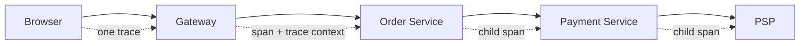

# Distributed Tracing for Backend Engineers

> Primary fit: `Shared core / Payments / Fintech`

Distributed tracing matters when one request crosses multiple services, queues,
or external providers and you need to know where the time or failure really was.

This note is the tracing-specific companion to the broader observability docs:

- [../devops/03-observability-and-monitoring.md](../devops/03-observability-and-monitoring.md)

---

## 1. What Distributed Tracing Actually Solves

Metrics tell you there is a latency spike.
Logs tell you what one service said.
Tracing tells you how one request moved across the whole system.

Smallest example:

- browser calls gateway
- gateway calls order service
- order service calls payment service
- payment service calls a `PSP` (`Payment Service Provider`, for example Stripe or Adyen)
- total request takes 2 seconds

Tracing answers:

- which service call consumed the time
- which dependency failed
- whether the problem was sequential or parallel

Short rule:

> tracing shows one request moving through the whole system

Visual anchor:



---

## 2. The Smallest Mental Model

### Trace

One end-to-end request journey.

### Span

One unit of work inside that journey.

### Passing the trace context along

The trace metadata must travel to the next service or provider call, otherwise the trace breaks.

Smallest example:

```text
trace abc-123
  gateway span
    order-service span
      payment-service span
        PSP call span
```

Important rule:

- one request -> one trace
- each service call or DB call -> one or more spans
- if the context is not passed along -> no usable distributed trace

Pros:

- makes latency and failure boundaries visible across services
- much easier root-cause analysis for distributed requests

Tradeoffs / Cons:

- every service has to pass the context along correctly
- tracing data volume and cardinality need active control

`Cardinality` here means how many unique values you create in tags or attributes.
If every trace carries too many unique values, tracing becomes expensive and noisy very quickly.

---

## 3. How It Works Over HTTP

The trace context is sent in request headers.
The modern standard is W3C Trace Context.

Example:

```text
traceparent: 00-4bf92f3577b34da6a3ce929d0e0e4736-00f067aa0ba902b7-01
```

You do not need to memorize the fields.
You do need to know what it means:

- the next service in the chain receives the trace context
- it creates a child span
- it forwards updated context to the next hop

That is how the trace tree is reconstructed later.

---

## 4. OpenTelemetry

OpenTelemetry is the default modern instrumentation model.

Smallest architecture:

```text
service -> OpenTelemetry instrumentation -> collector/exporter -> tracing backend
```

Why it matters:

- vendor-neutral instrumentation
- standard propagation
- easier backend switching

Good short line:

> I prefer OpenTelemetry-style instrumentation so traces, metrics, and trace context all
> follow one standard model instead of each tool doing its own thing.

Pros:

- standard propagation model
- easier to switch or combine backends

Tradeoffs / Cons:

- still requires instrumentation effort and operational setup
- tracing value stays limited if logs and metrics are weak

---

## 5. Minimal Spring Boot Shape

Spring Boot 3 with Micrometer tracing can auto-instrument a lot of the common flow.

```kotlin
implementation("io.micrometer:micrometer-tracing-bridge-otel")
implementation("io.opentelemetry:opentelemetry-exporter-otlp")
```

```yaml
management:
  tracing:
    sampling:
      probability: 1.0
  otlp:
    tracing:
      endpoint: http://localhost:4318/v1/traces

spring:
  application:
    name: order-service
```

Typical auto-instrumented boundaries:

- incoming HTTP requests
- outgoing HTTP clients
- database spans depending on integration
- message broker boundaries when configured

### Manual span for business context

```kotlin
val span = tracer.nextSpan().name("checkout.process").start()
try {
    span.tag("order.id", orderId)
    span.tag("cart.item_count", cart.items.size.toString())
    val paymentResult = paymentClient.charge(cart.total)
    span.tag("payment.status", paymentResult.status)
} finally {
    span.end()
}
```

That is useful when the default infrastructure spans are not enough and you want a clear
business operation boundary.

---

## 6. Async Boundaries: Kafka And Events

HTTP is the simpler case because headers can carry the trace context directly.
Async boundaries need you to copy that context into message headers yourself.

Smallest example:

- order service publishes `OrderCreated`
- inventory consumer handles the event later
- you still want both sides to appear in the same end-to-end trace

That means:

- inject trace context into message headers on publish
- extract it on consume
- continue with a child span

Short rule:

> tracing gets weaker at async boundaries unless you propagate context deliberately

---

## 7. What Tracing Looks Like In Real Systems

### Payment flow with an external provider

- API request span
- payment-service span
- PSP call span
- webhook or async confirmation span later

Tracing helps answer:

- was the delay inside our service or in the provider call?
- did the async confirmation arrive late or did our consumer lag?

### Checkout or stock flow

- gateway span
- order span
- inventory span
- pricing span
- partner or core-system span

Tracing helps answer:

- which service call is slow
- whether one dependency or one branch of the flow is dominating latency

---

## 8. The Big Traps

1. **Thinking traces replace logs or metrics**
   They do not. They complement them.

2. **No trace context across service boundaries**
   Then each service shows its own isolated trace and you lose the end-to-end view.

3. **Tracing only technical spans and no business step**
   You see HTTP calls but not the actual operation being explained.

4. **Too many unique tags**
   Avoid tagging every possible dynamic field or tracing becomes noisy and expensive.

5. **No correlation from trace to logs**
   Then traces show where time went but logs are still hard to inspect.

---

## 9. Practical Diagnosis Scenario

Question:

> A customer reports checkout took 8 seconds. How do you debug it?

Answer shape:

1. check p95/p99 latency metrics first
2. open a representative trace for the slow checkout path
3. identify the slow span
4. jump to logs with the trace ID
5. confirm whether the issue is internal, in a dependency, or specific to that business flow

---

## 10. Practical Summary

Good short answer:

> Distributed tracing lets me follow one request across services and see where the time
> went or where the failure happened. I think in terms of trace, span, and passing the
> trace context along, and I use tracing together with logs and metrics rather than as a
> replacement for them.
