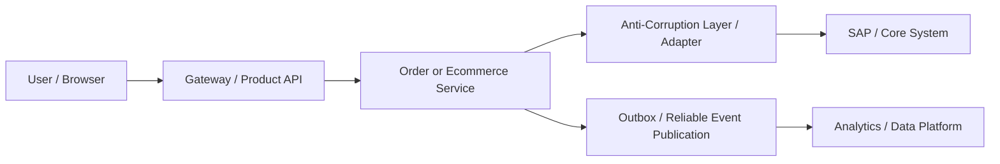

# Enterprise Integration Patterns

> Primary fit: `Retail / Ecommerce / Payments / Fintech`

You do not need to be an SAP specialist.
You do need a clean explanation of how the service behind the website or app
talks to SAP, batch jobs, and analytics systems without turning your own model
into a copy of the enterprise platform.

This pattern is useful any time a modern backend depends on older or company-wide systems.

---

## 1. What Problem Enterprise Integration Actually Creates

The challenge is not "how do I call SAP".
The real challenge is this:

- the service behind the website or app has one domain model
- the core enterprise system has another
- both need to exchange data safely
- but you do not want your service to become shaped around the `ERP` (`Enterprise Resource Planning`) system's model

Smallest example:

- ecommerce order service confirms an order
- finance or fulfillment master data lives in SAP
- analytics also needs the event
- you need to pass that update on safely without making checkout wait for every later system

Short rule:

> integrate with core systems through explicit boundaries, not through model leakage

Visual anchor:



---

## 2. Anti-Corruption Layer

### What it is

An anti-corruption layer (`ACL`) translates between your service model and the external system model.

### What problem it solves

Without a boundary layer, SAP field names, payload shapes, and workflow rules leak directly
into your service code and make it harder to keep your own domain clean.

### Smallest example

- internal service uses `Order`, `Reservation`, `StoreLocation`
- SAP payload expects different identifiers, fields, and status codes
- the `ACL` maps one model into the other instead of letting SAP objects flow everywhere

### Real implementation

```kotlin
data class Order(
    val id: String,
    val storeId: String,
    val totalAmount: BigDecimal,
)

data class SapSalesOrderPayload(
    val salesOrderId: String,
    val siteCode: String,
    val grossAmount: BigDecimal,
)

fun toSapPayload(order: Order): SapSalesOrderPayload =
    SapSalesOrderPayload(
        salesOrderId = order.id,
        siteCode = order.storeId,
        grossAmount = order.totalAmount,
    )
```

That is the core idea of the `ACL`:

- your service keeps its own domain model
- the adapter translates to the external model at the boundary
- SAP-shaped fields do not leak through the whole codebase

### Why it is related to DDD

This connects directly to `DDD` (`Domain-Driven Design`).

- `DDD` gives you the `Bounded Context`: your domain keeps its own language and model
- the `ACL` protects that boundary when an external system speaks a different language

Very short version:

> DDD gives you the boundary; the ACL helps you defend it.

### Where it fits

- ecommerce service talking to SAP S/4 or another enterprise core system
- payment or settlement service talking to core finance platform
- partner integrations with rigid legacy schemas

Pros:

- protects your internal domain language
- reduces direct coupling to legacy schemas

Tradeoffs / Cons:

- extra mapping code and boundary maintenance
- can feel like duplication if the boundary is still immature

### Practical summary

> I would put an anti-corruption layer between our service and SAP so the
> external model does not become the internal domain model by accident.

---

## 3. Batch vs Near-Real-Time Sync

### What this decision is really about

Not every integration needs to be synchronous or real-time.
Choose the sync model based on business urgency, not on taste.
`Near-real-time` here means "soon enough to affect current business decisions", not necessarily "every update in milliseconds".

### Batch fits when

- the flow is not user-blocking
- delay is acceptable
- the dataset is large
- the main need is processing a lot of data safely, and if the job fails halfway you want to resume instead of starting over

Examples:

- nightly finance reconciliation
- catalog enrichment jobs
- warehouse export files

### Near-real-time fits when

- later systems need the update soon
- the user experience gets worse quickly if the update arrives late
- being late creates a real business problem, such as showing the wrong stock, stale prices, or delayed order state

Examples:

- stock updates
- pricing changes
- order status updates

### Practical summary

> I separate batch from near-real-time sync explicitly. If the business does not need an
> immediate update, batch is often simpler and safer. If the data drives live user or
> business decisions, near-real-time updates are worth the complexity.

Pros:

- clearer business-aligned sync choice
- avoids unnecessary real-time complexity

Tradeoffs / Cons:

- batch adds lag
- near-real-time adds system and correctness complexity

---

## 4. Outbox Instead Of Fragile Dual Write

If your service writes to its own database and then also needs to notify SAP or another
platform, the first straightforward version many teams write is:

1. commit local DB write
2. send another update somewhere else

That is a dual write problem.

An `outbox` is a local database table or durable record where your service stores the
"this change happened" event in the same transaction as the business write.

Safer shape:

1. commit local business change
2. store an outbox record in the same local transaction
3. publish asynchronously from the outbox

Why it matters:

- local correctness stays atomic
- later updates to other systems can retry safely
- checkout does not wait for a request to go to the enterprise core system and come back before answering the user

Good short line:

> I do not want a user-facing write path to depend on a second fragile write into a core
> platform. I would prefer a local transaction plus outbox publication.

---

## 5. Data Platform and ETL Boundaries

### What problem this solves

Production databases are for live application work.
Heavy reporting and analytics should not compete with checkout or order APIs.

### Safe mental model

- the main database handles the live reads and writes
- data pipelines extract data for analytics
- large analytics jobs should run on copied data, away from the live user request path

### Smallest example

- do not run massive analytical joins on the checkout database
- stream or copy the live data out
- transform it in the analytics platform instead

Typical tools:

- `CDC` (`Change Data Capture`), which means reading committed database changes and copying them into another system
- Debezium, which is a popular tool that reads database change logs and publishes those changes as events
- Kafka Connect
- S3 or Cloud Storage as a first place to drop exported data
- warehouse jobs in Snowflake, BigQuery, Spark, Flink, or similar

`ETL` means `Extract, Transform, Load`: copy data out, reshape it, and load it into another analytics system.

### Practical summary

> I keep analytical workloads off the live database path. If the business needs large
> reporting or `ML` (`machine learning`) data flows, I prefer copying committed changes
> out through `CDC` or scheduled export jobs instead of running heavy queries on
> the live production database.

---

## 6. Batch Services As A First-Class Pattern

### What batch solves

- large-volume processing
- the ability to resume safely after failure
- scheduled synchronization
- controlled parallelism, meaning you decide how many workers or chunks run at once

### Minimal example

- process one million catalog records
- handle them in chunks
- if the job fails at record 500,000, restart from there instead of from zero

### Real implementation

```kotlin
@Bean
fun catalogSyncStep(
    jobRepository: JobRepository,
    transactionManager: PlatformTransactionManager,
): Step =
    StepBuilder("catalogSyncStep", jobRepository)
        .chunk<CatalogRow, SapCatalogUpdate>(500, transactionManager)
        .reader(catalogReader())
        .processor(catalogProcessor())
        .writer(sapCatalogWriter())
        .build()
```

The exact framework can vary.
What matters in practice is that batch usually means:

- `chunked processing`: handle the data in manageable pieces instead of loading everything at once
- `restartability`: if the job fails halfway, resume from the last safe point instead of starting from zero
- `clear reprocessing boundary`: know exactly what to rerun, such as one file, one date range, or one chunk
- `isolation from the live user request path`: the job runs separately from the request that serves a customer right now

Typical implementation options:

- Spring Batch for Java/Kotlin applications
- Kubernetes Jobs or AWS Batch for execution environment

### Practical summary

> For large platform sync or reconciliation jobs, I treat batch as a first-class design
> choice. The key concerns are restartability, chunking, isolation from the live user path,
> and clear ownership of reprocessing.

---

## 7. AI And ML Boundaries For Backend Engineers

If `AI` or `GenAI` (`generative AI`) is mentioned, the backend question is usually not "train the model".
It is closer to:

- how do you serve it safely
- how do you feed it data
- how do you keep it from overloading the rest of the platform

Backend responsibilities usually include:

- serving API around the model
- rate limiting and auth
- caching
- feature retrieval
- observability

Short rule:

> the model may be built elsewhere, but the production interface around it is still a
> backend system design problem

---

## 8. Practical Use Cases

### Ecommerce service to SAP/core systems

- order confirmed in ecommerce service
- outbox event created locally
- adapter translates it into the SAP/core-system payload
- failures retry later, not while the customer is waiting

### Catalog or pricing updates

- if urgency is low -> batch sync
- if the business needs the change quickly -> near-real-time event or `CDC` path

### Analytics and global data platform

- copy live application data out
- transform elsewhere
- do not run heavy reporting on the live checkout or API database

---

## 8.5 Choice By Use Case

### SAP or core-system update after checkout

- anti-corruption layer (`ACL`): yes
- outbox: yes
- batch vs near-real-time: depends on business urgency
  Why: keep your own domain clean, commit locally first, then update other systems safely.

### Nightly finance reconciliation or large catalog sync

- batch: yes
- near-real-time: usually no
- fallback: not really the point
  Why: these jobs are large and restartable, and users are not waiting on them live.

### Stock update or price change that other systems need soon

- near-real-time: yes
- batch: maybe as a backup or later reconciliation
- outbox or `CDC`: useful
  Why: delay now has a real business cost, so the update should move faster than a nightly batch.

### Analytics or reporting

- copy data out: yes
- heavy queries on the live DB: no
- `ETL` / warehouse jobs: yes
  Why: reporting should not compete with checkout or order APIs for the same database resources.

---

## 9. The Big Traps

1. **Letting the enterprise schema leak into the service model**
   Example: product service uses SAP field names and status codes everywhere.

2. **Putting user-facing latency on top of core-platform round trips**
   Example: checkout waits synchronously for several updates into other enterprise systems.

3. **Treating every sync need as real-time**
   Example: nightly reporting data pushed through an unnecessarily complex real-time event flow.

4. **Running analytical workloads on the live production database**
   Example: reporting query harms checkout performance.

5. **Using direct dual writes across systems**
   Example: local order commit succeeds but external platform update fails with no safe recovery path.

---

## 10. Short Answer Shape

Good short answer:

> When our service integrates with SAP or another core platform, I want a
> clean boundary layer, an explicit choice between batch and near-real-time sync, and a
> reliable update pattern like an outbox instead of fragile dual writes. The goal is to
> protect the service's own domain model and stop the customer-facing request from waiting on slow enterprise systems.
