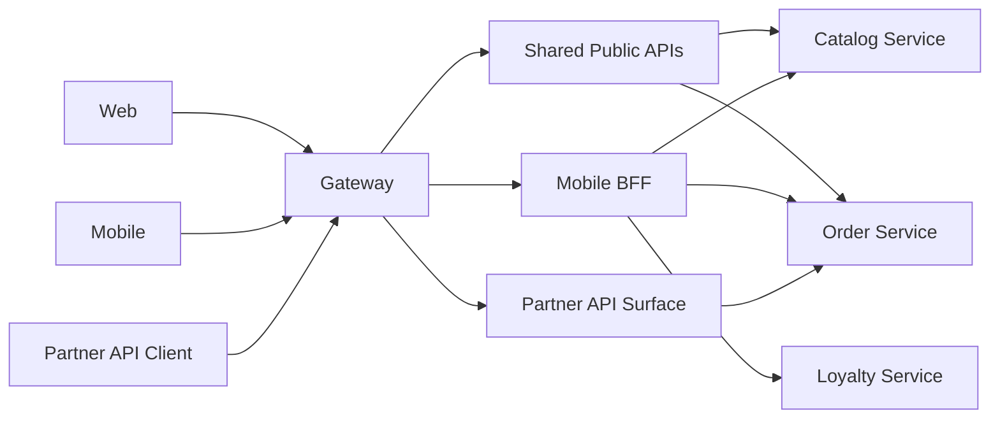

# Gateway vs BFF vs Edge Patterns

> Primary fit: `Shared core`

Use this topic when the discussion sounds like:

- do we need an API gateway here
- is this really a `BFF` (`Backend For Frontend`) problem
- is the load balancer already enough
- where should auth, rate limits, aggregation, and protocol translation live

This topic exists because teams often say `gateway` when they mean three
different things at once.

---

## Why This Matters

If you mix up edge components, you usually get one of these outcomes:

- too much client-specific logic shoved into a generic gateway
- a BFF added by default with no real client need
- a "microservices edge layer" that mostly hides weak service boundaries
- duplicated auth, routing, and throttling logic across services

This matters because edge design shapes latency, ownership, API contracts, and
security.

---

## Smallest Useful Mental Model

Use this map:

- **load balancer / reverse proxy**: route traffic to backend instances
- **API gateway**: one public entry point with shared edge concerns
- **BFF**: one backend layer shaped for one client experience
- **service mesh**: internal traffic policy and observability between services

Short rule:

> Gateway is mainly about shared edge policy. BFF is mainly about client-specific composition.

---

## Bad Mental Model vs Better Mental Model

Bad mental model:

- every distributed system should start with a gateway and a BFF
- the gateway should contain business composition logic for every client
- if a frontend needs one extra field, add another edge layer

Better mental model:

- start with the smallest edge that solves the real problem
- use a gateway for common public concerns such as routing, auth, TLS, and rate
  limits
- use a BFF only when clients genuinely diverge in payload, orchestration, or
  latency needs

Small concrete example:

- weak approach: web, mobile, and partner API all hit one gateway full of
  client-specific branching and response shaping
- better approach: gateway handles shared edge policy, while a mobile BFF exists
  only if mobile really needs different aggregation or latency behavior

---

## 1. The Components In Plain Language

### Load Balancer or Reverse Proxy

This is the basic traffic front door.

Typical jobs:

- terminate TLS
- forward traffic
- balance requests across instances
- do simple host or path routing

Good fit:

- one public backend
- one app replicated across many pods or instances
- simple path-based routing

This does not automatically make it a full API gateway architecture.

### API Gateway

An API gateway is a shared edge component for several APIs or backend domains.

Typical jobs:

- one public entry point
- route by path or host
- auth at the edge
- rate limiting or quotas
- request size limits
- CORS handling
- protocol translation in some platforms

Good fit:

- several backend services behind one public API surface
- shared auth and throttling rules
- public consumers or partner access
- a need to keep internal service topology hidden

### BFF

A BFF is a backend layer built for one client type such as:

- web storefront
- mobile app
- admin portal

Typical jobs:

- client-specific aggregation
- response shaping
- reducing frontend chattiness
- hiding internal orchestration from one client flow

Good fit:

- mobile wants compact payloads and fewer round trips
- admin web needs richer filters and audit fields
- third-party API needs stricter and more stable contracts than first-party UI

### Service Mesh

A service mesh is not your public API gateway.

Typical jobs:

- internal service-to-service traffic policy
- retries, mTLS, telemetry, and routing between services

Good fit:

- many internal services
- strong platform maturity
- real need for shared internal traffic controls

Do not use service mesh vocabulary to avoid making a simpler gateway or service
decision.

---

## 2. Gateway vs BFF

This is the confusion point worth remembering.

### Gateway asks:

- which backend should this request go to
- is this caller authenticated
- should this caller be throttled
- should this route even be exposed

### BFF asks:

- what does this client screen or app flow need
- how many internal calls should the client be spared from making
- what response shape best fits this one client type

Short version:

> Gateway protects and routes the edge. BFF adapts the backend experience for one client.

---

## 3. When A Plain Gateway Is Enough

Use a plain gateway or reverse proxy when:

- one frontend is talking to one main backend
- client payload needs are still similar
- the main problem is routing, auth, TLS, or rate limits
- aggregation logic is still small

Concrete example:

- React app and mobile app both use mostly the same order and account APIs
- edge needs JWT verification, path routing, and rate limiting
- payload differences are small enough to handle in normal APIs

Good decision:

- keep one shared gateway
- do not add a BFF yet

---

## 4. When A BFF Becomes Worth It

Use a BFF when:

- clients genuinely diverge
- one client suffers from too many round trips
- one client needs different aggregation or latency behavior
- frontend composition logic is leaking everywhere

Concrete example:

- mobile checkout needs order summary, coupon eligibility, delivery ETA, and
  loyalty points in one fast call
- admin backoffice needs detailed line items, audit trails, and operational
  flags
- partner API needs a slower-moving public contract

Good decision:

- keep shared edge concerns in the gateway
- add a mobile BFF only for the mobile-specific composition need

---

## 5. When Not To Add A BFF

Do not add a BFF when:

- there is only one client
- the backend is still a thin CRUD app
- the real problem is weak core service boundaries
- the BFF would mostly proxy requests unchanged

This is one of the highest-signal traps:

> If the BFF mainly exists to hide bad service boundaries, fix the boundaries first.

---

## 6. Where Auth, Rate Limits, And Validation Belong

### Edge auth

Good fit at gateway:

- token verification
- route protection
- coarse access policy

Still keep in backend:

- object-level authorization
- business authorization
- workflow state checks

Short rule:

> Gateway can reject obviously unauthorized traffic. The backend must still protect business actions.

### Rate limits

Good fit at gateway:

- public API quotas
- abusive caller throttling
- coarse route-based protection

Good fit in application:

- business identity limits
- workflow-specific throttles
- expensive action protection tied to domain state

### Validation

Good fit at edge:

- body size
- malformed transport constraints
- unsupported media types

Good fit in backend:

- business validation
- domain invariants
- workflow correctness

---

## 7. Common Real Shapes

### Shape A: One backend, one frontend

- reverse proxy or load balancer: yes
- full API gateway: maybe not
- BFF: no

Why:

- keep the edge simple

### Shape B: Several backend domains behind one public API

- gateway: yes
- BFF: maybe

Why:

- shared edge routing and auth are useful
- BFF depends on client divergence, not service count alone

### Shape C: Web, mobile, and partner API differ a lot

- gateway: yes
- BFF: likely yes for at least one client

Why:

- the public edge still needs shared policy
- at least one client probably needs custom composition or pacing

---

## 8. Concrete Example

Imagine:

- `Catalog Service`
- `Order Service`
- `Loyalty Service`
- `Notification Service`

Clients:

- web storefront
- mobile app
- partner API

Good shape:

Why this shape works:

- gateway handles shared public concerns
- web uses mostly shared APIs
- mobile gets one compact backend shape where needed
- partner contract stays separate from first-party UI concerns

---

## 9. Big Traps

1. **Putting business composition into the generic gateway**
   Example: gateway grows into an unowned application layer.

2. **Adding a BFF by default**
   Example: one extra hop with no real client-specific need.

3. **Treating gateway auth as full authorization**
   Example: token passes at edge, but backend never checks object ownership.

4. **Using a BFF to hide bad core service boundaries**
   Example: the edge layer compensates for chatty or badly split backend services.

5. **Confusing service mesh with public API gateway**
   Example: internal platform tooling is expected to solve client-facing API shape.

---

## 10. Practical Summary

Practical summary:

> I use a gateway when I need one public entry point with shared edge concerns such as routing, auth, TLS termination, and rate limits. I add a BFF only when one client type genuinely needs different aggregation, payload shape, or latency behavior. I do not use a BFF as a default architecture layer, and I do not rely on edge auth as a replacement for backend authorization.
