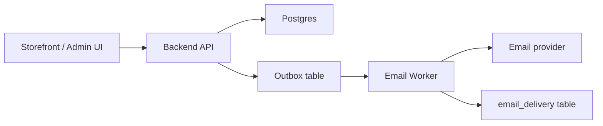
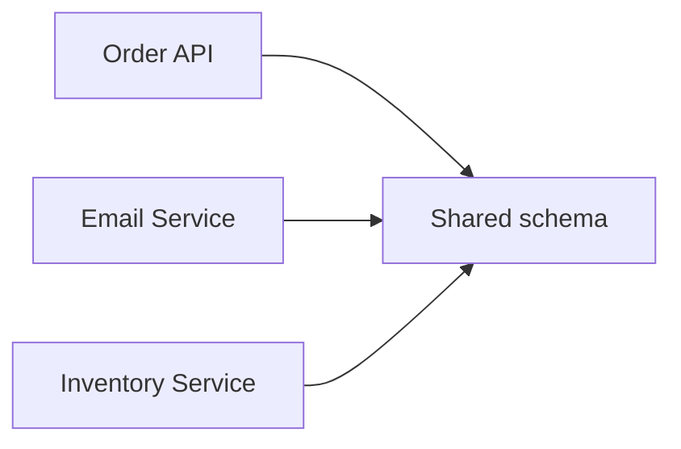

# Shared Database and Independent Deployments

> Primary fit: `Shared core`

Use this topic when the architecture discussion sounds like:

- can backend and email service deploy independently if they share the same database
- is this already microservices or still a modular monolith
- can we split deployables first and data ownership later
- is a shared schema an acceptable transition or already a bad boundary

This topic exists because many real systems live in the awkward middle, not at
the clean end of the spectrum.

---

## Why This Matters

Many architecture notes explain either:

- one monolith with one database
- clean microservices with one database per service

Real systems often look like this instead:

- one backend API
- one worker or email sender
- one admin app
- maybe one import job
- several deployables
- but still one shared Postgres schema

That shape can be practical for a while.
It can also become a distributed monolith if you pretend the data boundary
problem does not exist.

---

## Smallest Useful Mental Model

Separate these two questions:

- **deployment boundary**: what ships and scales independently
- **data ownership boundary**: who owns which data and schema changes

Short rule:

> Independent deployment does not automatically mean independent architecture.

If two deployables still need the same tables, the deployment split is real, but
the ownership split is weak.

---

## Bad Mental Model vs Better Mental Model

Bad mental model:

- if two processes deploy separately, we already have microservices
- sharing one schema is fine forever because it is simpler
- email service is a service boundary just because email is technical work

Better mental model:

- deployment split can be useful before full data split
- shared database can be an acceptable transition, but it preserves strong
  coupling
- service boundaries should follow ownership and business change, not just
  technical tasks

Small concrete example:

- weak approach: `Order API`, `Inventory API`, and `Email Service` are separate
  deployables, but all read and write the same schema freely
- better approach: keep one modular backend with one DB, or if you split
  deployables, make the write ownership explicit and reduce cross-table access

---

## 1. The Spectrum You Actually See In Real Systems

### Shape A: Modular monolith

- one deployable app
- one primary database
- internal modules

This is the cleanest early shape when boundaries still move.

### Shape B: Split deployables, shared database

- backend API
- background worker
- scheduler
- maybe notification sender
- still one shared database

This is common and not automatically wrong.

But it is not the same as clean microservices.

### Shape C: Independent services, database per service

- separate deployables
- separate data ownership
- explicit contracts or events between services

This is the stronger service boundary model.

---

## 2. When Shared Database Plus Separate Deployables Is Fine

This shape can be good when:

- one team still owns the whole capability
- the deploy split exists for runtime reasons, not domain-separation theater
- the worker is just asynchronous execution of the same domain
- one transaction model still matters more than service autonomy

Good examples:

- one checkout backend plus one async worker for email or PDF generation
- one Spring app plus one import processor using the same schema
- one web API plus one scheduled reconciliation job inside the same bounded context

In those cases, you often still have:

- one domain
- one team
- one source of truth
- one release story with a few separate runtime units

That is closer to:

- modular monolith with workers

Than to:

- true independent microservices

---

## 3. When It Becomes A Distributed Monolith Smell

This shape becomes a smell when:

- deployables claim independence but schema changes still require lockstep coordination
- several teams write the same tables
- one service reads another service's tables directly instead of using an API or event
- failures are harder to isolate but ownership is not actually cleaner

Concrete example:

- `Order Service` writes `orders`
- `Inventory Service` writes `inventory`
- both also join each other's tables directly for convenience
- schema change in either area breaks both deployables

That gives you:

- network complexity
- operational complexity
- shared data coupling

Without the real benefit of cleaner ownership.

---

## 4. Backend, Frontend, And Email Service: The Specific Cases

### Frontend and backend

A frontend being independently deployed does **not** mean it should share the
database.

Strong default:

- frontend talks to backend APIs
- frontend does not access business tables directly

That boundary is usually clear.

### Backend and email service

This depends on what `email service` really means.

#### Good shape

- backend writes business state
- backend stores an outbox event or job record
- email worker consumes that record and sends mail
- email worker may update delivery status in its own table or a narrow shared operational table

This is acceptable because the email worker is operationally separate but not
pretending to own core business data.

#### Weak shape

- email service directly queries many business tables and decides domain behavior
- email templates and send logic depend on hidden joins across order, payment,
  and inventory tables

That is a boundary smell.

The issue is not "email is technical".
The issue is:

- domain logic leaked into a sidecar process with weak ownership

---

## 5. Shared Schema vs Narrow Shared Operational Tables

This distinction matters a lot.

### Shared schema

Bad sign when:

- many deployables read and write many domain tables freely

Why it hurts:

- migration coordination stays high
- accidental coupling grows
- ownership gets blurry

### Narrow shared operational tables

Sometimes acceptable when:

- one worker consumes from `outbox_events`
- one scheduler claims jobs from `scheduled_jobs`
- one notification worker marks rows in `email_delivery`

Why this is different:

- those tables are explicit integration or operational boundaries
- they are not the whole business schema

Short rule:

> Sharing an outbox table is very different from sharing the whole domain model.

---

## 6. Transitional Architecture: When To Accept It

You can accept split deployables with shared DB as a transition when:

- you know it is transitional
- one team still owns the capability
- you are reducing one clear runtime pain first
- you are not pretending the data boundary problem is solved

Good reasons:

- background processing needs different scaling
- one long-running worker should not block API deploys
- operational isolation is useful before domain extraction is justified

Bad reasons:

- "microservices maturity"
- "we wanted more services on the diagram"
- "email should always be its own service"

---

## 7. Migration Path Toward Cleaner Boundaries

If you are in the awkward middle, use this progression:

1. make write ownership explicit
2. stop direct cross-domain table access where possible
3. introduce outbox or event publication for follow-up work
4. move read-side joins behind APIs, projections, or replicated views
5. extract the database boundary only when the domain ownership is real

That is usually stronger than:

1. split deployables quickly
2. keep shared schema forever
3. call it microservices

---

## 8. Concrete Example

Imagine:

- `Storefront API`
- `Email Worker`
- `Admin API`
- one Postgres database

### Better transitional shape

Why this is acceptable:

- backend still owns order and customer state
- worker handles async notification concern
- shared DB use is narrow and explicit

### Worse shape

Why this is weak:

- all deployables depend on the same domain tables
- migration timing is coupled
- data ownership is unclear

---

## 9. Decision Rules

- If several deployables still write the same domain tables, you do not have strong service boundaries yet.
- If a worker is part of the same domain and mainly processes outbox or jobs, shared DB can be acceptable.
- If a frontend is independently deployed, it should still use APIs rather than business tables.
- If you need separate deploys but still need one transactional source of truth, prefer a modular monolith plus workers over fake microservices.
- If you call something a microservice but it still requires shared-table coordination, treat it as a transitional shape, not a finished architecture.

---

## 10. Practical Summary

Good short answer:

> Separate deployables and separate data ownership are not the same decision. A backend plus worker can share one database safely for a while if one team still owns the domain and the shared tables are narrow and explicit, such as outbox or job records. But if several services freely share the same business schema, that is usually a distributed monolith, not clean microservices.
