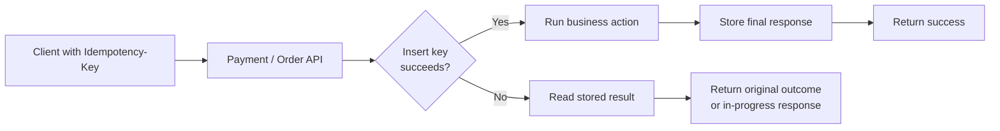

# Idempotency and Transaction Safety

> Primary fit: `Shared core / Payments / Fintech`

When a checkout, payment, order, or inventory request times out, retries are normal.
If the write path is not retry-safe, you can double-charge a customer, create the same
order twice, or apply the same stock change multiple times.

This note starts from the smallest possible idea of idempotency, then moves toward the
real implementation shape used in backend production systems.

Quick terms used here:

- `idempotency key` = a stable client or business request identifier used to recognize retries
- `durable` = persisted in storage that survives process restart
- `claim the key` = reserve that request identity so only the first valid execution may proceed

---

## Smallest Mental Model

Idempotency answers one question:

> what happens if the same request arrives again?

Transaction safety answers a different question:

> what happens if part of my local work succeeds and another part fails?

Strong systems often need both at the same time.

## Bad Mental Model vs Better Mental Model

Bad mental model:

- retries are mostly a client concern
- one transaction annotation makes duplicate effects unlikely enough
- deduplication can be added later without shaping the write path

Better mental model:

- retries are normal in distributed systems
- duplicate prevention needs explicit request identity plus durable state
- transaction safety and idempotency solve different failure shapes and often
  have to work together

Small concrete example:

- weak approach: retry `POST /payments` after timeout and hope the first attempt
  failed cleanly
- better approach: claim an idempotency key durably, store the attempt state,
  and return the existing result when the same logical request appears again

Strong default:

- if the flow can charge, reserve, create, publish, or mutate something
  important, assume retries will happen and design the write path around stable
  request identity from the start

Interview-ready takeaway:

> Idempotency is how I make retries safe: I give the business action a stable
> identity, claim it durably, and return or continue the same logical attempt
> instead of creating a second effect.

---

## 1. What Idempotency Actually Means

An operation is **idempotent** if repeating it does not change the final effect after
the first successful application.

Short version:

- "Do this again" leads to the same final state.
- Idempotent does **not** mean "same code path" or "same HTTP status every time".
- Idempotent usually means "same durable effect on the system".

Examples:

- `setActive(true)` is idempotent.
- `deleteUser(42)` is idempotent even if the second call finds nothing to delete.
- `incrementBalanceBy(10)` is **not** idempotent.
- `createPayment()` is usually **not** naturally idempotent.

Two common cases:

1. **Naturally idempotent operation**
   The operation directly sets the target state.
2. **Retry-safe non-idempotent operation**
   The business action is not naturally idempotent, so you make it retry-safe with a
   request identity, usually an idempotency key.

Important rule:

> If you want to deduplicate an external side effect, you need state somewhere.
> There is no stateless way to know that a previous request already changed the system.

`External side effect` means something like charging a card, creating an order,
reserving inventory, or publishing an event that another system will react to.

Another plain-English distinction that helps:

- `idempotency` answers: "what if the same request arrives again?"
- `transaction` answers: "what if part of my local work succeeds and another part fails?"

You often need both.

Pros:

- protects users from duplicate effects
- makes retries much safer
- improves correctness under timeout and network uncertainty

Tradeoffs / Cons:

- you need extra state and storage
- key design, uniqueness, and replay behaviour add complexity
- it does not remove the need for correct state transitions underneath

---

## 2. Smallest Possible Code Examples

### 2.1 Naturally idempotent

This is the cleanest form. The method defines the final state directly.

```kotlin
class SubscriptionService {
    private var subscribed = false

    fun subscribe() {
        subscribed = true // set final state directly
    }

    fun unsubscribe() {
        subscribed = false // set final state directly
    }

    fun toggle() {
        subscribed = !subscribed // flips state every time, so this is not idempotent
    }

    fun isSubscribed(): Boolean = subscribed
}
```

<details>
<summary>Java version</summary>

```java
public final class SubscriptionService {
    private boolean subscribed = false;

    public void subscribe() {
        subscribed = true; // set final state directly
    }

    public void unsubscribe() {
        subscribed = false; // set final state directly
    }

    public void toggle() {
        subscribed = !subscribed; // flips state every time, so this is not idempotent
    }

    public boolean isSubscribed() {
        return subscribed;
    }
}
```

</details>

Why this matters:

- `subscribe()` is idempotent. Calling it once or five times leaves `subscribed = true`.
- `unsubscribe()` is idempotent for the same reason.
- `toggle()` is not idempotent because every call changes the state again.

### 2.2 Retry-safe in-memory example

This example is for the second case: the action is not naturally idempotent, so the
service claims a request ID before doing the work.

**Kotlin**
```kotlin
import java.util.concurrent.ConcurrentHashMap

class InMemoryPaymentService {
    private val processedRequests = ConcurrentHashMap.newKeySet<String>()

    fun charge(requestId: String, amount: Int): String {
        val firstTime = processedRequests.add(requestId) // add() returns true only on the first request with this ID
        if (!firstTime) {
            return "duplicate request ignored"
        }

        return "charged $amount"
    }
}
```

<details>
<summary>Java version</summary>

```java
import java.util.Set;
import java.util.concurrent.ConcurrentHashMap;

public final class InMemoryPaymentService {
    private final Set<String> processedRequests = ConcurrentHashMap.newKeySet();

    public String charge(String requestId, int amount) {
        boolean firstTime = processedRequests.add(requestId); // add() returns true only for the first time this requestId appears
        if (!firstTime) {
            return "duplicate request ignored";
        }
        return "charged " + amount;
    }
}
```

</details>

Why this is the minimum useful shape:

- the caller sends a stable `requestId`
- the server remembers whether it has already seen that request
- if the same request is retried, the side effect is skipped

Why this is still only a teaching example:

- it is only in memory
- it is lost on restart
- it does not work across multiple application instances
- it does not store the original response body
- if the process crashes after claiming the key but before finishing the work, you need
  extra handling

That last point is important: the minimal idea is simple, but production
correctness needs durable state and better failure handling.

`Multiple application instances` means several copies of the same service are
running at once, so in-memory deduplication inside only one process is not enough.

---

## 3. HTTP: Why PUT Is Idempotent And POST Usually Is Not

HTTP method semantics are one of the fastest ways to explain idempotency clearly.

| Method | Safe? | Idempotent? | Why |
|---|---|---|---|
| `GET` | Yes | Yes | Reads only. |
| `PUT` | No | Yes | Replaces or sets a known resource state. |
| `DELETE` | No | Yes | After the first delete, the resource remains deleted. |
| `POST` | No | Usually no | Often creates a new resource or triggers a new side effect. |
| `PATCH` | No | Depends | `set status = PAID` can be idempotent, `increment stock by 1` is not. |

Good explanation:

- `PUT /users/42/subscription` with body `{ "active": true }` is idempotent because
  the intent is "make resource 42 look like this".
- `POST /payments` is not naturally idempotent because retrying may create a second
  payment attempt or charge twice.
- `POST` can still be made retry-safe by design if you require an idempotency key and
  persist the result of the first execution.

Important nuance:

> Idempotent does not mean identical response every time.

That distinction matters because the business effect can stay safely the same
even if a later retry returns a different HTTP status or a reused cached result.

Example:

- first `DELETE /users/42` returns `204 No Content`
- second `DELETE /users/42` returns `404 Not Found`

That can still be idempotent because the final server state is unchanged after the
first successful delete.

---

## 4. The Smallest Spring Boot Example

For Spring, this is usually the minimum practical answer:

- accept an `Idempotency-Key`
- claim it before doing the business action
- if the key already exists, return the stored result or reject the duplicate

`Stored result` means the first durable business answer or response body that
belongs to that key, not just a boolean saying "I saw this once."

```kotlin
import org.springframework.http.HttpStatus
import org.springframework.http.ResponseEntity
import org.springframework.web.bind.annotation.PostMapping
import org.springframework.web.bind.annotation.RequestHeader
import org.springframework.web.bind.annotation.RequestMapping
import org.springframework.web.bind.annotation.RequestParam
import org.springframework.web.bind.annotation.RestController
import java.math.BigDecimal
import java.util.concurrent.ConcurrentHashMap

@RestController
@RequestMapping("/payments")
class PaymentController {
    private val responses = ConcurrentHashMap<String, String>()

    @PostMapping
    fun pay(
        @RequestHeader("Idempotency-Key") key: String,
        @RequestParam amount: BigDecimal,
    ): ResponseEntity<String> {
        responses[key]?.let { return ResponseEntity.ok(it) } // if we already have a final response, reuse it

        val previous = responses.putIfAbsent(key, "PROCESSING") // claim the key only if nobody claimed it first
        if (previous != null) {
            return if (previous == "PROCESSING") {
                ResponseEntity.status(HttpStatus.CONFLICT)
                    .body("request already in progress")
            } else {
                ResponseEntity.ok(previous)
            }
        }

        return try {
            val result = "payment accepted for $amount"
            responses[key] = result // replace PROCESSING with the final response body
            ResponseEntity.ok(result)
        } catch (ex: RuntimeException) {
            responses.remove(key, "PROCESSING") // remove only if value is still PROCESSING
            throw ex
        }
    }
}
```

<details>
<summary>Java version</summary>

```java
@RestController
@RequestMapping("/payments")
public class PaymentController {
    private final ConcurrentHashMap<String, String> responses = new ConcurrentHashMap<>();

    @PostMapping
    public ResponseEntity<String> pay(
        @RequestHeader("Idempotency-Key") String key,
        @RequestParam BigDecimal amount
    ) {
        String existing = responses.get(key); // if we already have a final response, reuse it
        if (existing != null) {
            return ResponseEntity.ok(existing);
        }

        String previous = responses.putIfAbsent(key, "PROCESSING"); // claim the key only if absent
        if (previous != null) {
            if ("PROCESSING".equals(previous)) {
                return ResponseEntity.status(HttpStatus.CONFLICT)
                    .body("request already in progress");
            }
            return ResponseEntity.ok(previous);
        }

        try {
            String result = "payment accepted for " + amount;
            responses.put(key, result); // replace PROCESSING with the final response body
            return ResponseEntity.ok(result);
        } catch (RuntimeException ex) {
            responses.remove(key, "PROCESSING"); // remove only if value is still PROCESSING
            throw ex;
        }
    }
}
```

</details>

Why this version is worth learning:

- it uses `putIfAbsent`, not `containsKey()` plus `put()`
- that avoids the obvious race where two concurrent retries both pass the read check
- it makes the key claim explicit before the business side effect

Pros:

- easy way to explain the idea clearly
- makes the key-claim boundary explicit

Tradeoffs / Cons:

- not durable
- not safe across multiple instances or restarts

What to say right after showing this:

> This is the minimum application-level shape, but in-memory storage is not sufficient
> for multi-instance or restart-safe correctness. For a real payment or order flow, I
> would persist the idempotency record in a durable store.

---

## 5. The Real Minimum In Production

For user-critical writes, the minimum serious solution is:

- client sends a stable idempotency key
- server stores that key durably
- storage enforces uniqueness
- server returns the original result on retry

The simplest durable pattern is usually a database table with a unique key.

```sql
CREATE TABLE idempotency_records (
    idempotency_key VARCHAR(100) PRIMARY KEY,
    request_hash VARCHAR(64) NOT NULL,
    status VARCHAR(20) NOT NULL,
    response_body TEXT,
    created_at TIMESTAMP NOT NULL DEFAULT NOW()
);
```

Why this is a strong answer:

- the uniqueness constraint prevents two requests from claiming the same key
- `request_hash` lets you reject "same key, different payload"
- `response_body` lets you return the original result on retry

`request_hash` is worth one extra sentence:

- it is a fingerprint of the meaningful request payload
- it stops a caller from reusing the same idempotency key for a different amount or a different order

Pros:

- durable across restarts and multiple instances
- explicit business protection against duplicate effects
- easy to reason about with database uniqueness

Tradeoffs / Cons:

- extra write path state and storage
- more cleanup and retention decisions
- still needs a clear transaction boundary and good failure handling

High-level flow:

1. Client sends `Idempotency-Key: abc-123`.
2. Server tries to insert `abc-123`.
3. If insert succeeds, this request owns the work.
4. If insert fails on uniqueness, server reads the saved result and returns it.
5. After the business action succeeds, the server stores the final response.

Visual anchor:



If the whole action is local to one database, you want the key claim and the business
write inside the same transaction.

### Minimal SQL-oriented mental model

This is the shortest explanation that usually lands well:

> I would treat the idempotency key as a unique business request identifier. The first
> request claims it and writes the result. Retries with the same key do not execute the
> side effect again; they get the stored outcome.

---

## 6. Where Transactions Matter

Idempotency answers "what if the client retries?"

Transactions answer "what if part of my local write succeeds and another part fails?"

Example:

- deduct balance
- create payment row

If those are both in Postgres, use a local transaction.

```kotlin
import org.springframework.stereotype.Service
import org.springframework.transaction.annotation.Transactional
import java.math.BigDecimal

@Service
class OrderService(
    private val accountRepository: AccountRepository,
    private val orderRepository: OrderRepository,
) {
    @Transactional // both repository writes belong to one local DB transaction
    fun createOrder(accountId: Long, amount: BigDecimal) {
        val account = accountRepository.findById(accountId).orElseThrow() // fail fast if account is missing
        account.debit(amount)
        accountRepository.save(account) // first local write

        orderRepository.save(Order(accountId = accountId, amount = amount)) // second local write
    }
}
```

<details>
<summary>Java version</summary>

```java
@Service
public class OrderService {
    private final AccountRepository accountRepository;
    private final OrderRepository orderRepository;

    public OrderService(AccountRepository accountRepository, OrderRepository orderRepository) {
        this.accountRepository = accountRepository;
        this.orderRepository = orderRepository;
    }

    @Transactional // both repository writes belong to one local DB transaction
    public void createOrder(Long accountId, BigDecimal amount) {
        Account account = accountRepository.findById(accountId).orElseThrow(); // fail fast if account is missing
        account.debit(amount);
        accountRepository.save(account); // first local write

        orderRepository.save(new Order(accountId, amount)); // second local write
    }
}
```

</details>

What this gives you:

- both writes commit
- or both roll back

What it does **not** give you:

- atomicity with Stripe
- atomicity with Kafka
- atomicity with another service over HTTP

That leads to the next rule.

---

## 7. Idempotency Is Not A Global Transaction

A common mistake is to mix these ideas:

- idempotency
- local database transaction
- distributed transaction

They solve different problems.

If your flow is:

1. write order in Postgres
2. publish event
3. call payment provider

then a single Spring `@Transactional` does not make all three steps globally atomic.

Safer answer:

- make the local state change durable first
- persist the intent to publish or call downstream (the next external system or service)
- execute downstream work asynchronously or with explicit retry logic
- assume at-least-once delivery and make consumers idempotent too

This is why the **outbox pattern** keeps appearing in senior backend discussions.

Shortest explanation:

> outbox means you save the business row and the "message to publish later" record
> in the same local transaction, then publish asynchronously afterward.

---

## 8. Explanation Shapes

### 20-second answer

> Idempotency means repeating the same operation does not change the final effect after
> the first success. Some operations are naturally idempotent, like setting a field to
> a known value. For retry-prone writes like payments or order creation, I make them
> idempotent with a request key and durable storage so retries return the first result
> instead of executing the side effect again.

### 1-minute answer

> I separate natural idempotency from retry-safe writes. A `PUT` that sets the final
> resource state is naturally idempotent. A `POST /payments` is not, because retries
> can create duplicate side effects. In that case I require an idempotency key, claim
> it in durable storage with a uniqueness constraint, execute the business logic once,
> and return the stored result on retries. If the flow also spans external systems like
> Kafka or a payment service provider (`PSP`), I do not pretend a local transaction solves that. I combine local
> transactions for the source of truth with outbox or explicit retry-safe integration
> patterns.

## 9. Two Common Failure Cases

### Case A. Duplicate payment because of retry

Typical shape:

1. client sends `POST /payments`
2. payment provider succeeds
3. client times out or loses the response
4. client retries the same payment request

What can go wrong:

- the provider is charged twice
- your system stores two payment attempts as if both were independent

Minimum safe answer:

- require a stable idempotency key from the client or checkout session
- claim that key durably before the side effect
- if the PSP supports idempotency keys, pass the same key downstream to the provider too
- store payment state transitions explicitly, for example `PENDING -> AUTHORIZED -> CAPTURED`
- on retry, return the existing payment result instead of creating a new charge path

### Case B. Payment succeeded once, but order is processed twice

Typical shape:

1. payment is accepted correctly
2. webhook or async consumer is delivered more than once
3. order creation or post-payment workflow runs twice

What can go wrong:

- two orders for one checkout
- duplicate fulfillment
- inconsistent order vs payment state

Minimum safe answer:

- make the order side idempotent too, not only the payment side
- enforce one order per business key such as `checkout_id`, `payment_intent_id`, or `merchant_order_id`
- use a unique constraint or equivalent durable claim on that business key
- validate workflow transitions so `PAID -> SHIPPED` cannot be re-applied blindly
- assume at-least-once delivery for webhooks and async consumers

Short line:

> I protect both boundaries. First I stop duplicate charges with an idempotency key on
> the payment request. Then I separately stop duplicate order creation by enforcing one
> order per business key and making webhook or consumer handling idempotent too.

---

## 10. Choice By Use Case

### Client retries `POST /payments`

- idempotency key: yes
- durable storage: yes
- pass the same key to the provider if supported: yes
  Why: you must protect the payment boundary itself from duplicate charges.

### Webhook or broker consumer may deliver the same event twice

- HTTP idempotency key: no, not the main tool here
- durable business key or processed-events table: yes
- idempotent state transitions: yes
  Why: this is not a browser retry problem; it is a duplicate-delivery problem.

### Local write spans two tables in one database

- local transaction: yes
- idempotency key: maybe, if the request itself can be retried
- outbox: only if later async publication also matters
  Why: a transaction protects the local write; idempotency protects retries of the overall business request.

### Natural "set the final state" operation

- extra idempotency key: often no
- clear final-state semantics: yes
  Why: `set status = CANCELLED` is already much safer than "increment" style commands.

---

## 11. The Big Traps

1. **Thinking idempotency means "same response every time"**
   Example: the second `DELETE` returns `404`, but the final effect is still idempotent.

2. **Using in-memory deduplication for a real payment or order flow**
   Example: the app restarts and forgets which key it already processed.

3. **Protecting the payment request but not the webhook or consumer**
   Example: the charge is safe, but order creation or fulfillment still runs twice.

4. **Confusing local transactions with distributed safety**
   Example: one `@Transactional` method writes Postgres and calls a PSP, but the external call still is not part of the DB transaction.

5. **Reusing the same key for different payloads**
   Example: the key matches, but the amount changed and the system does not detect it.

---

## 12. What To Internalize

- idempotency is about final effect, not identical code paths
- `PUT` is usually idempotent because it sets known state
- `POST` is usually not idempotent because it creates a new effect
- a retry-safe side effect always needs state somewhere
- in-memory idempotency is only a teaching tool unless the risk is trivial
- uniqueness constraints are the cleanest minimum durable implementation
- local transactions and idempotency are complementary, not interchangeable
- once async delivery exists, downstream consumers need idempotent handling too
