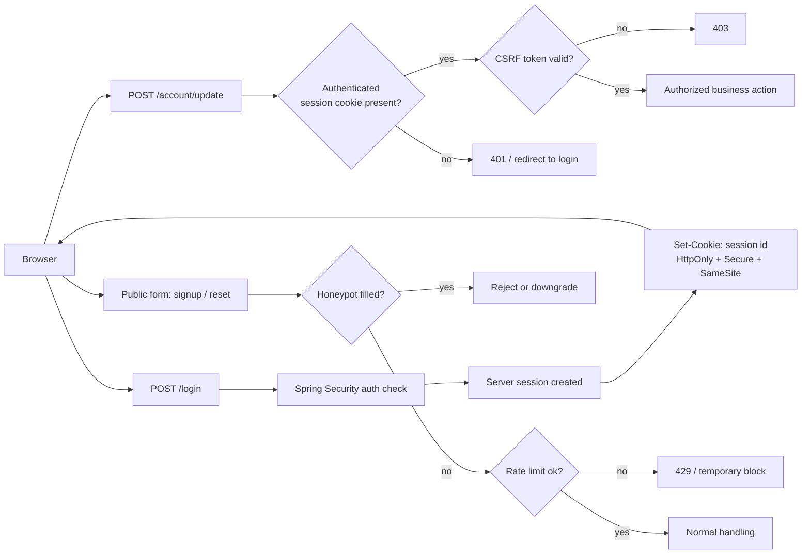

# 20. Spring Boot Fast Review

You do not need to reopen every Spring annotation before a practical refresh.

This is the fast review map for when you do not want to reopen the whole
Spring Boot folder.

Use it when you want a short refresh of what matters most in production-minded
Spring work.

Why this matters:

- Spring knowledge decays unevenly
- people remember annotations longer than runtime behavior
- production bugs usually come from proxies, transactions, query shape, config,
  or persistence tradeoffs, not from forgetting an annotation name

Smallest mental model:

- Spring is mainly a managed runtime and wiring model
- Spring Boot is mainly a defaulting and packaging layer on top
- most production surprises come from proxy boundaries, persistence behavior, or
  configuration shape

Bad refresh instinct vs better refresh instinct:

- weak refresh: reopen random annotations until things feel familiar
- better refresh: reopen the runtime boundaries, data boundaries, and security
  boundaries that usually decide real production behavior

If you only want the retention layer, keep these four ideas in your head:

- Spring behavior is often proxy-driven, so transaction and caching behavior has boundaries
- query shape and transaction boundaries still matter more than repository convenience
- Redis, Mongo, and Postgres should not be treated as interchangeable persistence layers
- hot production paths usually fail because of correctness, query cost, or runtime behavior, not because you forgot an annotation

Reusable takeaway:

> The fastest useful Spring refresh is not annotation recall. It is remembering
> how the container, proxies, persistence model, and configuration shape real
> runtime behavior.

---

## 1. The Essential Module Map

If you want the shortest safe Spring and Spring Boot map, keep these
modules straight:

- **Spring Core / IoC / AOP**: Inversion of Control (IoC), Aspect-Oriented Programming (AOP), bean lifecycle, proxies, and why `@Transactional` or `@Cacheable` have boundaries
- **Spring Boot**: auto-configuration, conditional beans, profiles, and external configuration
- **Spring Web / MVC**: Spring's servlet-based web layer (Model-View-Controller, MVC), controllers, validation, serialization, and consistent error shape
- **Spring Data JPA**: repository convenience on top of SQL through JPA (Java Persistence API), transaction boundaries, and Hibernate behavior
- **Spring Security**: authentication flow, password hashing, session vs token model, CSRF (cross-site request forgery), and method-level authorization
- **Redis / Mongo integrations**: useful when the use case fits, but secondary to the core Spring Boot path

Short rule:

> For most backend work, the Spring essentials are container/runtime,
> web boundaries and application programming interface (API) boundaries, Data JPA, and Security. Redis and Mongo matter more as
> integrations than as the center of the framework story.

Fast distinction:

- **Spring Framework**: the core programming model and container, especially IoC, dependency injection, AOP, web support, and the base abstractions behind the Spring ecosystem
- **Spring Boot**: opinionated setup on top of Spring Framework, mainly to reduce manual wiring through starters, auto-configuration, embedded server support, and externalized configuration

Short answer:

> Spring Framework is the core container and programming model. Spring Boot is
> the faster way to build and run a Spring application without wiring everything
> by hand.

---

## 2. Core Runtime and Boot Configuration

Reopen these if you need to refresh how Spring really behaves:

- [05-ioc-deep-dive.md](./05-ioc-deep-dive.md)
- [06-bean-lifecycle.md](./06-bean-lifecycle.md)
- [07-proxies-and-aop.md](./07-proxies-and-aop.md)
- [08-auto-configuration.md](./08-auto-configuration.md)
- [09-conditional-beans.md](./09-conditional-beans.md)
- [10-profiles.md](./10-profiles.md)

Main points:

- everything interesting in Spring starts from the container
- proxies explain many "why did this annotation not work?" issues
- `@Transactional` and `@Cacheable` are proxy-based behavior
- Spring Boot is mostly about wiring, defaults, and configuration conventions on top of Spring
- profiles and conditional config decide real runtime behavior; they are not just YAML organization

IoC in one minute:

- IoC means object creation and wiring are controlled by the framework container instead of each class building its own dependencies
- the main problem it solves is object graph management: who creates what, with which config, and how parts are replaced cleanly
- dependency injection is the practical mechanism: your class declares what it needs, and Spring provides it

Minimal example:

```kotlin
@Repository
class UserRepository

@Service
class UserService(
    private val userRepository: UserRepository,
)
```

<details>
<summary>Java version</summary>

```java
@Repository
public class UserRepository {
}

@Service
public class UserService {
    private final UserRepository userRepository;

    public UserService(UserRepository userRepository) {
        this.userRepository = userRepository;
    }
}
```

</details>

Without IoC, `UserService` would create `UserRepository` itself.
With IoC, Spring creates both objects and wires them together.

Why this matters:

- easier testing
- cleaner replacement of implementations
- one central container can add cross-cutting behavior like transactions, caching, and security around your beans

Short line:

> IoC is the core Spring idea: classes declare dependencies, and the container
> builds and wires the object graph for you. That is why Spring can manage
> configuration, lifecycle, and proxy-based behavior in one place.

---

## 3. Web and API Boundaries

Reopen:

- [11-web-annotations.md](./11-web-annotations.md)
- [02-exception-handling.md](./02-exception-handling.md)

Main points:

- controllers are HTTP boundary code, not a place to leak entities or business rules
- validation, serialization, and error shape are part of backend quality
- consistent API contracts matter more than remembering annotation trivia

---

## 4. Data and Persistence

For the practical data refresh, reopen:

- [13-spring-data.md](./13-spring-data.md)
- [19-flyway-and-schema-migrations.md](./19-flyway-and-schema-migrations.md)
- [03-transactions-and-isolation.md](./03-transactions-and-isolation.md)
- [04-jpa-hibernate-performance-traps.md](./04-jpa-hibernate-performance-traps.md)

Main points:

- understand what Spring Data gives you and what SQL still decides underneath
- keep transaction boundaries explicit
- know JPA traps: N+1, lazy loading, dirty checking, transaction scope
- use Flyway, not accidental schema drift

Quick repository choice map:

- `JpaRepository`: default choice for aggregate CRUD and conventional query flows on Postgres
- projections / specifications: good when you still want Spring Data ergonomics
- JPQL (Java Persistence Query Language) / native SQL / `JdbcTemplate`: better when query shape, joins, pagination, or performance matter more than repository convenience
- `MongoRepository`: good for straightforward document access
- `MongoTemplate`: better for custom updates, aggregations, and more explicit document operations
- `RedisTemplate`: better for counters, sessions, rate limiting, locks, and explicit key-based workflows than pretending Redis is "just another repository"

Typical real decisions:

- product catalog detail: `JpaRepository` + projection/data transfer object (DTO) + cache if it is hot
- admin reporting query: native SQL or `JdbcTemplate` if the join/query shape matters
- document-heavy search facet: `MongoTemplate` aggregation
- rate limiting or counters: `RedisTemplate`, not JPA-style thinking

---

## 5. Security and Auth Boundaries

Reopen:

- [16-appsec-authz-lab.md](./16-appsec-authz-lab.md)
- [01-auth-sessions-vs-jwt.md](../../topics/security/01-auth-sessions-vs-jwt.md)
- [03-spring-and-jvm-appsec.md](../../topics/security/03-spring-and-jvm-appsec.md)

Main points:

- understand the basic auth flow: credentials in, password hash check, authenticated principal out
- for browser login with server-controlled auth, know sessions, secure cookies, and CSRF
- `HttpOnly`, `Secure`, and `SameSite` are baseline cookie controls, not advanced extras
- use Spring Security for broad request boundaries, then enforce business authorization close to the service/action
- password hashing should use framework-supported encoders, not custom crypto

Minimal auth hardening checklist:

- secure cookies for browser sessions, so the browser treats auth cookies as protected session state instead of generic client data
- password hashing with Argon2 or BCrypt, because password storage needs slow adaptive hashing rather than generic crypto
- active CSRF protection when auth rides on browser cookies, because the browser can send those cookies automatically on forged requests
- CORS (cross-origin resource sharing) narrowed to the real frontend origin set, so cross-origin browser access is not wider than the product actually needs
- rate limiting on login, signup, and password-reset paths, because auth endpoints are common brute-force and abuse targets
- basic audit logs for meaningful auth events, so suspicious sign-in or privilege activity is visible later
- secrets outside the repo and outside static config files, so credential handling stays revocable and operationally sane

Browser auth implementation sketch in Spring Boot:

```yaml
server:
  servlet:
    session:
      cookie:
        http-only: true
        secure: true
        same-site: lax
```

```kotlin
@Bean
fun securityFilterChain(http: HttpSecurity): SecurityFilterChain =
    http
        .cors { }
        .csrf { }
        .authorizeHttpRequests {
            it.requestMatchers("/login", "/signup", "/password-reset").permitAll()
                .anyRequest().authenticated()
        }
        .formLogin { }
        .build()
```

<details>
<summary>Java version</summary>

```java
@Bean
SecurityFilterChain securityFilterChain(HttpSecurity http) throws Exception {
    return http
        .cors(c -> {})
        .csrf(c -> {})
        .authorizeHttpRequests(a -> a
            .requestMatchers("/login", "/signup", "/password-reset").permitAll()
            .anyRequest().authenticated()
        )
        .formLogin(f -> {})
        .build();
}
```

</details>

This is only the shape of the setup.
In a real system, `CORS` usually needs an explicit allowlist and `CSRF` needs an
explicit token strategy that matches the frontend shape.

Minimal explicit example for a separate frontend origin:

```kotlin
@Bean
fun corsConfigurationSource(): CorsConfigurationSource {
    val config = CorsConfiguration().apply {
        allowedOrigins = listOf("https://app.example.com")
        allowedMethods = listOf("GET", "POST", "PUT", "DELETE")
        allowedHeaders = listOf("Content-Type", "X-CSRF-TOKEN")
        allowCredentials = true
    }

    return UrlBasedCorsConfigurationSource().apply {
        registerCorsConfiguration("/**", config)
    }
}

@Bean
fun securityFilterChain(http: HttpSecurity): SecurityFilterChain =
    http
        .cors { it.configurationSource(corsConfigurationSource()) }
        .csrf {
            it.csrfTokenRepository(CookieCsrfTokenRepository.withHttpOnlyFalse())
        }
        .authorizeHttpRequests {
            it.requestMatchers("/login", "/signup", "/password-reset").permitAll()
                .anyRequest().authenticated()
        }
        .formLogin { }
        .build()
```

<details>
<summary>Java version</summary>

```java
@Bean
CorsConfigurationSource corsConfigurationSource() {
    CorsConfiguration config = new CorsConfiguration();
    config.setAllowedOrigins(List.of("https://app.example.com"));
    config.setAllowedMethods(List.of("GET", "POST", "PUT", "DELETE"));
    config.setAllowedHeaders(List.of("Content-Type", "X-CSRF-TOKEN"));
    config.setAllowCredentials(true);

    UrlBasedCorsConfigurationSource source = new UrlBasedCorsConfigurationSource();
    source.registerCorsConfiguration("/**", config);
    return source;
}

@Bean
SecurityFilterChain securityFilterChain(HttpSecurity http) throws Exception {
    return http
        .cors(c -> c.configurationSource(corsConfigurationSource()))
        .csrf(c -> c.csrfTokenRepository(CookieCsrfTokenRepository.withHttpOnlyFalse()))
        .authorizeHttpRequests(a -> a
            .requestMatchers("/login", "/signup", "/password-reset").permitAll()
            .anyRequest().authenticated()
        )
        .formLogin(f -> {})
        .build();
}
```

</details>

Why this example helps:

- `allowedOrigins` should name the real frontend origin, not `"*"`
- `allowCredentials = true` matters when the browser must send cookies
- the session cookie can stay `HttpOnly`
- the CSRF token cookie may need to be readable by frontend JavaScript so it can be echoed back in a header such as `X-CSRF-TOKEN`

Implementation rule:

- same-origin HTML app -> Spring's normal CSRF support is usually enough; do not disable it just because the login flow works without it
- separate frontend origin -> keep a narrow CORS allowlist and use an explicit CSRF token strategy instead of assuming cookies alone are safe
- cookie auth without CSRF thinking is an incomplete design, even if the cookie is `HttpOnly`

Minimal browser-auth picture:



Why this picture matters:

- the session cookie proves who the browser is logged in as
- the CSRF check protects state-changing requests that browsers can send automatically
- CORS matters only for cross-origin browser access, not as a substitute for auth or CSRF
- `honeypot` and rate limiting sit at the public-form edge as low-cost anti-abuse controls

Low-friction anti-bot note:

- `honeypot` fields are useful on public forms such as signup, password-reset request, contact, or waitlist flows
- the idea is simple: add one hidden field that real users never fill; if a bot fills it, reject or downgrade the request
- this is good cheap friction against low-quality bots, but it does not replace rate limiting, audit logs, or stronger escalation such as CAPTCHA when abuse is persistent

Short answer:

> In Spring web systems, I treat Security as essential, not optional. I want a
> clean authentication flow, server-side authorization close to the business
> action, and safe browser-session behavior when cookies are involved.

Operational note:

- reverse proxy or gateway terminating TLS is important, but it is an edge/runtime topic more than a Spring Security topic
- Postgres backups and restore confidence matter, but they belong to operability and data safety rather than auth design

---

## 6. Redis, Mongo, and Polyglot Persistence

Reopen:

- [12-caching-and-redis.md](./12-caching-and-redis.md)
- [13-spring-data.md](./13-spring-data.md)
- [14-datastore-choice-postgres-mongo-redis.md](./14-datastore-choice-postgres-mongo-redis.md)

Main points:

- `@Cacheable`, `@CachePut`, `@CacheEvict`, TTLs, invalidation, and when not to cache
- Redis as cache / fast state / coordination, not "database replacement"
- Mongo as document store with different query and modeling tradeoffs
- Postgres, Mongo, and Redis usually play different roles in one system
- Spring Data gives a shared programming model, but the persistence and cost model underneath are still very different

Practical rule:

> If you cannot explain the source of truth, cache policy, and failure mode for
> a piece of data, you are not done designing that persistence flow yet.

---

## 7. Kotlin + Spring

Reopen:

- [15-kotlin-spring-idioms.md](./15-kotlin-spring-idioms.md)

Main points:

- plugin support for proxies and JPA
- data classes as DTOs
- nullable return types instead of `Optional`
- Kotlin coroutines are a mature supporting model, but coroutine boundaries with Spring still need care
- compare coroutines and virtual threads by stack fit, not as interchangeable buzzwords
- Java interop and platform types still matter when mixed libraries are involved

---

## 8. Service Integration and Runtime Awareness

Reopen:

- [10-profiles.md](./10-profiles.md)
- [20-spring-cloud-and-service-integration.md](./20-spring-cloud-and-service-integration.md)

Main points:

- configuration and profiles are runtime concerns, not just YAML organization
- service boundaries, resilience, and integration style matter more than framework novelty
- know where Spring Cloud helps and where plain HTTP clients are enough

---

## 9. Virtual Threads Note

Spring Boot supports virtual threads when running on Java 21+.

Key reminder:

- enabling them changes runtime behavior
- pool settings no longer behave the same way
- scheduler behavior matters
- pinned virtual threads can still hurt throughput
- virtual threads are often a simpler fit for blocking Java/Spring code than a coroutine rewrite
- they are not "better coroutines"; they are a different tool

Practical point:

> Virtual threads are interesting for Spring Boot services with blocking I/O, but they still require runtime awareness, not checkbox adoption.

---

## 10. What To Practice

If you want a practical Spring Boot refresh:

1. trace one request from controller -> service -> repository -> database
2. identify where transaction boundaries really begin and end
3. explain how authentication enters the request and where authorization is enforced
4. pick one hot read endpoint and decide whether it needs projection, cache, or query tuning first
5. compare one Postgres use case, one Mongo use case, and one Redis use case without forcing the same abstraction on all three

That is a better refresh than reopening annotations in isolation.

---

## 11. Best Reopen Order for a Quick Refresh

If you have limited time:

1. [07-proxies-and-aop.md](./07-proxies-and-aop.md)
2. [11-web-annotations.md](./11-web-annotations.md)
3. [13-spring-data.md](./13-spring-data.md)
4. [03-transactions-and-isolation.md](./03-transactions-and-isolation.md)
5. [04-jpa-hibernate-performance-traps.md](./04-jpa-hibernate-performance-traps.md)
6. [16-appsec-authz-lab.md](./16-appsec-authz-lab.md)
7. [01-auth-sessions-vs-jwt.md](../../topics/security/01-auth-sessions-vs-jwt.md)

That gets you most of the practical value quickly.

If your next project is more data-heavy, use this order instead:

1. [13-spring-data.md](./13-spring-data.md)
2. [04-jpa-hibernate-performance-traps.md](./04-jpa-hibernate-performance-traps.md)
3. [03-transactions-and-isolation.md](./03-transactions-and-isolation.md)
4. [12-caching-and-redis.md](./12-caching-and-redis.md)
5. [14-datastore-choice-postgres-mongo-redis.md](./14-datastore-choice-postgres-mongo-redis.md)

---

## 12. Further Reading

- [Spring Boot Virtual Threads](https://docs.spring.io/spring-boot/reference/features/spring-application.html)
- [Spring Boot Task Execution and Scheduling](https://docs.spring.io/spring-boot/reference/features/task-execution-and-scheduling.html)
- [Spring Data JPA Auditing](https://docs.spring.io/spring-data/jpa/reference/auditing.html)
