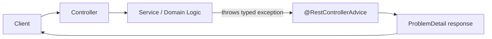

# Exception Handling for Backend APIs
## @RestControllerAdvice and ProblemDetail

> Primary fit: `Shared core`

You do not need a long error-handling philosophy.
You do need one clean mental model:

- controllers should not contain repetitive try/catch blocks
- clients should receive one consistent error shape
- internal details should be logged, not leaked

This topic matters because API quality gets shallow fast when error handling is
treated as an afterthought.

---

## 1. What Exception Handling Actually Solves

Bad backend error handling usually creates three problems:

1. duplicated controller code
2. inconsistent status codes and payloads
3. accidental leakage of internal exceptions

Smallest broken example:

```kotlin
@GetMapping("/{id}")
fun getProduct(@PathVariable id: String): Product {
    return try {
        productService.findById(id)
    } catch (e: ProductNotFoundException) {
        throw ResponseStatusException(HttpStatus.NOT_FOUND, e.message)
    } catch (e: Exception) {
        throw ResponseStatusException(HttpStatus.INTERNAL_SERVER_ERROR, "Unexpected error")
    }
}
```

This works once, but at scale every controller starts inventing its own error style.

---

## 2. The Minimum Clean Shape

The simplest production-friendly model is:

1. throw typed domain exceptions from application code
2. handle them centrally with `@RestControllerAdvice`
3. return one standard error format
4. log internal detail on the server side

Short rule:

> controllers should focus on request/response flow, not on hand-written error mapping

Visual anchor:



Pros:

- one consistent error shape
- less duplicated controller code
- easier logging and monitoring of failures

Tradeoffs / Cons:

- needs discipline around exception taxonomy
- if over-engineered, teams can create too many custom exception types

---

## 3. Minimal Spring Boot Example

```kotlin
class ProductNotFoundException(val productId: String) :
    RuntimeException("Product not found: $productId")

@RestController
@RequestMapping("/api/products")
class ProductController(private val productService: ProductService) {

    @GetMapping("/{id}")
    fun getById(@PathVariable id: String): ProductDto {
        return productService.findById(id)
            ?: throw ProductNotFoundException(id)
    }
}

@RestControllerAdvice
class GlobalExceptionHandler {

    @ExceptionHandler(ProductNotFoundException::class)
    @ResponseStatus(HttpStatus.NOT_FOUND)
    fun handleNotFound(ex: ProductNotFoundException, request: HttpServletRequest): ProblemDetail {
        return ProblemDetail.forStatusAndDetail(
            HttpStatus.NOT_FOUND,
            ex.message ?: "Not found",
        ).apply {
            title = "Product Not Found"
            instance = URI.create(request.requestURI)
            setProperty("productId", ex.productId)
        }
    }

    @ExceptionHandler(Exception::class)
    @ResponseStatus(HttpStatus.INTERNAL_SERVER_ERROR)
    fun handleGeneric(ex: Exception, request: HttpServletRequest): ProblemDetail {
        return ProblemDetail.forStatusAndDetail(
            HttpStatus.INTERNAL_SERVER_ERROR,
            "An unexpected error occurred. Please try again later.",
        ).apply {
            title = "Internal Server Error"
            instance = URI.create(request.requestURI)
        }
    }
}
```

How the pieces connect:

1. the controller calls the service normally
2. if the product does not exist, the service/controller throws `ProductNotFoundException`
3. Spring routes that exception to the matching method in `@RestControllerAdvice`
4. that handler returns a `ProblemDetail`, which Spring serializes as the HTTP error response

Why this is already a good answer:

- one place owns API error mapping
- business exceptions become clean status codes
- generic failures do not leak stack traces to clients

---

## 4. ProblemDetail

`ProblemDetail` is the Spring Framework 6 error type used by Spring Boot 3 applications
for the standard HTTP problem format defined by RFC 9457.

In the example above, the advice method does not return a custom DTO.
It returns a `ProblemDetail`, and that object becomes the JSON error body sent to the client.

Smallest mental model:

- `@RestControllerAdvice` decides **when** to handle the exception
- `@ExceptionHandler` decides **which exception** maps here
- `ProblemDetail` defines **what error payload** the client receives

Minimal construction example:

```kotlin
@ExceptionHandler(ProductNotFoundException::class)
@ResponseStatus(HttpStatus.NOT_FOUND)
fun handleNotFound(ex: ProductNotFoundException): ProblemDetail {
    return ProblemDetail.forStatusAndDetail(
        HttpStatus.NOT_FOUND,
        ex.message ?: "Product not found",
    ).apply {
        title = "Product Not Found"
        setProperty("productId", ex.productId)
    }
}
```

Standard fields you should recognize:

- `status`: HTTP status code
- `title`: short summary
- `detail`: human-readable explanation
- `instance`: which request/resource failed
- extra properties: your stable extension fields such as `productId`

Practical note:

- if you return `ProblemDetail` from an `@ExceptionHandler`, Spring can initialize `instance` from the request path for you; set it explicitly only when you want to be very clear or override it

Example response:

```json
{
  "title": "Product Not Found",
  "status": 404,
  "detail": "Product 'J999' does not exist in this store",
  "instance": "/api/products/J999",
  "productId": "J999"
}
```

Why it matters:

- consistent error shape
- clients can parse errors more reliably
- easier API documentation

You can also enable it for Spring's own MVC exceptions:

```yaml
spring:
  mvc:
    problemdetails:
      enabled: true
```

Useful line:

> I prefer one consistent error contract, and in Spring Boot 3 `ProblemDetail` is the
> clean default because it standardizes error payloads without inventing a custom format.

Pros:

- standard HTTP problem shape
- better consistency for clients and docs

Tradeoffs / Cons:

- still needs good domain mapping and stable extension fields
- a standard format does not by itself guarantee good status-code choices

---

## 5. Domain Exceptions

Typed exceptions carry meaning and data.
That is better than throwing a generic `RuntimeException("bad thing happened")`.

```kotlin
class InsufficientStockException(
    val productId: String,
    val requested: Int,
    val available: Int,
) : RuntimeException(
    "Insufficient stock for $productId: requested=$requested, available=$available",
)
```

Why this is useful:

- clearer mapping to HTTP status
- better log context
- easier tests

---

## 6. Validation, Auth, And Generic Failures

You usually need a small number of categories:

- domain/business exceptions -> `404`, `409`, `422`
- validation exceptions -> `422`
- auth/authorization exceptions -> `401` or `403`
- unexpected exceptions -> `500`

Example validation mapping:

```kotlin
@ExceptionHandler(MethodArgumentNotValidException::class)
@ResponseStatus(HttpStatus.UNPROCESSABLE_ENTITY)
fun handleValidation(ex: MethodArgumentNotValidException): ProblemDetail {
    val errors = ex.bindingResult.fieldErrors.associate { it.field to it.defaultMessage }
    return ProblemDetail.forStatus(HttpStatus.UNPROCESSABLE_ENTITY).apply {
        title = "Validation Failed"
        setProperty("errors", errors)
    }
}
```

Important nuance:

- Spring Security may handle some auth exceptions before your advice does
- that is normal; just be clear about who owns the error shape in your stack

---

## 7. Testing The Error Contract

If you care about API quality, you should test the error payload too, not only the happy path.

```kotlin
@WebMvcTest(ProductController::class)
class ProductControllerTest {

    @Autowired lateinit var mockMvc: MockMvc
    @MockBean lateinit var productService: ProductService

    @Test
    fun `getById returns 404 ProblemDetail when product not found`() {
        whenever(productService.findById("J999")).thenThrow(ProductNotFoundException("J999"))

        mockMvc.get("/api/products/J999") {
            accept(MediaType.APPLICATION_PROBLEM_JSON)
        }.andExpect {
            status { isNotFound() }
            content { contentType(MediaType.APPLICATION_PROBLEM_JSON) }
            jsonPath("$.title") { value("Product Not Found") }
            jsonPath("$.productId") { value("J999") }
        }
    }
}
```

That test proves:

- the right status code
- the right content type
- the right stable fields in the error body

---

## 8. Real Backend Use Cases

### Commerce-style API

- `ProductNotFound` -> `404`
- `InsufficientStock` -> `409`
- validation failure on checkout payload -> `422`

### Payment-style API

- duplicate or invalid state transition -> `409`
- invalid idempotency input -> `422`
- forbidden operation on someone else's resource -> `403`

Short rule:

> error handling is part of API design, not a framework afterthought

---

## 9. The Big Traps

1. **Per-controller try/catch everywhere**
   You get duplication and inconsistent responses.

2. **Leaking internal details**
   Stack traces and internal class names should stay in logs.

3. **One generic 500 for everything**
   Clients lose the ability to respond correctly.

4. **No stable error contract**
   Frontends and partner systems end up special-casing every endpoint.

5. **Testing only happy paths**
   Error payload drift goes unnoticed.

---

## 10. Practical Summary

Good short answer:

> I centralize API error handling with `@RestControllerAdvice`, map typed business and
> validation exceptions to consistent HTTP responses, and use `ProblemDetail` so clients
> get one stable error shape. Internal details go to logs, not to the client.

Useful follow-up line:

> I also test the error contract, because error responses are part of the API, not just
> the happy path.
