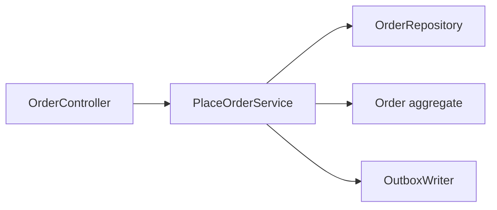

# Practical DDD in Spring Boot

`DDD` (`Domain-Driven Design`) gets unhelpful fast when it stays at the level of
words like `Entity`, `Aggregate`, and `Bounded Context` without showing where
those ideas land in a real Spring codebase.

This note exists to bridge that gap.

---

## Why This Matters

A lot of backend teams understand DDD conceptually but still end up with:

- controllers calling repositories directly
- JPA entities exposed as API contracts
- packages grouped only by technical layer
- "service" classes holding both workflow orchestration and domain rules
- shared models leaking between contexts

This matters because then DDD becomes vocabulary, not design help.

---

## Smallest Useful Mental Model

Use DDD in Spring to answer four practical questions:

- where does domain logic live
- what is one consistency boundary
- what belongs to one bounded context
- how does Spring infrastructure stay around the domain instead of inside it

Short rule:

> Let Spring own the infrastructure. Let the domain own the business rules.

---

## Bad Mental Model vs Better Mental Model

Bad mental model:

- DDD means every class type from the book must exist
- every `@Entity` is automatically a good domain model
- package-by-layer is good enough if the code compiles

Better mental model:

- DDD means making business boundaries and invariants explicit
- JPA is a persistence tool, not your architecture
- start with one bounded context and one aggregate that protects a real rule

Small concrete example:

- weak approach: `OrderController` calls `OrderRepository`, mutates entity fields,
  and sends email inside the same method
- better approach: controller calls an application service, the aggregate enforces
  order rules, and follow-up email is triggered through an event or outbox path

---

## 1. The Layers In Plain Language

### Domain layer

Owns:

- business rules
- aggregates
- value objects
- domain events

Should not depend on:

- Spring MVC
- JPA repositories as business API
- HTTP payload classes

### Application layer

Owns:

- use-case orchestration
- transaction boundary
- loading aggregates
- calling domain behavior
- publishing domain events or writing outbox records

This is where "place order", "cancel order", or "capture payment" usually lives.

### Infrastructure layer

Owns:

- Spring Data implementations
- controllers
- persistence mappings
- messaging adapters
- provider clients

This is where Spring should be loud.

---

## 2. Package By Bounded Context, Not Only By Technical Layer

Weak shape:

```text
controller/
service/
repository/
entity/
dto/
```

This often becomes:

- one giant service package
- one giant entity package
- domain boundaries hidden by technical folders

Stronger shape:

```text
com.example.app
  order
    domain
      Order.kt
      OrderItem.kt
      OrderStatus.kt
      Money.kt
      OrderPlaced.kt
    application
      PlaceOrderService.kt
      CancelOrderService.kt
    infrastructure
      OrderController.kt
      JpaOrderRepository.kt
      OrderEntity.kt
      OrderJpaRepository.kt
  payment
    domain
    application
    infrastructure
```

Why this is better:

- order and payment boundaries stay visible
- each context can evolve more independently
- you can still keep a layered style inside one context

---

## 3. Aggregate: What It Should Look Like In Practice

The aggregate should protect one consistency boundary.

Example:

- order can add items only while pending
- order cannot be cancelled after shipment

```kotlin
class Order(
    val id: UUID,
    private var status: OrderStatus = OrderStatus.PENDING,
    private val items: MutableList<OrderItem> = mutableListOf(),
) {
    fun addItem(item: OrderItem) {
        check(status == OrderStatus.PENDING) { "Cannot add items once order is no longer pending" }
        items.add(item)
    }

    fun cancel() {
        check(status != OrderStatus.SHIPPED) { "Cannot cancel a shipped order" }
        status = OrderStatus.CANCELLED
    }
}
```

The important part is not the syntax.
The important part is:

- invalid state transitions are blocked here
- not scattered across controllers and services

---

## 4. Application Service: Orchestration, Not Domain Dumping Ground

This is where many Spring codebases blur the line.

A good application service should:

- load the aggregate
- call domain behavior
- persist changes
- trigger external follow-up safely

```kotlin
@Service
class CancelOrderService(
    private val orders: OrderRepository,
    private val outbox: OutboxWriter,
) {
    @Transactional
    fun cancel(orderId: UUID) {
        val order = orders.getById(orderId)
        order.cancel()
        orders.save(order)
        outbox.write("OrderCancelled", orderId.toString())
    }
}
```

This service is useful because it orchestrates:

- transaction
- repository access
- domain behavior
- follow-up publication

It should not become the place where all domain rules live.

---

## 5. Controller: Transport Boundary Only

The controller should mainly do:

- HTTP mapping
- request parsing
- response shaping

Not:

- business invariants
- direct entity mutation
- multi-step orchestration of domain and infrastructure concerns

```kotlin
@RestController
class OrderController(
    private val cancelOrder: CancelOrderService,
) {
    @PostMapping("/orders/{id}/cancel")
    fun cancel(@PathVariable id: UUID): ResponseEntity<Void> {
        cancelOrder.cancel(id)
        return ResponseEntity.noContent().build()
    }
}
```

This keeps the HTTP boundary thin and explicit.

---

## 6. Entity vs DTO vs Domain Model

This is one of the sharpest Spring traps.

### Bad default

- JPA entity is also the API response
- JPA entity is also the whole domain model
- lazy fields and persistence concerns leak outward

### Better default

- domain model protects business rules
- persistence model is adapted to storage
- API DTO is shaped for the contract

You do not need three classes for every trivial CRUD field.
But you should separate them when:

- API shape differs from persistence shape
- domain rules matter
- lazy loading or entity graph behavior would leak

Short rule:

> Do not let JPA convenience decide your domain boundary for you.

---

## 7. Repositories: Aggregate Access, Not Query Dumpster

Repository is a good fit for:

- load one aggregate
- save one aggregate
- simple aggregate-oriented lookup

Repository is a weaker fit for:

- every report query
- cross-context analytics
- huge custom joins that are really read models

Good practical rule:

- use repository for aggregate lifecycle
- use SQL, projection, or dedicated query model for read-heavy reporting shapes

This aligns well with the repo's existing JPA and query-shape notes.

---

## 8. Domain Events and Outbox

When one domain action should trigger later work:

- notification
- analytics
- payment follow-up
- inventory reaction

Do not bury those concerns inside the controller or aggregate.

Better shape:

1. aggregate changes state
2. application service persists state
3. application service records event or outbox entry
4. later handler or worker performs external effects

This keeps the core domain from becoming tightly coupled to providers and side
effects.

---

## 9. Example: Order Context In Spring

Good practical shape:



What each part owns:

- controller: HTTP
- application service: use case and transaction
- aggregate: order rules
- repository: aggregate persistence
- outbox: reliable follow-up work

---

## 10. When Not To Push DDD Hard

Do not force rich DDD ceremony when:

- the feature is thin CRUD with weak domain rules
- the bounded context is still immature
- the team would copy patterns mechanically without understanding the invariants

Good default:

- use DDD where the domain has real rules, state transitions, or language worth protecting
- stay simpler where the value is mostly contract and persistence plumbing

---

## 11. Big Traps

1. **Treating `@Entity` as the architecture**
   Example: persistence shape becomes the domain model by accident.

2. **Putting all business logic in `*Service` classes**
   Example: aggregates become dumb data holders.

3. **Exposing entities directly as API responses**
   Example: lazy loading, persistence concerns, and unstable contracts leak out.

4. **Packaging only by technical layer**
   Example: order and payment rules disappear into giant shared folders.

5. **Adding DDD ceremony where no real domain complexity exists**
   Example: five abstractions for plain admin CRUD.

---

## 12. Practical Summary

Good short answer:

> In Spring Boot, I use DDD by keeping packages aligned to bounded contexts, putting business invariants in aggregates, use-case orchestration in application services, and Spring-specific infrastructure around the edge. I do not let controllers own domain rules, and I do not let JPA entities become the whole architecture by accident.
