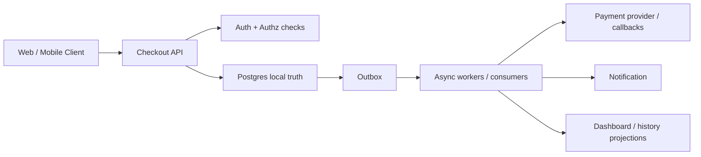

# Checkout to Fulfillment: End-to-End Product Flow Case Study

Use this note when you want one concrete flow that connects:

- API design
- auth and AppSec
- DDD and modular boundaries
- transactions and outbox
- payment and inventory coordination
- read models
- deployment boundaries
- observability

This is a product-flow study, not a single-pattern note.

---

## Why This Matters

Many backend topics make sense alone but stay weaker until one real flow ties
them together.

Checkout is a good example because it forces several concerns into one path:

- money correctness
- stock correctness
- retries and duplicates
- user-facing latency
- async follow-up work
- mobile and web client differences

---

## Smallest Useful Mental Model

Treat checkout as one protected write path with later follow-up work.

Short rule:

> The critical path must protect "do not charge twice" and "do not oversell", then move everything else off the path unless the user truly needs it now.

---

## Bad Mental Model vs Better Mental Model

Bad mental model:

- checkout is just `POST /orders`
- if payment and stock logic exist somewhere, the system is fine
- email, analytics, and dashboards can be figured out later

Better mental model:

- checkout is a correctness-critical workflow
- source of truth, retries, and state transitions must be explicit
- later systems still need safe publication, read models, and observability

Small concrete example:

- weak approach: synchronous request charges payment, updates stock, sends email,
  writes analytics, and returns only after everything succeeds
- better approach: protect the local commit path, publish follow-up work
  reliably, and keep side effects out of the user-facing critical path where possible

---

## 1. The Main Invariants

For this flow, the important rules are:

- do not create duplicate orders from retries
- do not charge twice
- do not oversell final stock
- do not show users fake success if the critical state is still uncertain

Those invariants matter more than diagram style.

---

## 2. Public API Shape

Good default:

- one explicit write endpoint such as `POST /checkout/confirm`
- stable request identity or idempotency key
- clear response contract under retry or async uncertainty

Why:

- user networks fail
- mobile apps retry
- PSP callbacks can arrive later

Strong API rule:

> If a write can be retried and duplicate effects would hurt, make request identity explicit.

---

## 3. Auth And AppSec

Auth questions:

- who is the user
- what customer or merchant context are they acting in
- can they perform this checkout action

Security questions:

- can they mutate another user's cart or order
- can they replay a sensitive step
- can they skip workflow steps
- are rate limits and payload limits present

Mobile nuance:

- mobile app is still a public client
- backend owns final authorization and checkout-state validation

---

## 4. Modular Boundary Inside The Backend

A good modular-monolith or service shape usually separates:

- `checkout`
- `order`
- `payment`
- `inventory`
- `notification`

This does not mean five microservices by default.

It means:

- each capability has clearer ownership

Good default early:

- modular monolith
- one main Postgres
- explicit internal module boundaries

---

## 5. The Critical Write Path

Good practical shape:

1. authenticate caller
2. validate cart and checkout state
3. claim idempotency key
4. reserve or validate stock according to chosen model
5. create local order / payment intent state
6. commit local transaction
7. record outbox event
8. return durable result or accepted state

This keeps one local source of truth visible.

---

## 6. Payment And Inventory Coordination

This is where many weak designs appear.

### Strong default early

- one bounded backend owns the local transaction
- external PSP call and later callbacks are handled with explicit state
- inventory rules stay explicit and replay-safe

### If boundaries split later

- local ACID remains inside each boundary
- outbox plus saga-style recovery thinking handles wider workflow uncertainty

Short rule:

> One local transaction can protect one local truth. Cross-boundary correctness needs explicit recovery, not wishful rollback.

---

## 7. Outbox And Follow-Up Work

Later work usually includes:

- email
- analytics
- search or dashboard updates
- fulfillment triggers

These should usually not stay on the critical path.

Good shape:

- local business write commits
- outbox row commits with it
- workers or consumers handle later reactions

This prevents:

- fragile dual writes
- user-facing latency inflation

---

## 8. Read Models

Write side is not the same as read side here.

Examples of reads that want different shapes:

- customer order history
- merchant dashboard
- support tool
- fulfillment queue

Good progression:

- normal SQL or projection first
- API composition when needed
- event-fed read model when the read is hot or cross-domain

Do not let dashboards force the write model into awkward shapes.

---

## 9. Deployment Boundaries

Early strong shape:

- backend API
- background worker
- maybe admin UI
- one main DB

This can still be a good modular monolith.

Later split only when:

- ownership is real
- scaling and release cadence diverge
- shared deploy is causing real pain

If you split deployables early but still share domain tables freely, you are
drifting toward a distributed monolith.

---

## 10. Observability And Recovery

For this flow, observe at least:

- checkout confirmation attempts
- idempotency-key conflicts
- PSP callback failures
- inventory reservation failures
- stuck outbox rows
- order state transitions

Why:

- correctness bugs in checkout are often uncertainty bugs first

Good recovery questions:

- can stuck outbox rows be replayed
- can callback failures be retried safely
- can duplicate delivery be absorbed

---

## 11. Concrete Shape

What this shape is trying to protect:

- one critical commit path
- safe async follow-up
- clearer read and write responsibilities

---

## 12. Strong Default

For a product team building this flow:

- start with modular monolith plus explicit boundaries
- protect critical writes with local transaction and idempotency
- keep side effects off the main path
- use outbox for reliable follow-up publication
- add read models only when query shape or load really justifies it
- split services later only when ownership and operational reasons are real

---

## 13. Big Traps

1. **Doing every side effect synchronously in checkout**
   Example: latency and failure blast radius grow immediately.

2. **No request identity on retry-prone writes**
   Example: duplicate orders or charges appear under timeout.

3. **Dashboard read needs forcing the write model to bloat**
   Example: critical path gets shaped by reporting convenience.

4. **Premature service split with shared-table coupling**
   Example: complexity rises before boundaries are real.

5. **Weak visibility into state transitions and stuck work**
   Example: the system becomes hard to trust after partial failure.

---

## 14. Practical Summary

Practical summary:

> In a checkout-to-fulfillment flow, I start from invariants: do not charge twice and do not oversell. I protect the local commit path with idempotency and explicit state, publish follow-up work through an outbox, keep dashboards and search off the write path, and split deployment or data boundaries only when ownership and operational pressure make that tradeoff worth it.
