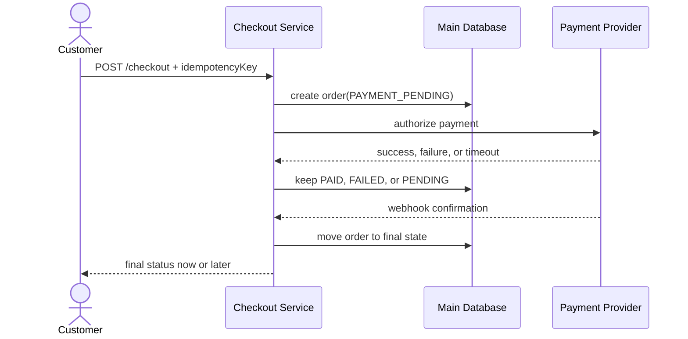

# Practical Checkout Design

> Primary fit: `Retail / Ecommerce`

Use this note when system design still feels too abstract and you want one
practical way to think about a checkout flow from start to finish.

Checkout is the example here, but the same thinking also helps with:

- order creation
- payment capture
- refunds
- stock reservation
- webhook-driven flows

This is not about drawing many boxes.
It is about answering one business question clearly:

> How do we turn purchase intent into a paid order without losing money,
> overselling stock, or charging the customer twice?

If you can answer that well, you are already doing useful system design.

---

## 1. Start With the Business Goal

Do not start with:

- microservices
- Kafka
- caches
- Kubernetes

Start with the job of the flow.

A checkout exists to do this:

1. the customer wants to buy
2. the system validates the purchase
3. the payment is accepted or rejected
4. the order ends in a trustworthy final state

That sounds simple, but this is where real design lives.

Bad checkout design usually fails in one of these ways:

- the customer is charged twice
- the order is created twice
- stock is sold that was not really available
- the payment succeeds but the order is left in the wrong state
- the customer sees one result and support sees another

Good design starts by saying which of these risks matters most.

---

## 2. Break the Flow Into Simple Parts

For almost any checkout design, you can split the flow into five parts.

### 1. Input

The customer clicks `Pay`.

Input usually includes:

- cart items
- customer ID or guest info
- shipping address
- payment method
- request ID or idempotency key

### 2. Core flow

This is the part that decides what should happen.

Typical steps:

- validate the cart
- calculate the final price
- check stock
- create or update the order
- start the payment

### 3. External systems

Checkout rarely lives alone.

Common dependencies:

- payment provider
- inventory system
- fraud checks
- tax service
- shipping or fulfillment systems

### 4. Durable storage

This is where the trustworthy state lives.

Common data:

- orders
- payment attempts
- stock reservations
- processed webhook events
- audit logs

### 5. Output

What the customer and the rest of the business see.

Examples:

- order confirmation page
- payment pending page
- email
- internal event for fulfillment

This simple split helps because it stops you from mixing everything together.

---

## 3. Decide What Must Never Go Wrong

Before choosing components, name the rules that must stay true.

For checkout, common rules are:

- one purchase intent must not create two paid orders
- one payment must not be captured twice
- stock must not go below the real allowed amount
- only a valid payment can move an order to `PAID`

These rules are more important than the shape of the architecture.

If you remember only one habit, remember this:

> name the rule first, then design around protecting it

---

## 4. Choose the Source of Truth Early

Many design answers stay vague here.
Do not.

You should be able to say clearly:

- where the final order state lives
- where the final payment state lives
- where final stock numbers live

In a simple and strong starting design, this is often a relational database
such as Postgres.

Important point:

- cache can help reads
- queues can help async work
- Redis can help speed
- but none of those should quietly become the final truth by accident

For a checkout flow, final confirmation should come from durable storage, not
from a cache entry or a temporary in-memory result.

---

## 5. Model the Flow With Clear States

Do not build checkout with random `if` statements only.
Use explicit states.

For orders, a simple example is:

```text
CREATED
-> PAYMENT_PENDING
-> PAID
-> FULFILLMENT_PENDING
-> SHIPPED

side paths:
PAYMENT_PENDING -> PAYMENT_FAILED
PAYMENT_PENDING -> CANCELED
PAID -> REFUNDED
```

For payments:

```text
INITIATED
-> PENDING_PROVIDER_CONFIRMATION
-> AUTHORIZED
-> CAPTURED

side paths:
INITIATED -> FAILED
AUTHORIZED -> VOIDED
CAPTURED -> REFUNDED
```

For stock:

```text
AVAILABLE
-> SOFT_HELD
-> COMMITTED

side paths:
SOFT_HELD -> AVAILABLE
COMMITTED -> AVAILABLE
```

This matters because it makes the business rules visible.

Examples:

- an order in `PAID` should not become `CREATED` again
- a duplicate webhook should not move `PAID` to `PAID` a second time in a way
  that repeats downstream work
- stock held for one checkout should expire or be released if payment fails

When the states are clear, the failure handling becomes much easier to explain.

---

## 6. Keep the First Design Small

A strong first design for checkout is often a modular monolith.

That means:

- one deployable application
- clear internal modules
- one main database
- clean separation between checkout, orders, payments, pricing, and inventory

This is a good starting shape:

```text
Checkout module
|- Pricing
|- Inventory
|- Payments
|- Orders
```

Why this is a good start:

- easier local development
- easier debugging
- simpler transactions inside one database
- less operational overhead

You can still scale later.
Simple does not mean weak.

---

## 7. Decide What Happens Now and What Happens Later

One of the biggest checkout mistakes is trying to finish everything in one
synchronous request.

Some work must happen now because the customer needs an answer.
Some work should happen later because external systems are slow or uncertain.

### Usually synchronous

- validate request
- calculate price
- create order record
- create payment attempt
- reserve stock if needed

### Often asynchronous

- final payment confirmation from webhook
- email sending
- analytics events
- downstream fulfillment work
- reconciliation jobs

Good practical rule:

> if an external provider can answer late, timeout, or retry, your design should
> accept that the first HTTP response may not be the final truth

That is why `PENDING` is often an honest and safe result.

---

## 8. Idempotency: The Most Important Checkout Pattern

This is the pattern that prevents duplicate damage.

Simple meaning:

> if the same request arrives twice, the system should not perform the same
> money-sensitive action twice

Why duplicate requests happen:

- the user double-clicks
- the app retries
- the server times out and the client retries
- the payment provider sends the same callback again

The usual fix is an `idempotency key`.

Simple version:

1. the client sends a stable key with the request
2. the server stores the result linked to that key
3. if the same key arrives again, the server returns the stored result

This is especially important for:

- create checkout
- authorize payment
- capture payment
- process payment webhook

Without this, the happy path may work in testing and still fail badly in real
traffic.

Small Java 21 example:

```java
public CheckoutResponse checkout(CheckoutCommand command) {
    var existing = idempotencyRepository.findByKey(command.idempotencyKey());
    if (existing.isPresent()) {
        return existing.get().response();
    }

    var order = orderRepository.create(command, OrderStatus.PAYMENT_PENDING);

    var paymentResult = paymentGateway.authorize(order.id(), command.paymentMethod());
    var finalStatus = paymentResult.isFinalSuccess()
        ? OrderStatus.PAID
        : OrderStatus.PAYMENT_PENDING;

    orderRepository.updateStatus(order.id(), finalStatus);

    var response = new CheckoutResponse(order.id(), finalStatus);
    idempotencyRepository.save(command.idempotencyKey(), response);
    return response;
}
```

This snippet is intentionally small.
The point is not the framework.
The point is the pattern:

- check whether the request already exists
- create a durable order state first
- accept `PENDING` when the result is not final yet
- save the response so a retry returns the same outcome

---

## 9. A Safe End-to-End Checkout Shape

Here is a practical and simple flow.

1. client sends `POST /checkout` with cart data and an idempotency key
2. server validates items, price, and customer input
3. server creates an order in `PAYMENT_PENDING`
4. server creates a stock reservation if the business needs one
5. server creates a payment attempt in `PENDING_PROVIDER_CONFIRMATION`
6. server calls the payment provider
7. if the provider clearly declines, mark the payment as `FAILED` and release stock
8. if the provider clearly succeeds, move to the next valid payment state
9. if the result is uncertain or delayed, keep the order in a pending state
10. webhook or later confirmation updates the final payment state
11. once payment is truly final, move the order to `PAID`
12. publish follow-up work for fulfillment, email, and other downstream tasks

This may look longer than a simple API handler, but it is much safer.

Minimal flow sketch:



Why this diagram helps:

- it separates the user request from later confirmation
- it shows durable state before external uncertainty
- it makes retries and webhook handling feel normal, not exceptional

---

## 10. Think Through Failures Before Adding Scale

In interviews and real systems, the quality of the answer often depends on how
well you handle failure.

Ask these questions every time:

- what if the payment provider times out
- what if the order is stored but the provider response is lost
- what if the webhook arrives twice
- what if stock is reserved but payment fails
- what if the payment succeeds but the order update fails

Useful patterns here:

- retries with backoff
- idempotency keys
- deduplication of webhook events
- scheduled cleanup of expired stock holds
- reconciliation jobs to compare internal state with provider state

One practical rule matters a lot:

> if the system is uncertain, do not lie with a fake success or fake failure

A clear `PENDING` state is often better than a wrong `PAID` or `FAILED`.

---

## 11. Security: Keep It Real

You do not need advanced security theory to design a better checkout.
You do need the basics.

Important rules:

- use HTTPS
- validate all input
- do not store raw card details in your own system unless you truly need to and
  are ready for the compliance burden
- verify payment webhooks with signatures
- reject replayed or duplicate external events safely
- keep secrets out of logs

For payment integrations, a good practical default is:

> let the payment provider handle sensitive card data and keep your own system
> focused on order, payment state, and business logic

---

## 12. Scale Without Overbuilding

A lot of weak system design answers jump too early into big infrastructure.

Start with simple scaling ideas that match the real problem.

Good examples:

- stateless application instances so you can add more servers
- proper database indexes on the checkout write path
- caching for product and catalog reads
- queues for slower follow-up work
- rate limiting for bursts and abuse

Do not start with:

- many microservices before the boundaries are stable
- a broker for every small interaction
- extra databases without a clear ownership reason

Good design grows in steps.

---

## 13. What To Say In a Design Discussion

If someone asks you to design a checkout, a strong practical answer can sound
like this:

> I would start from the business risk: do not double charge, do not create the
> same paid order twice, and do not oversell stock. I would keep a durable source
> of truth in the main database, model order and payment as explicit states, make
> every money-sensitive request safe for retries with idempotency keys, and treat
> payment confirmation as potentially asynchronous because provider timeouts and
> webhooks are part of the normal flow.

That answer is strong because it talks about correctness first.

---

## 14. How To Practice This Properly

Do not only read.
Practice in small loops.

One useful exercise:

1. write down the business goal in one sentence
2. list the rules that must never break
3. draw the main states for order, payment, and stock
4. walk the happy path
5. walk three failure paths
6. explain where idempotency lives
7. explain what is synchronous and what is asynchronous

Even better, implement a tiny version:

- `POST /checkout`
- order states
- payment attempt states
- idempotency table
- mock webhook
- duplicate webhook test

That kind of practice teaches more than reading ten generic diagrams.

---

## 15. Practical Summary

If you need the shortest useful reset, remember this:

1. checkout is a business flow, not just an API
2. define what must never happen twice
3. choose the source of truth early
4. model order, payment, and stock with clear states
5. treat retries and duplicate delivery as normal
6. use pending states when the result is not final yet
7. start with a modular monolith before splitting into many services

---

## Related Reading

- [backend-system-principles.md](./backend-system-principles.md)
- [system-design-guide.md](./system-design-guide.md)
- [lifecycles-and-flows-cheatsheet.md](./lifecycles-and-flows-cheatsheet.md)
- [worked-diagrams.md](./worked-diagrams.md)
- [../spring-boot/17-webhook-idempotency-lab.md](../spring-boot/17-webhook-idempotency-lab.md)
