# System Design Diagrams

> Primary fit: `Retail / Ecommerce`

Status:

- companion file for the system-design notes in this folder
- useful for deeper retail and workflow study after the main guide
- best used as visual support, not as the first entry point

Mermaid diagrams for worked system design exercises.
Paste any block into a Mermaid renderer (GitHub markdown, Obsidian, draw.io, mermaid.live).

Quick term guide for this companion file:

- `BFF` = `Backend For Frontend`: an edge backend that shapes one response for one client type
- `TTL` = `time to live`: how long a cache entry or temporary reservation lives before expiry
- `CDC` = `Change Data Capture`: copying committed database changes into another system
- `Debezium` = a common tool that reads database change logs and publishes those changes as events
- `WAL` = `Write-Ahead Log`: the database change log Debezium reads in Postgres
- `SSE` = `Server-Sent Events`: one-way server-to-browser streaming over HTTP
- `WMS` = `Warehouse Management System`

---

## Exercise 1: Global Checkout System

### 1a. Component Architecture

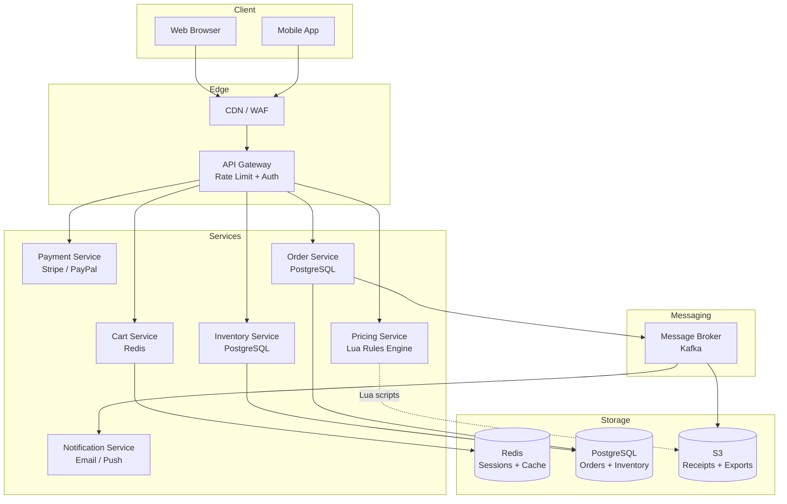

### 1a-bis. Gateway With Internal gRPC Aggregation

Use this variant when the public edge still speaks normal HTTP, but the gateway or `BFF`
(`Backend For Frontend`) has to call several internal services owned by the same organisation.

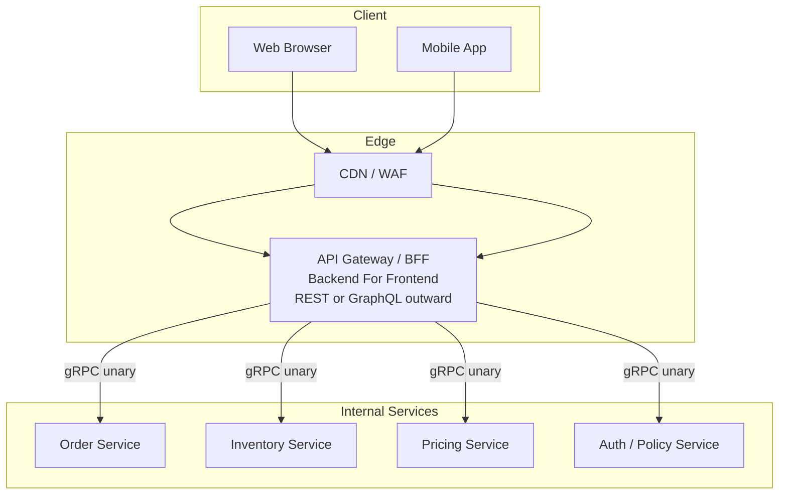

Protocol note:

- browser or public app traffic usually stays `REST/JSON` or `GraphQL` at the edge
- internal gateway-to-service calls can be `gRPC` if you want typed contracts and low-overhead one-to-many backend calls from the gateway to several services
- do not force `gRPC` if the backend is still one deployable service or if the main consumers are browsers

### 1b. Checkout Flow (Happy Path)

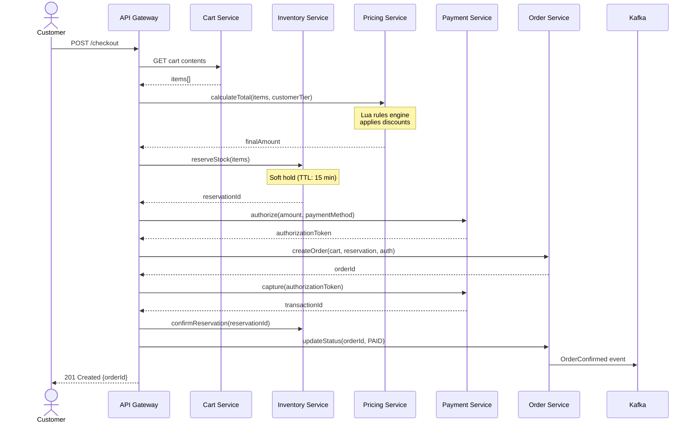

### 1c. Failure Scenarios

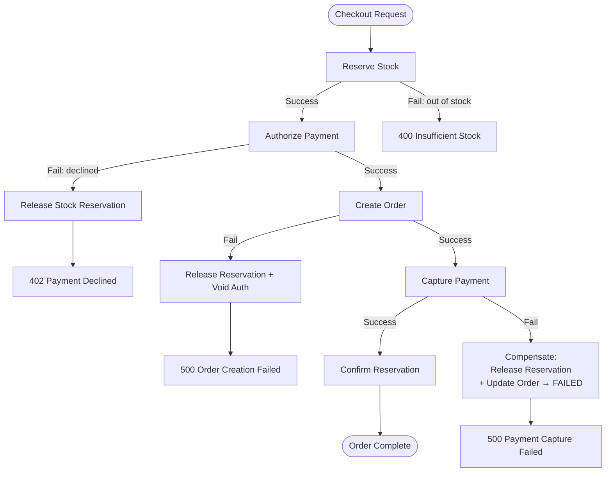

---

## Exercise 2: Omnichannel Inventory

### 2a. Inventory Architecture

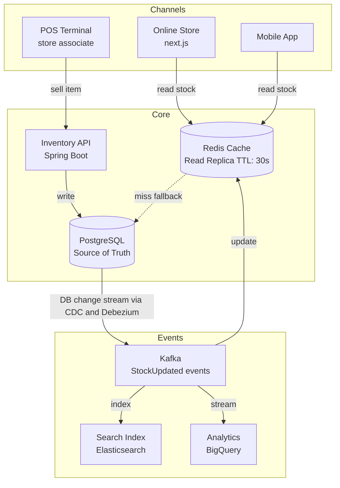

### 2b. Stock Reservation State Machine

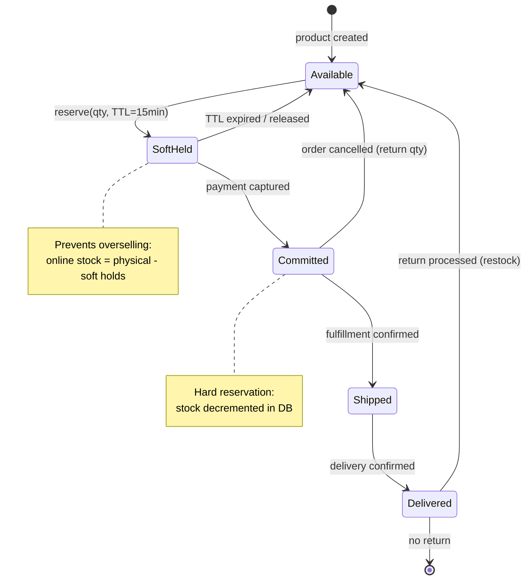

### 2c. Cache Invalidation Strategy

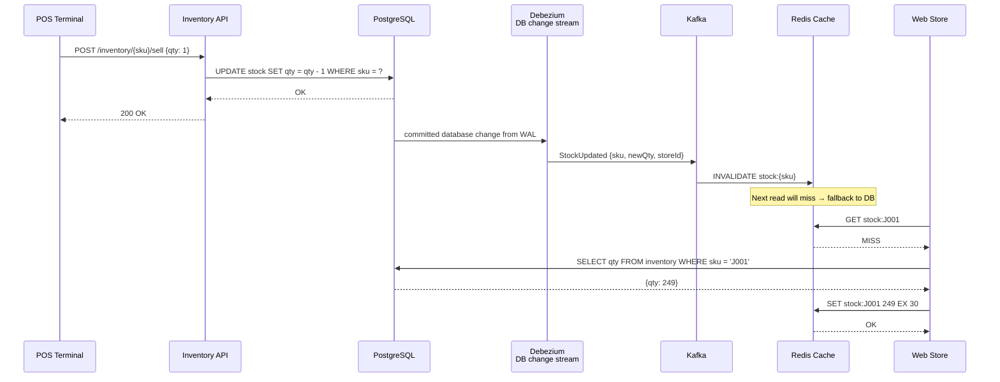

### 2d. Interface Fit Note

Use this pattern when:

- public and gateway-facing traffic should stay `HTTP/REST`
- the current backend is still one main deployable unit
- `gRPC` would only become interesting if the backend later splits into several
  internal services and the gateway or `BFF` has to call several of them for
  one frontend request

Practical implementation direction if that split ever happens:

- keep `REST` at the public edge
- add `gRPC` only for internal service-to-service contracts
- let the gateway or BFF aggregate `gRPC` calls and return one HTTP response to
  the frontend

---

## Exercise 3: Order Lifecycle

### 3a. Order State Machine

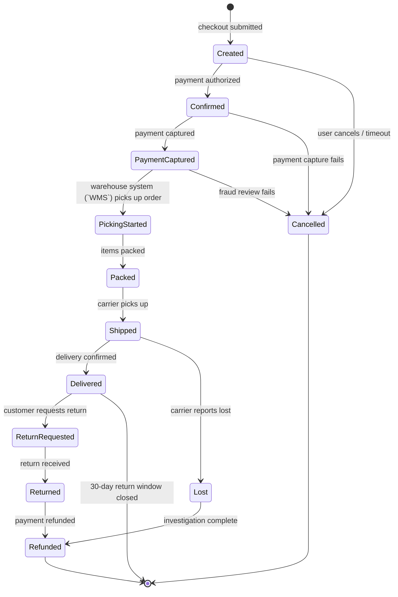

### 3b. Order Service Architecture

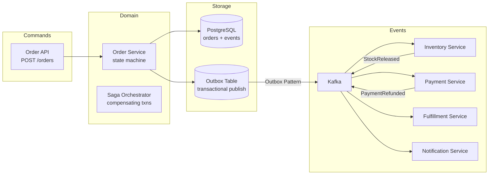

### 3c. Idempotency Pattern (Prevent Double Processing)

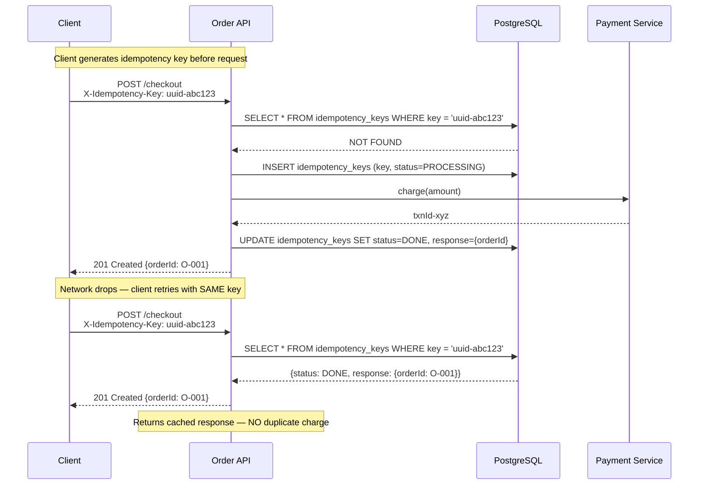

---

## Quick Reference: The Four Questions

Every system design answer must address:

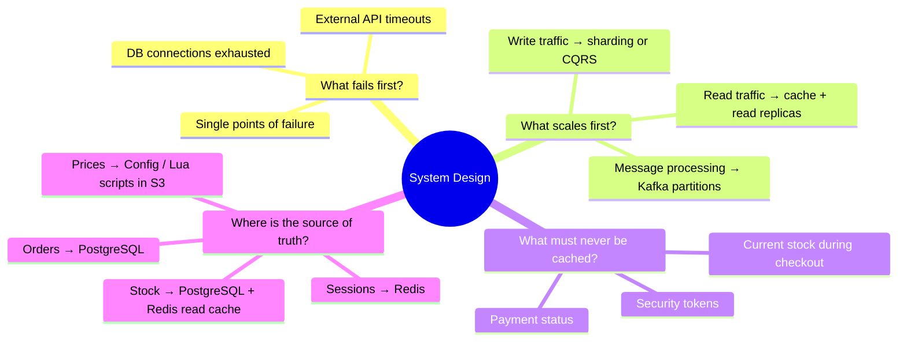
